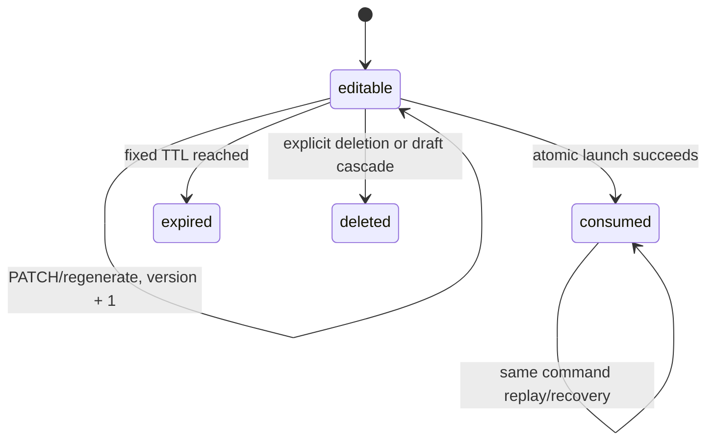

# Interview-Agent 产品体验与跨端契约

> 文档类型：Reference
>
> 目标读者：前后端维护者、测试维护者和执行优化计划的工程 Agent
>
> 目标：把 Gate 0B 的产品不变量、PrepPlan、启动幂等、草稿、V15、报告可靠性和进度字段冻结为可实现、可测试的契约。
>
> 适用基线：`codex/frontend-optimization-v031`，Gate 0A 提交 `6ee7830`，父代码基线 `81ff57ce2284`。

## 1. 术语和权威性

| 术语 | 定义 | 权威来源 |
| --- | --- | --- |
| PrepPlan | 由 `/api/prep` 生成、可编辑且有版本的面试计划 | `PrepPlanStore` |
| plan question | PrepPlan 内部题目，使用不可变 `question_id` | PrepPlan 当前版本/版本快照 |
| session question | 启动时投影出的 `q1..qN`，只在会话内稳定 | 会话快照和 mapping 表 |
| launch command | 一次启动意图的幂等凭证 | `prep_plan_launch_commands` |
| effective/confirmed answer | 权威会话中 `answer_state == "answered"` 的题目；不表达回答质量 | 会话快照 |
| product mode | 默认用户界面，只展示任务、结果、证据和下一步 | 前端能力开关关闭 |
| diagnostic mode | 显式开启后才请求和渲染 attempt、heartbeat、job、Agent runs 等信息 | `VITE_SHOW_RUNTIME_DIAGNOSTICS=true` |

服务端快照是所有恢复和产品事实的唯一权威来源。`localStorage`/`sessionStorage` 只能保存恢复引用、编辑草稿和待重试命令，不能作为业务状态数据库。

## 2. 产品体验不变量

### 2.1 真实性

- `/prep` 展示并确认的计划必须是实际启动会话使用的计划；启动接口不再调用 `prepare_interview()`。
- 所有题目、题型、focus、required、enabled、证据 ID、阶段、百分比、状态、错误和 reliability 字段必须来自服务端真实返回。
- 不能以 `feedbacks.length`、`events.length`、空对象、固定示例题或文案关键词推断分母或成功状态。
- 报告进度本轮只承诺当前快照：`status`、`stage`、`percent`、`message`、`last_updated_at` 和公开安全错误；不承诺持久化事件历史。

### 2.2 信息分层

- 产品模式只显示阶段、等待/失败状态、可离开性、结果、覆盖度、证据和下一步。
- Worker、workflow、job ID、attempt、heartbeat、stalled/orphaned、Agent runs 和 runtime events 仅在诊断模式请求和显示。
- 诊断请求失败不能阻断报告主内容；报告主内容失败必须使用稳定公开错误码。
- Provider 原始错误、提示词、堆栈、绝对路径、JD/简历正文、完整私有证据和恢复凭证不得出现在用户文案、日志、指标或事件中。

### 2.3 操作安全和无障碍

- 跳题和结束面试必须在确认前零写请求。退出会话只保存恢复入口，不改变会话为 finished。
- 确认对话框使用语义 dialog、焦点圈定、Escape 取消、取消后恢复触发按钮焦点。
- 整个对话记录不是 live region；只为“已提交”“已恢复”“追问完成”等短状态使用专用 live region。
- 所有主操作、取消、重试和移动导航目标最小 44px，键盘焦点可见，200% 缩放和 reduced-motion 可用。
- 前端不使用 `dangerouslySetInnerHTML` 展示后端文本。

## 3. PrepPlan 公共模型

### 3.1 `PrepQuestionPublic`

```json
{
  "question_id": "pq_550e8400-e29b-41d4-a716-446655440000",
  "position": 1,
  "kind": "technical",
  "prompt": "Explain Redis cache consistency.",
  "focus": "redis consistency",
  "required": false,
  "enabled": true,
  "source_signals": ["jd", "resume"],
  "topic_labels": ["缓存一致性"],
  "evidence_ids": ["redis_consistency"]
}
```

字段契约：

| 字段 | 类型 | 规则 |
| --- | --- | --- |
| `question_id` | string | 完整 UUIDv4 级别、稳定不透明、计划生命周期内不可变 |
| `position` | integer/null | 只对 enabled 题目有效；启用题连续且唯一为 `1..N`；禁用题为 `null` |
| `kind` | enum | `project`、`technical`、`system-design`、`behavioral`；服务端生成，普通 PATCH 只读 |
| `prompt` | string | 非空；不包含 Provider 原始错误 |
| `focus` | string | 非空；可通过 `set_focus` 修改 |
| `required` | boolean | `true` 的题目不能被禁用 |
| `enabled` | boolean | 排除使用 `false`，不物理删除题目 |
| `source_signals` | string[] | 公开安全来源标签，不返回完整 JD/简历片段 |
| `topic_labels` | string[] | 与本题绑定的安全主题名称；不返回内部查询或简历原文 |
| `evidence_ids` | string[] | 与本题绑定的公开安全证据标识；无知识证据时为空数组 |

### 3.2 `PrepPlanPublic`

```json
{
  "plan_id": "prep_550e8400-e29b-41d4-a716-446655440000",
  "plan_version": 1,
  "state": "editable",
  "expires_at": "2026-08-06T12:00:00Z",
  "source_sha256": "...",
  "title": "Stage 41 browser interview",
  "questions": [],
  "prep_context": {},
  "job_tags": [],
  "durability": "postgres"
}
```

`prep_context` 只能包含产品需要的公开上下文；完整原始 JD、简历、私有 evidence binding 由 Store 持有，不能要求前端回传。

## 4. PrepPlan 状态机和错误

### 4.1 生命周期



| 状态 | GET | PATCH/regenerate | start |
| --- | --- | --- | --- |
| `editable` | 200 | 200，版本递增 | 201；相同 command 的 replay 为 200 |
| `consumed` | 200，只读并带恢复 session | 409 | 相同 command 200；不同 command 409 |
| `expired` | grace 期间 410 | 410 | 410 |
| `deleted`/不存在 | 404 | 404 | 404 |
| Store 暂不可用 | 503 | 503 | 503 |

Local V1 默认 TTL 为 24 小时，编辑不延长。expired 在 24 小时 grace 内保留 tombstone，之后计划内容可硬删除。consumed 计划内容和版本快照默认保留 7 天；会话最终快照、mapping 和 launch command 的保留期跟随 session。

### 4.2 稳定错误结构

```json
{
  "code": "PREP_PLAN_VERSION_CONFLICT",
  "message": "计划已经更新，请确认最新版本",
  "retryable": true,
  "request_id": "req_...",
  "details": {
    "plan_id": "prep_...",
    "latest_version": 4
  }
}
```

最小错误码表：

| HTTP | code | 前端行为 |
| ---: | --- | --- |
| 409 | `PREP_PLAN_VERSION_CONFLICT` | 获取最新公开计划，保留可编辑状态 |
| 409 | `PREP_PLAN_ALREADY_CONSUMED` | 锁定编辑，进入既有 session/启动恢复 |
| 410 | `PREP_PLAN_EXPIRED` | 清除不可恢复引用，要求重新生成 |
| 404 | `PREP_PLAN_NOT_FOUND` | 清除不可恢复引用 |
| 422 | `PREP_PLAN_DUPLICATE_OPERATION` | 保留旧版本并指出重复操作 |
| 422 | `PREP_PLAN_QUESTION_LIMIT` | 保留旧版本并提示启用题必须为 3–5 道 |
| 422 | `PREP_PLAN_REQUIRED_QUESTION_DISABLED` | 要求先解除 required |
| 503 | `PREP_PLAN_STORE_UNAVAILABLE` | 保留浏览器引用，允许稍后重试 |
| 503 | `INTERVIEW_BOOTSTRAP_PENDING` | 保留原 command，有限退避后重试 |

## 5. PrepPlan PATCH 和版本快照

### 5.1 操作负载

```json
{
  "expected_version": 3,
  "operations": [
    {"type": "set_required", "question_id": "pq_1", "required": false},
    {"type": "set_enabled", "question_id": "pq_1", "enabled": false},
    {"type": "move", "question_id": "pq_2", "position": 1},
    {"type": "set_focus", "question_id": "pq_2", "focus": "缓存一致性"}
  ]
}
```

Store 必须在一次 compare-and-swap 中：

1. 锁定计划并比较 `expected_version`；
2. 校验所有 `question_id`；
3. 按数组顺序应用操作到工作副本；`move.position` 相对于当时的 enabled 题列表；
4. 允许同题不同操作，拒绝同题同 operation type 重复并返回 `PREP_PLAN_DUPLICATE_OPERATION`；
5. 验证 required/enabled、未知题、禁用题移动和 3–5 题边界；
6. 规范化 enabled 题 `position=1..N`，禁用题 `position=null`；
7. 写入一条新版本快照；任意失败则当前计划、版本号和快照均不变。

再次启用的题目默认追加到 enabled 列表末尾，之后可通过 `move` 调整。单题重生成创建新的 `question_id` 和服务端生成的 `kind`，继承原启用位置；旧 ID 不复用。

### 5.3 单题重生成

```json
POST /api/prep-plans/{plan_id}/questions/{question_id}/regenerate
{
  "expected_version": 3
}
```

生成在计划锁外执行，写入时重新锁定并比较版本。成功响应返回最新完整计划以及 `replaced_question_id`、`replacement_question_id`；新题继承原题的 `position/enabled/required`，其 `kind/prompt/focus/source_signals/topic_labels/evidence_ids` 来自服务端重新生成结果。成功写一条 `change_type=regenerated` 的不可变快照；生成失败、重复候选或版本冲突均不得修改当前计划和版本历史。

稳定错误：`PREP_PLAN_REGENERATION_FAILED`、`PREP_PLAN_REGENERATION_DUPLICATE`、`PREP_PLAN_VERSION_CONFLICT`、`PREP_PLAN_QUESTION_NOT_FOUND`。错误响应不包含 Provider 原文、提示词或原始 JD/简历。

### 5.2 版本快照

`prep_plan_versions` 每次初始创建、有效 PATCH、单题重生成写一条不可变快照，至少包含：

```text
plan_id
version
public_questions_json
created_at
change_type
replaced_question_id
replacement_question_id
```

快照不包含 JD/简历原文、完整私有 evidence、提示词、Provider 原始错误。普通产品 API 不提供历史浏览；快照只用于并发恢复、审计和测试。显式删除/过期清理按 retention 规则级联版本快照。

## 6. 权威启动协议

### 6.1 请求和唯一入口

```json
POST /api/interviews
{
  "plan_id": "prep_...",
  "expected_plan_version": 3,
  "command_id": "start_550e8400-e29b-41d4-a716-446655440000"
}
```

路由只调用：

```python
InterviewLaunchCoordinator.launch(
    plan_id=plan_id,
    expected_plan_version=expected_plan_version,
    command_id=command_id,
)
```

路由不得顺序调用多个自行提交的 Store。

### 6.2 PostgreSQL 事务时序

```text
BEGIN (non-autocommit)
  fast-path read launch command
  SELECT prep_plan FOR UPDATE
  re-read launch command/consumed fields while plan lock is held
  same command -> existing session recovery path
  different command + consumed -> 409
  editable -> validate version/TTL/3–5/enabled positions
  choose engine and generate one session_id
  insert session shell using caller-owned cursor
  insert plan_question_id ↔ session_question_id mappings
  insert launch command (UNIQUE(plan_id), UNIQUE(plan_id, command_id))
  mark plan consumed with session/command/version
COMMIT
post-commit durable graph bootstrap under workflow/session lock
```

业务事务失败必须整体回滚。`PostgresInterviewSessionStore` 的事务感知插入只接受调用方 connection/cursor，不获取新连接、不提交、不回滚。

### 6.3 Launch 状态

| 内部状态 | 语义 | 相同 command |
| --- | --- | --- |
| `bootstrap_pending` | session/plan/mapping 已提交，graph 尚未 ready | 继续 bootstrap |
| `ready` | session 可进入 | 200 返回同一 session |
| `failed_recoverable` | 业务记录完整，bootstrap 可在依赖修复后继续 | 使用同一 session/command |

launch command 保存：

```text
bootstrap_attempt_count
last_bootstrap_attempt_at
next_retry_at
last_error_code
last_error_retryable
```

503 `INTERVIEW_BOOTSTRAP_PENDING` 通过 `Retry-After` 或等价信息提示有限退避。前端最多自动重试三次，之后停用自动请求、保留原 command 并显示手动恢复。绝不创建新 session 或重新消费计划。

### 6.4 浏览器 command 生命周期

浏览器按以下键保存 pending command：

```text
interview-agent:pending-start:<plan_id>
```

内容为 `command_id`、`expected_plan_version`、`created_at`。请求超时、断网、Abort、503 时保留；ready 时先保存 `last_active_session_id` 再清理；404/410 时清理；已消费 409 携带可恢复 session 时进入该 session 并清理失效 pending command。command ID 不进入 URL、日志、埋点或公开错误文本。

### 6.5 并发不变量

- 相同 `(plan_id, command_id)` 只能创建一个 session；并发请求即使都错过锁外快速查询，也必须在 plan 行锁内二次收敛到同一 session。
- 不同 command 不能再次消费同一 plan，返回 `PREP_PLAN_ALREADY_CONSUMED`。
- 创建路径锁顺序固定为 PrepPlan 行锁 → launch command 写入；bootstrap 使用 workflow/session 锁。
- 内存模式按 `plan_id` 加锁，使用临时副本；任意异常不得将半成品留在多个字典。

## 7. DraftStore

- `DraftStore` Port 独立于 `PrepPlanStore`，不得继续无条件返回 `AnonymousDraftStore()`。
- PostgreSQL 模式保存 JD/简历正文，API 进程重启后可恢复；内存模式必须显示重启失效。
- API 返回 `durability`、`expires_at`、`draft_id`；浏览器不再声称正文直接保存在浏览器。
- 404/410 清除对应浏览器凭证；503、超时、断网保留凭证。
- 删除草稿只级联删除尚未 consumed 的关联 PrepPlan；已 consumed session 使用自身快照，不被破坏。
- 草稿 ID 使用完整 UUIDv4，不允许 `uuid4().hex[:12]`。

## 8. V15 PostgreSQL schema contract

V15 必须通过现有 `postgres_schema_contract.py` 和 `postgres_runtime_migrations.py` 注册；不得创建孤立 `migrations/` 目录，不修改 V1–V14 manifest/checksum。

### 8.1 表和关键约束

| 表 | 关键字段/约束 |
| --- | --- |
| `interview_drafts` | `draft_id`、正文 JSON/文本、`source_sha256`、`durability`、`expires_at`、`deleted_at`；公开 ID UUIDv4 |
| `prep_plans` | `plan_id`、`plan_version`、`state`、`expires_at`、`consumed_session_id`、`consumed_command_id`、`consumed_plan_version`、`source_draft_id` |
| `prep_plan_versions` | 不可变 `plan_id + version` 唯一快照；删除/过期按 retention 清理 |
| `prep_plan_launch_commands` | `plan_id`、`command_id`、`session_id`、bootstrap 状态/尝试/错误；`UNIQUE(plan_id)`、`UNIQUE(plan_id, command_id)`；session 删除时级联 |
| `prep_plan_session_question_mappings` | `session_id`、`plan_question_id`、`session_question_id`、position、kind；两组双向唯一；session 删除时级联 |

launch command 和 mapping 的保留所有者是 session，不是会被提前清理的 PrepPlan 内容行。PrepPlan 内容 GET 在清理后可以 404，但 launch tombstone 必须继续支持相同 command 恢复和不同 command 409。

逻辑 DDL 约束冻结如下；实现时表名继续服从 runtime prefix，不硬编码公共 schema：

```sql
CREATE TABLE <prefix>_interview_drafts (
  draft_id TEXT PRIMARY KEY,
  job_description TEXT NOT NULL,
  resume_text TEXT NOT NULL,
  source_sha256 TEXT NOT NULL,
  expires_at TIMESTAMPTZ NOT NULL,
  created_at TIMESTAMPTZ NOT NULL DEFAULT NOW(),
  updated_at TIMESTAMPTZ NOT NULL DEFAULT NOW()
);

CREATE TABLE <prefix>_prep_plans (
  plan_id TEXT PRIMARY KEY,
  plan_version INTEGER NOT NULL CHECK (plan_version >= 1),
  state TEXT NOT NULL CHECK (state IN ('editable', 'consumed', 'expired')),
  plan_json JSONB NOT NULL,
  internal_context_json JSONB NOT NULL,
  source_sha256 TEXT NOT NULL,
  source_draft_id TEXT NULL,
  expires_at TIMESTAMPTZ NOT NULL,
  consumed_session_id TEXT NULL,
  consumed_command_id TEXT NULL,
  consumed_plan_version INTEGER NULL,
  created_at TIMESTAMPTZ NOT NULL DEFAULT NOW(),
  updated_at TIMESTAMPTZ NOT NULL DEFAULT NOW(),
  FOREIGN KEY (source_draft_id)
    REFERENCES <prefix>_interview_drafts(draft_id)
    ON DELETE SET NULL
);

CREATE TABLE <prefix>_prep_plan_versions (
  plan_id TEXT NOT NULL,
  version INTEGER NOT NULL CHECK (version >= 1),
  public_snapshot_json JSONB NOT NULL,
  change_type TEXT NOT NULL,
  replaced_question_id TEXT NULL,
  replacement_question_id TEXT NULL,
  created_at TIMESTAMPTZ NOT NULL DEFAULT NOW(),
  PRIMARY KEY (plan_id, version),
  FOREIGN KEY (plan_id)
    REFERENCES <prefix>_prep_plans(plan_id)
    ON DELETE CASCADE
);

CREATE TABLE <prefix>_prep_plan_launch_commands (
  plan_id TEXT NOT NULL,
  command_id TEXT NOT NULL,
  consumed_plan_version INTEGER NOT NULL,
  session_id TEXT NOT NULL,
  bootstrap_status TEXT NOT NULL CHECK (
    bootstrap_status IN ('bootstrap_pending', 'ready', 'failed_recoverable')
  ),
  bootstrap_attempt_count INTEGER NOT NULL DEFAULT 0,
  last_bootstrap_attempt_at TIMESTAMPTZ NULL,
  next_retry_at TIMESTAMPTZ NULL,
  last_error_code TEXT NULL,
  last_error_retryable BOOLEAN NOT NULL DEFAULT TRUE,
  created_at TIMESTAMPTZ NOT NULL DEFAULT NOW(),
  updated_at TIMESTAMPTZ NOT NULL DEFAULT NOW(),
  PRIMARY KEY (plan_id, command_id),
  UNIQUE (plan_id),
  FOREIGN KEY (session_id)
    REFERENCES <prefix>_sessions(session_id)
    ON DELETE CASCADE
);

CREATE TABLE <prefix>_prep_plan_session_question_mappings (
  session_id TEXT NOT NULL,
  plan_question_id TEXT NOT NULL,
  session_question_id TEXT NOT NULL,
  position INTEGER NOT NULL CHECK (position >= 1),
  kind TEXT NOT NULL CHECK (
    kind IN ('project', 'technical', 'system-design', 'behavioral')
  ),
  PRIMARY KEY (session_id, plan_question_id),
  UNIQUE (session_id, session_question_id),
  UNIQUE (session_id, position),
  FOREIGN KEY (session_id)
    REFERENCES <prefix>_sessions(session_id)
    ON DELETE CASCADE
);
```

`prep_plan_launch_commands.plan_id` 刻意不使用指向 `<prefix>_prep_plans` 的删除级联外键，因为计划内容可以早于 session 清理。`UNIQUE(plan_id)` 使 launch command 本身成为 consumed tombstone。草稿删除关联未消费计划的规则由同一业务事务显式执行；`source_draft_id ON DELETE SET NULL` 只作为数据库安全网，不能代替领域级联。

### 8.2 迁移和验证

V15 必须支持：

- `schema_mode=migrate` 创建缺失表、索引、约束；
- `schema_mode=validate` 识别缺表、缺列、错误类型、约束缺失和 checksum 漂移；
- preflight 在 PostgreSQL 不可用时返回明确不可用，而不是“计划不存在”；
- 从 V14 升级后旧 manifest 行和 checksum 不变；
- 测试初始化、重启恢复、并发锁和清理级联验证。

## 9. Report reliability 和 progress

报告 API 返回后端计算的稳定 `reliability`：

```json
{
  "planned_question_count": 4,
  "answered_question_count": 3,
  "skipped_question_count": 1,
  "unanswered_question_count": 0,
  "reviewed_answer_count": 2,
  "review_failed_answer_count": 1,
  "evidence_bound_question_count": 2,
  "degraded_question_count": 1,
  "generation_path": "mixed",
  "degraded_reasons": ["QUESTION_REVIEW_UNAVAILABLE"],
  "score_applicability": "limited"
}
```

字段来源冻结为：

- `planned_question_count` 来自启动时权威计划快照；
- `answered_question_count` 严格计 `answer_state == "answered"`；提交接口已拒绝空白回答；
- skipped/unanswered 不计入 answered；
- `reviewed_answer_count` 只计成功结构化逐题评审；失败单列；
- evidence 按题去重；degraded 按题去重；
- `generation_path` 为 `structured | mixed | fallback`；
- `score_applicability` 为 `normal | limited | insufficient`，前端不得自行计算或放宽阈值；
- 没有统计校准数据前不展示 AI 置信度数字。

`GET /api/reports` 的每个列表项同时返回服务端权威 `answered_question_count`。内存实现从会话 answer state 统计，PostgreSQL 实现从带 `question_id` 的非空 candidate message 去重统计；报告中心不得以 `feedbacks.length`、逐题评分数组或浏览器缓存推断该值。

进度公开字段沿用现有 `last_updated_at`，不引入未版本化的 `updated_at`。产品模式不请求 Agent runs、runtime events，也不渲染 job ID、heartbeat、attempt、workflow engine、knowledge path 或 report path；诊断模式按能力开关按需请求。报告中心列表同样不以 report path 作为产品标签。

## 10. Practice-plan 映射

practice-plan 输入可以使用 `session_question_id`，但服务端必须通过会话 mapping 追溯稳定 `plan_question_id`。前端不得自行拼接旧题目 ID。

输出始终是新的可编辑 PrepPlan，保存 provenance：

```json
{
  "source_session_id": "...",
  "source_session_question_ids": ["q2"],
  "source_plan_question_ids": ["pq_..."],
  "source_report_id": "...",
  "focus_dimension": "engineering"
}
```

如果报告失败、有效回答为 0 或弱项不可解析，隐藏入口并解释原因。

## 11. 测试验收清单

### PrepPlan/PATCH

- `/api/prep` 每题返回合法 `kind`、`enabled`、nullable `position`；同一计划不重复调用模型。
- PATCH 旧版本返回 409；同题不同操作按顺序生效；同题同类型重复返回 `PREP_PLAN_DUPLICATE_OPERATION`。
- enabled 题 position 连续；禁用题 position 为 null；重新启用追加到末尾；required 题不能被禁用。
- 初始创建、有效 PATCH、单题重生成各写一条不可变版本快照；失败不写快照。

### Launch/事务

- 相同 command 首次并发即使同时错过锁外快速查询，也只创建一个 session，第二个请求返回同一 session 而非 409。
- 不同 command 消费已 consumed 计划返回 409，不创建第二会话。
- session shell、mapping、launch command、consume 任一 PostgreSQL 写入失败均整体回滚。
- 业务事务提交后 bootstrap 失败返回 503；相同 command 重试恢复同一 session 到 ready。
- launch command/mapping 在 PrepPlan 内容清理后仍能恢复同 command，删除 session 才级联清理。

### Draft/reliability/progress

- PostgreSQL 草稿重启恢复；内存模式明确不持久；503 不清理浏览器凭证。
- reliability 计数与权威 answer_state fixture 一致，前端不从数组推导。
- progress 和前端 fixture 统一使用 `last_updated_at`；产品模式不请求诊断资源；没有虚构事件历史。

### Frontend recovery

- pending command 在刷新、超时、断网、503 后复用；ready 后清理顺序正确。
- `PREP_PLAN_VERSION_CONFLICT` 与 `PREP_PLAN_ALREADY_CONSUMED` 使用不同 UI 行为。
- bootstrap 自动重试最多三次，遵守 Retry-After，之后只保留手动恢复。

## 12. 兼容窗口

旧版 `/api/interviews` 接口只能保留一个有监测、测试、负责人和移除日期的兼容窗口。新前端不得发送旧的 JD/简历启动 payload；如果旧路径仍存在，必须标记为 legacy，不能继续承诺“已确认计划就是实际计划”。

任何未满足本文件或 `DESIGN.md` 的 Gate 都不能将计划状态改为 `READY_FOR_IMPLEMENTATION`。视觉完成不能替代契约完成。

## 13. Pydantic 模型草案

Phase 1 实现使用 Pydantic v2 discriminated union，不在路由里手工判断操作 payload：

```python
QuestionKind = Literal["project", "technical", "system-design", "behavioral"]
PrepPlanState = Literal["editable", "consumed", "expired"]
BootstrapStatus = Literal["bootstrap_pending", "ready", "failed_recoverable"]

class PrepQuestionPublic(BaseModel):
    model_config = ConfigDict(extra="forbid")
    question_id: str
    position: int | None
    kind: QuestionKind
    prompt: str = Field(min_length=1)
    focus: str = Field(min_length=1, max_length=500)
    required: bool
    enabled: bool
    source_signals: list[str] = Field(default_factory=list)

class SetEnabledOperation(BaseModel):
    model_config = ConfigDict(extra="forbid")
    type: Literal["set_enabled"]
    question_id: str
    enabled: bool

class MoveOperation(BaseModel):
    model_config = ConfigDict(extra="forbid")
    type: Literal["move"]
    question_id: str
    position: int = Field(ge=1)

class SetRequiredOperation(BaseModel):
    model_config = ConfigDict(extra="forbid")
    type: Literal["set_required"]
    question_id: str
    required: bool

class SetFocusOperation(BaseModel):
    model_config = ConfigDict(extra="forbid")
    type: Literal["set_focus"]
    question_id: str
    focus: str = Field(min_length=1, max_length=500)

PrepPlanOperation = Annotated[
    SetEnabledOperation | MoveOperation | SetRequiredOperation | SetFocusOperation,
    Field(discriminator="type"),
]

class PatchPrepPlanRequest(BaseModel):
    model_config = ConfigDict(extra="forbid")
    expected_version: int = Field(ge=1)
    operations: list[PrepPlanOperation] = Field(min_length=1, max_length=20)

class LaunchInterviewRequest(BaseModel):
    model_config = ConfigDict(extra="forbid")
    plan_id: str
    expected_plan_version: int = Field(ge=1)
    command_id: str

class PublicError(BaseModel):
    model_config = ConfigDict(extra="forbid")
    code: str
    message: str
    retryable: bool
    request_id: str | None = None
    details: dict[str, Any] = Field(default_factory=dict)
```

跨字段不变量（enabled/position、required/enabled、3–5 题、重复 operation、版本 CAS）属于 Store/领域服务验证，不只依赖单个 Pydantic 字段验证器。路由捕获稳定领域异常并投影为本文件的 `PublicError`，不得把 `ValueError` 原文直接公开。
