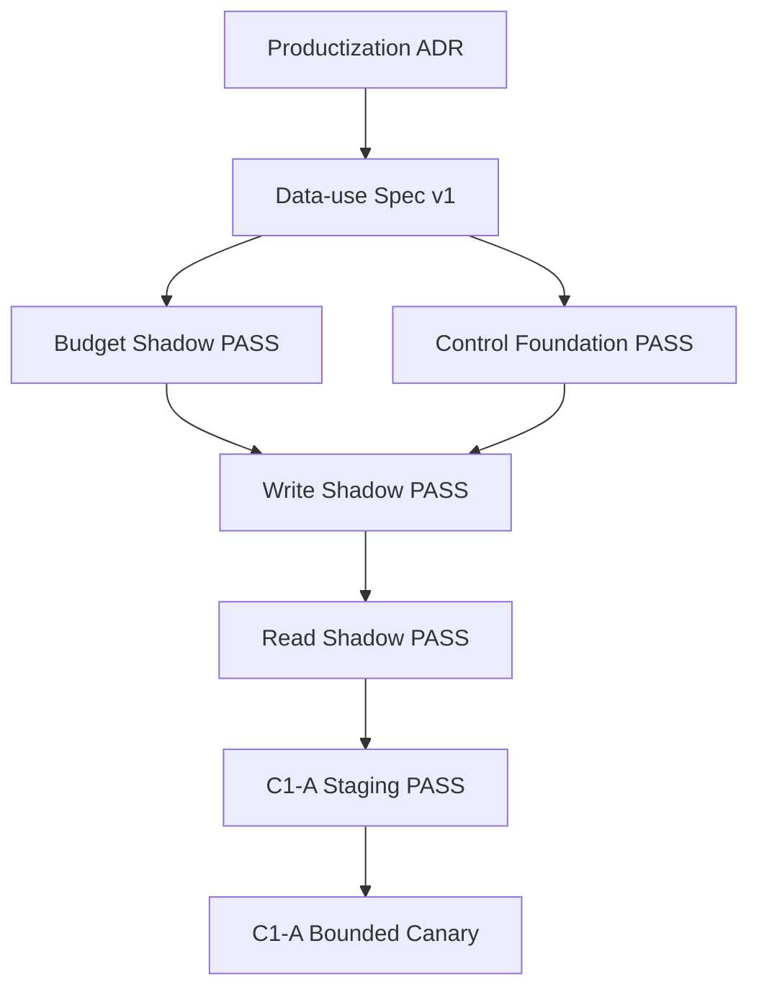
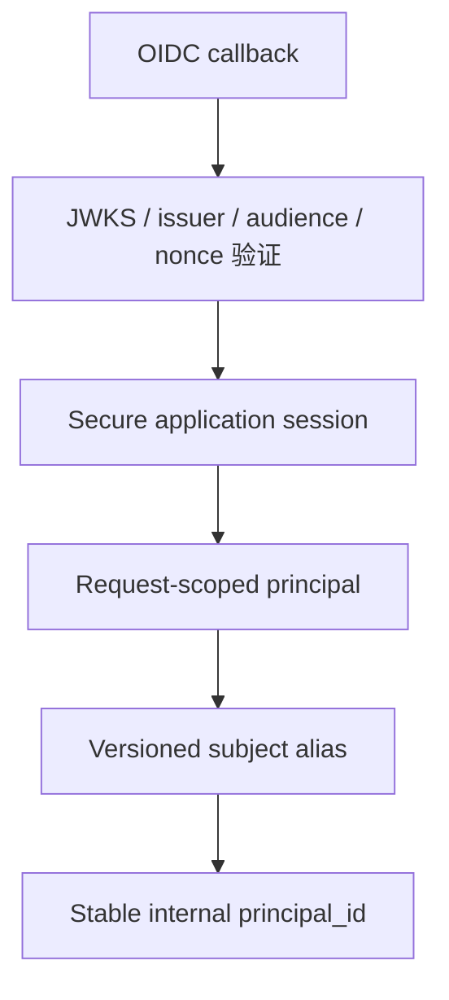
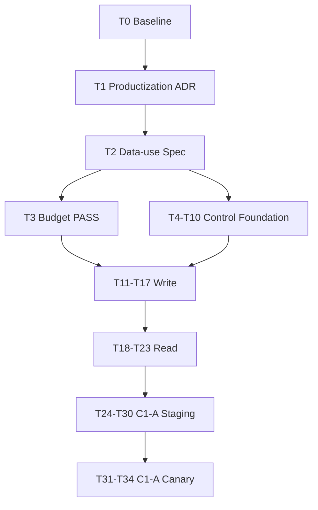

# Interview Agent 长期记忆 Hosted 产品化、Production Shadow 与有界晋级主计划

**Plan revision:** v0.2-revised
**Document type:** Master Roadmap + Phase Execution Contract
**Target audience:** Product、Change Owner、Operations、Privacy、Security、Fairness、Legal、Interview Quality、后端、Agent、前端、SRE、QA 与验收负责人
**Historical Memory RC:** `f5dce4206751775c1650a4fccbd5060625af523a`
**Repository baseline reviewed:** `6969efa119de0da33698f0de74f4fdeee502b375`

**Primary goal:** 先决定项目是否从“本地单机、单用户、无登录”升级为 Hosted Multi-user V2；只有该产品化决策通过后，才依次建立真实认证、稳定 Principal、独立 Consent、候选人控制面、Production Write Shadow、Production Read Shadow 单轴零注入，以及不把历史事实直接注入 Provider Prompt 的 C1-A 有界辅助能力。

**Status at revision:**

```text
HOSTED_PRODUCTIZATION_DECISION=NOT_APPROVED
PRODUCTION_DATA_USE_SPEC=NOT_APPROVED
PRODUCTION_BUDGET_SHADOW=NOT_RUN
PRINCIPAL_WRITE_SHADOW_PRODUCTION=NOT_AUTHORIZED
PRINCIPAL_READ_SHADOW_PRODUCTION=NOT_AUTHORIZED
PRINCIPAL_MEMORY_C1A_SPEC=DRAFT
IMPLEMENTATION=NOT_AUTHORIZED
PRODUCTION_CANARY=NOT_AUTHORIZED
```

> **授权边界：** 本文件规定路线、依赖、技术不变量和晋级门禁，不构成任何生产授权。生产任务必须绑定精确 revision、deployment scope、数据目的、窗口、绝对暴露上限、配置和外部批准记录；change preflight 未返回 `PASS` 时不得改变生产配置。

---

## 1. 修订结论与执行方式

### 1.1 本次修订解决的问题

本版本对 v0.1 做出以下实质修正：

1. 在 OIDC、Memory Center 和生产候选人数据处理前新增 Hosted Multi-user V2 Productization ADR；
2. 把 Consent 文案、jurisdiction、retention、人工复核、Provider logging/training/DPA 等决策前置到首次 Write Shadow 之前；
3. Principal ID 改为稳定随机内部 ID，versioned HMAC 只用于 subject alias 映射，密钥轮换不改变 Principal ID；
4. 补齐 OIDC callback、JWKS、Session、Cookie/Token、CSRF、logout、re-auth、request-scoped Principal 和异步 owner binding；
5. 补齐真实 Production extractor/provider adapter 与 runtime wiring，禁止生产 Shadow 使用 Null identity/extractor；
6. 修正 Read Shadow：Write gate 必须为 `false`，不得创建 proposal/outbox event；
7. 生产窗口不再以 `0.1% + 固定样本` 作为唯一可执行口径，改为绝对 Principal/Session 暴露上限，并由预注册 observation protocol 固定最小证据量；
8. C1 收缩为 C1-A：语言只做候选人确认前的预填；无障碍偏好只作用于 UI/交互；历史事实不直接进入 Provider Prompt；
9. `learning_goal`、`target_role_family` 移出本计划的生产范围，仅允许未来 C1-B 在非评分练习模式单独立项；
10. 评分/报告验收改为“相同当前会话设置与 transcript 的路径等价”，不再声称改变追问后仍能保持最终输出完全相等；
11. Plan 测试只锁定结构化不变量、DAG 和禁止状态，不再用大量字符串断言代替运行时契约测试；
12. 将 35 个任务分为五个独立阶段包，每个生产阶段使用独立 RC、审批和关闭证据。

### 1.2 本文件如何执行

本文件是 Master Roadmap，不授权一次性实施 Tasks 0-34。

- 每次只启动一个已满足入口门禁的阶段包；
- repository-only 的 Budget 与 Control Foundation 分支可在明确条件下并行；
- Write、Read、C1-A Production 严格串行；
- 每个生产窗口都要生成独立 phase runbook、RC、PENDING bundle、批准与 post-observation evidence；
- 任一阶段输出 `BLOCKED` 或 `CONTINUE_OBSERVATION` 时，不得进入下一阶段；
- 子阶段的实现细节可以在独立 phase plan 中细化，但不得修改本文件的安全不变量。

### 1.3 固定晋级路线



以下结论彼此不等价：

```text
Productization ADR APPROVED ≠ 数据使用已批准
Budget PASS ≠ Write Shadow 已授权
Write PASS ≠ Read Shadow 已授权
Read PASS ≠ C1-A 实现已授权
C1-A Staging PASS ≠ Production Canary 已授权
C1-A Canary PASS ≠ 扩容或 General Availability 已授权
```

---

## 2. 当前工程基线与已确认冲突

### 2.1 产品基线

当前 README 将项目定位为本地单机、单用户、不包含登录和账户隔离。OIDC、多用户 Principal、账户恢复、候选人 Memory Center 和真实生产 Consent 均属于 Hosted Multi-user V2 产品化升级，而不是 Local V1 的普通功能增量。

因此：

```text
HOSTED_PRODUCTIZATION_DECISION != APPROVED
  → Tasks 4-34 不得实施
  → Local V1 行为必须保持不变
```

### 2.2 已确认的运行时冲突

执行时必须再次以实际 HEAD 核验，当前已知冲突包括：

- `app/services/memory_config.py` 的 `read_shadow` 同时要求 Write gate；
- `app/services/principal_memory_proposals.py` 在 `write_shadow` 和 `read_shadow` 都可能构造 proposal event；
- `app/services/runtime.py` 使用 `NullPrincipalIdentityResolver`；
- `app/services/runtime.py` 使用 `NullPrincipalMemoryExtractor`；
- 当前 Consent 是 Principal 级聚合记录，不能完整表达各 purpose 独立版本和撤回；
- 当前 runtime dependency graph 不具备多用户 request scope 与异步 owner re-binding。

这些冲突不是 observation tooling 可以弥补的，必须在对应 runtime 任务中修复并由代码测试锁定。

### 2.3 历史证据边界

历史 frozen RC：

```text
f5dce4206751775c1650a4fccbd5060625af523a
```

历史证据可作为 Staging 和工具链参考，但不能自动授权新的 Hosted 产品、真实候选人数据处理、Write、Read 或 C1-A Production。

Task 0 必须重新记录：

```text
EXECUTION_START_HEAD
EXECUTION_REMOTE_HEAD
ahead/behind
dirty paths and ownership
deployed revision
test baseline
```

不得 reset、restore、clean、覆盖或错误提交用户已有修改。

---

## 3. 范围

### 3.1 本计划包含

- Hosted Multi-user V2 go/no-go ADR；
- Production Principal Memory Data-use Spec v1；
- OIDC authentication、secure session、CSRF、logout、re-auth；
- 稳定随机内部 Principal ID 与 versioned subject alias；
- request-scoped Principal、immutable session owner 和 async worker binding；
- purpose-specific、versioned、default-off Consent ledger；
- Candidate Memory Center、自助 API 和用户权利生命周期；
- session ignore、disable-now、delete/export 与 tombstone replay；
- Production extractor/provider adapter、结构化输出、容错、成本和 retention 边界；
- Production Write Shadow 单轴运行与 proposal 质量评审；
- Production Read Shadow 单轴整改、would-select 和零注入审计；
- C1-A：语言预填后由候选人确认；无障碍偏好只进入 UI/交互；
- 独立 Staging、bounded production canary、hard stop、关闭和证据闭环。

### 3.2 本计划明确排除

- 在 Hosted Productization ADR 通过前实现生产 OIDC、Memory Center 或 Principal Memory；
- 在 Data-use Spec v1 通过前处理真实候选人 proposal、调用提取 Provider 或进行人工源内容复核；
- trusted-local、email、姓名、电话、IP、设备指纹、简历或模型推断作为 production identity；
- 把 HMAC 输出直接作为稳定内部 Principal ID；
- global mutable current-user singleton；
- 后台 worker 依赖当前 HTTP 用户或 raw OIDC subject；
- production Write 使用 Null identity resolver 或 Null extractor；
- Read Shadow 开启 Write gate、调用 extractor、创建 proposal 或 proposal outbox event；
- 模型自动确认、激活、纠正或合并 fact；
- unconfirmed、revoked、expired、deleted、conflicting 或 stale fact 被读取或应用；
- C1-A 将任何 Principal fact block、source excerpt 或历史自由文本发送给 Provider；
- C1-A 用 `learning_goal`、`target_role_family` 或 `confirmed_skill` 改变正式评分面试；
- 长期记忆直接或间接成为 score、evidence、report、rank、recommendation 或 hiring decision 输入；
- Principal data 进入公共 Knowledge、corpus、embedding 或共享向量检索；
- cross-Principal retrieval、similarity、collaborative filtering 或自动 identity merge；
- 用百分比流量替代绝对暴露上限和预注册证据门槛；
- 把不足样本、审批缺失或指标不完整解释为 PASS；
- 在生产窗口内热修代码、切换 revision、改变 schema 或复用其他阶段批准；
- 把外部批准记录、ticket、approver、deployment digest、secret 或 candidate locator 写入 Git；
- 本计划自动授权超过 C1-A 有界 Canary、5% 扩容或 General Availability。

---

## 4. 固定决策

### Decision 1：Hosted Productization ADR 是首个产品门禁

ADR 必须明确目标用户、部署模型、账户边界、运营责任、合规区域、支持与退出策略。若结果为 `NO_GO`，本计划停止，Local V1 保持原样。

### Decision 2：原始 Session 和当前会话输入始终权威

Principal Memory 是派生、可撤回、非权威数据。当前 session 的明确选择、当前 interview plan、当前 evidence 和 transcript 永远优先。

### Decision 3：Data-use Spec 必须早于首次真实 Write

Consent 文案、目的、retention、删除、导出、人工复核、Provider policy、jurisdiction、Legal/Privacy/Security approval 必须在 Production extractor 和 Write Shadow 使用真实数据前完成。

### Decision 4：内部 Principal ID 稳定且不由 HMAC 直接充当

结构固定为：

```text
verified issuer/subject
  → versioned subject HMAC alias
  → stable random internal principal_id
```

HMAC key rotation 只更新或新增 alias，不改变内部 Principal ID。

### Decision 5：Principal 必须 request-scoped，异步任务使用不可变 owner binding

HTTP request 解析 authenticated Principal；Session 创建时冻结 owner；Outbox/worker 只携带 opaque owner binding，并在 operation time 重新读取 Consent、disable、deletion 和 source state。禁止 global mutable current user。

### Decision 6：Consent 按 purpose 独立、版本化、default off

固定 purposes：

```text
proposal_write
fact_storage
read_shadow
assist_c1a
```

任何 purpose 的 grant/revoke 不隐含其他 purpose。

### Decision 7：模型和 Provider 只能产生 proposed fact

只有 authenticated candidate 的显式 confirm/correct 可以创建 active user-confirmed fact。Correct 的“supersede predecessor + activate replacement”必须在一个数据库事务中完成。

### Decision 8：候选人控制面先于生产 Shadow

正式 Write 前必须具备 view、confirm、correct、revoke、delete、export、ignore-for-session 和 disable-now。拒绝或关闭不得降低功能或影响评分。

### Decision 9：Write 与 Read 是严格单轴模式

```text
Write Shadow: write=true, read=false, assist=false
Read Shadow:  write=false, read=true, assist=false
C1-A:         write=false, read=false, assist=true
```

Read Shadow 内 `new proposal operations=0` 是硬不变量。

### Decision 10：Production runtime 禁止 Null 组件

当 Write 或 Read production gate 打开时，Null identity/extractor、trusted-local identity、缺失 owner binding 或测试 Provider 必须导致 startup/preflight fail-closed。

### Decision 11：生产暴露由绝对上限控制

每个窗口必须批准 `max_principals`、`max_sessions`、`minimum_duration`、`maximum_duration` 和预注册的 `minimum_evidence_n`。百分比或 basis points 只可作为附加收缩条件，不能替代绝对上限。

### Decision 12：Assignment 必须稳定、版本化、可复现

如使用流量分配，必须固定 hash input、salt/version、basis points、eligible denominator 和 sticky scope。改变算法或 version 需要新批准。

### Decision 13：C1-A 不把历史事实直接发送给 Provider

- `interview_language`：只作为面试前建议值；候选人确认后转为当前 session setting；
- `accessibility_preference`：只进入 UI、键盘、字幕、节奏或交互控制；永不发送给 LLM；
- `learning_goal`、`target_role_family`：只允许未来 C1-B 非评分练习模式单独立项；
- `confirmed_skill`：继续禁止消费。

### Decision 14：C1-A 使用同输入路径等价性验收

对相同 candidate-confirmed session settings 和相同 transcript，memory-assisted 与 manual-setting 路径的 evaluator input、score、evidence 和 report 必须完全相等。不得用不同问题路径之间的“on/off 全相等”作为伪验收。

### Decision 15：无候选人确认不得应用语言预填

预填必须可见、可拒绝、可修改；候选人不操作时使用产品默认值。Memory fact 本身不能成为 current session setting。

### Decision 16：常规观察只保存低基数聚合

Observation 不保存 Principal、Session、Fact、Question、Message、Prompt、source、answer、resume、report 或 approval locator；低样本 bucket 合并、延迟或抑制。

### Decision 17：删除由 online state 与 operator tombstone 共同维持

Online delete 清理 facts、proposals、effects、bindings、cache 和 derived refs；旧备份恢复后必须先 replay operator tombstone，residue=0 后才可接流量。

### Decision 18：Hard stop 不等待统计显著性

Cross-Principal、no-Consent、Read proposal creation、private artifact、历史 fact 进入 Provider、score/report direct dependency、disable/delete SLA breach 等问题立即关闭。

### Decision 19：窗口结束先关闭再判定

Scheduled end、manual stop 或 hard stop 都先恢复 disabled，验证 zero new operation，再输出 `PASS`、`BLOCKED` 或 `CONTINUE_OBSERVATION`。

### Decision 20：实现批准、生产批准和扩容批准相互独立

Spec approval 只允许实现；Staging PASS 只允许申请 Production；Canary PASS 只证明批准上限内的行为，不授权扩容或 GA。

---

## 5. 目标架构

### 5.1 Authentication 与 Principal Mapping



认证边界必须覆盖：callback、JWKS rotation、issuer/audience、state/nonce、Session fixation、Cookie/Token 生命周期、CSRF、logout、re-auth、account recovery 和 incident revoke。

### 5.2 Session Owner 与 Async Binding

```text
authenticated request
  → create session with immutable owner_principal_id
  → create outbox event with opaque owner binding
  → worker loads session owner
  → worker rechecks consent/control/deletion/source
  → eligible operation or no-op
```

Outbox 不保存 raw issuer/subject、email 或姓名。

### 5.3 Write Shadow

```text
authoritative completed session
  → production extractor adapter
  → strict structured output validation
  → operation-time identity/consent/source checks
  → proposed fact only
  → candidate-visible review
  → explicit confirm/correct transaction
  → active user-confirmed fact
```

Provider failure、timeout、rate limit、circuit open 或 schema mismatch 均返回 no proposal，面试主流程继续。

### 5.4 Read Shadow

```text
authenticated session owner
  → current read_shadow consent/control
  → eligible active facts
  → deterministic would-select
  → aggregate outcome only
  → no prompt/provider/question/output mutation
```

Read Shadow 不初始化 extractor，不创建 proposal，不写 proposal outbox。

### 5.5 C1-A Assist

```text
confirmed eligible preference
  → visible pre-interview suggestion
  → candidate accepts/edits/rejects
  → current session setting
  → normal deterministic interview path
```

Accessibility 只作用于 UI/interaction；Principal fact 不进入 Provider payload。

---

## 6. Consent Ledger v2 与撤回语义

Ledger 使用 append-only versioned records，业务键至少包含：

```text
(deployment_id, principal_id, purpose, policy_version, consent_version)
```

每条记录包含 decision、effective_at、revoked_at、authority、policy copy reference 和 immutable audit metadata。当前有效授权由确定性规则解析，不使用 session-start 缓存。

| Purpose | Grant | Revoke effect |
|---|---|---|
| `proposal_write` | 允许提取并按批准的短期 TTL 保存 proposed record | 立即停止新 proposal；既有未确认 proposal 终止并在 proposal retention SLO 内清除 |
| `fact_storage` | 允许保存 candidate-confirmed active fact | 立即使 active facts 不可选，并在 SLO 内 purge facts/derived refs 与写入 tombstone；proposal 仍由 `proposal_write` 管理 |
| `read_shadow` | 允许 would-select | 立即停止 selection；不改变其他 purpose |
| `assist_c1a` | 允许显示预填建议 | 立即停止新 suggestion；不删除事实，不改变其他 purpose |

规则：

- policy version 变化需要重新同意；
- revoke 在下一 operation 前生效；
- confirm/correct 必须同时具备有效 `fact_storage`；
- Correct 在单事务中 supersede predecessor 并激活 replacement；
- exclusive key 必须由数据库约束保证同一时刻最多一个 active fact；
- delete 与 Consent revoke 是不同用户动作，但 `fact_storage` revoke 必须触发 purge。

---

## 7. 安全配置矩阵

| 配置 | Disabled | Write Shadow | Read Shadow | C1-A Staging | C1-A Canary |
|---|---:|---:|---:|---:|---:|
| `MEMORY_LONG_TERM_MODE` | `disabled` | `write_shadow` | `read_shadow` | `assist_c1a` | `assist_c1a` |
| `MEMORY_LONG_TERM_WRITE_SHADOW_ENABLED` | `false` | `true` | `false` | `false` | `false` |
| `MEMORY_LONG_TERM_READ_SHADOW_ENABLED` | `false` | `false` | `true` | `false` | `false` |
| `MEMORY_LONG_TERM_ASSIST_C1A_ENABLED` | `false` | `false` | `false` | `true` | `true` |
| `MEMORY_LONG_TERM_ASSIGNMENT_BPS` | `0` | approval-defined or `0` | approval-defined or `0` | synthetic-only | approval-defined or `0` |
| `MEMORY_LONG_TERM_MAX_PRINCIPALS` | `0` | approved absolute cap | approved absolute cap | fixture cap | approved absolute cap |
| `MEMORY_LONG_TERM_MAX_SESSIONS` | `0` | approved absolute cap | approved absolute cap | fixture cap | approved absolute cap |
| `MEMORY_TRUSTED_LOCAL_PRINCIPAL_MEMORY_API_ENABLED` | `false` | `false` | `false` | `false` | `false` |
| `MEMORY_AUTHENTICATED_SELF_SERVICE_ENABLED` | `false` | cohort-only | cohort-only | `true` | `true` |
| `MEMORY_CONSUMPTION_KILL_SWITCH` | `true` | `true` | `true` | test-controlled | window-controlled |

共同约束：

- `read_shadow` 时 Write gate 必须为 `false`；
- `assist_c1a` 不允许 Provider Prompt memory block；
- `consume`、`consume_c1` 在本计划中继续为非法值；
- canonical/legacy 配置冲突 fail-closed；
- 绝对 cap 必须在 assignment 前和 operation 前各校验一次；
- production mode + Null/test component 组合必须 startup/preflight fail-closed。

---

## 8. 任务依赖与阶段包

### 8.1 依赖图



### 8.2 允许的并行

Task 2 PASS 后：

- Task 3 Budget observation；
- Tasks 4-10 repository-only Control Foundation。

这两个分支可并行，但不得处理 Principal Write/Read/Assist 生产数据。Task 11 必须同时等待 Task 3 和 Task 10 PASS。

Write、Read 和 C1-A Production 不允许并行。Reviewer training、synthetic fixtures、offline tooling 可以提前准备，但不得形成生产结论。

### 8.3 Plan 测试策略

`tests/test_long_term_memory_production_plan.py` 只应锁定：

- Task 0-34 连续且 DAG 无环；
- Decisions 1-20 存在；
- Productization ADR 与 Data-use Spec 是生产前置；
- stable internal Principal ID，不允许 HMAC rotation 改变 ID；
- Read mode 的 Write gate 为 false；
- C1-A 不把历史 fact 发送给 Provider；
- absolute exposure caps 和三态关闭；
- phase approval 不可复用。

以下必须由真实代码测试锁定，不能只做 Markdown 字符串断言：

- Read 不创建 proposal/outbox；
- production mode 禁止 Null identity/extractor；
- Consent 各 purpose 独立 grant/revoke；
- request-scoped Principal 与 async owner isolation；
- disable/delete 后 zero new operation；
- Correct 原子事务和 exclusive active unique constraint；
- same-session-input score/report parity；
- C1-A Provider payload 不含 Principal fact。

---

## 9. 统一生产窗口与证据协议

### 9.1 暴露协议

每个生产窗口在外部批准系统预注册：

```text
phase
exact_revision
deployment_scope
eligible_population
assignment_version
assignment_bps (optional narrowing only)
max_principals
max_sessions
minimum_evidence_n
minimum_duration
maximum_duration
hard_stops
performance_thresholds
rollback_owner
incident_channel
```

默认安全上限建议仅作为审批输入，不是自动批准：

| Window | max_principals | max_sessions | minimum_duration | maximum_duration |
|---|---:|---:|---:|---:|
| Warm-up | 20 | 50 | 30 分钟 | 4 小时 |
| Observation/Canary | 200 | 500 | 24 小时 | 7 天 |

`minimum_evidence_n` 必须依据真实 eligible traffic、事件发生率和风险容忍度预注册。达不到时输出 `CONTINUE_OBSERVATION`，不得为达到样本而突破绝对 cap。

### 9.2 共同证据字段

允许保存：public revision、phase、duration、approved caps、aggregate exposure count、low-cardinality category/outcome counts、hard-stop count、error/latency aggregate、config restored boolean。

禁止保存：Principal/Session/Fact/Question/Message/Artifact locator、fact value、Prompt、answer、resume、report、source excerpt/digest、OIDC issuer/subject、email/name、DSN/secret、approval/ticket/approver digest、低样本时间序列和自由文本 reviewer note。

### 9.3 三态关闭

```text
PASS
BLOCKED
CONTINUE_OBSERVATION
```

共同顺序：

```text
stop assignment
  → disable phase gate
  → stop new leasing
  → verify zero new operations
  → sanitize aggregate evidence
  → decide PASS/BLOCKED/CONTINUE
```

---

## 10. Hard Stop Gates

### 10.1 Write Shadow

```text
WRITE_CROSS_PRINCIPAL
WRITE_WITHOUT_CURRENT_CONSENT
WRITE_AFTER_DISABLE_OR_DELETE
WRITE_ASYNC_OWNER_MISMATCH
WRITE_NULL_OR_TEST_IDENTITY
WRITE_NULL_OR_TEST_EXTRACTOR
WRITE_SOURCE_MISMATCH
WRITE_FREE_TEXT_OR_INVALID_TAXONOMY
WRITE_INFERRED_ACCESSIBILITY
WRITE_AUTOMATIC_ACTIVE
WRITE_PROVIDER_POLICY_NOT_APPROVED
WRITE_PUBLIC_KNOWLEDGE_MUTATION
WRITE_INTERVIEW_BEHAVIOR_CHANGED
WRITE_PRIVATE_ARTIFACT_HIT
WRITE_ABSOLUTE_CAP_EXCEEDED
WRITE_APPROVAL_REVISION_SCOPE_MISMATCH
WRITE_METRICS_INCOMPLETE
```

### 10.2 Read Shadow

```text
READ_CROSS_PRINCIPAL
READ_WITHOUT_CURRENT_CONSENT
READ_WRITE_GATE_ENABLED
READ_PROPOSAL_OR_OUTBOX_CREATED
READ_EXTRACTOR_INVOKED
READ_UNCONFIRMED_REVOKED_EXPIRED_DELETED
READ_CONFLICT_OR_STALE_SOURCE_SELECTED
READ_PROMPT_OR_PROVIDER_CONTEXT_CHANGED
READ_QUESTION_SCORE_REPORT_API_CHANGED
READ_PRIVATE_ARTIFACT_HIT
READ_ABSOLUTE_CAP_EXCEEDED
READ_APPROVAL_REVISION_SCOPE_MISMATCH
READ_METRICS_INCOMPLETE
```

### 10.3 C1-A Assist

```text
C1A_CROSS_PRINCIPAL
C1A_WITHOUT_CURRENT_CONSENT
C1A_AFTER_IGNORE_DISABLE_OR_DELETE
C1A_UNCONFIRMED_PREFILL_APPLIED
C1A_HIDDEN_OR_UNDISMISSABLE_SUGGESTION
C1A_MEMORY_FACT_IN_PROVIDER_PAYLOAD
C1A_ACCESSIBILITY_SENT_TO_PROVIDER
C1A_LEARNING_GOAL_ROLE_OR_SKILL_USED
C1A_SCORE_REPORT_DIRECT_DEPENDENCY
C1A_SAME_INPUT_PARITY_MISMATCH
C1A_PUBLIC_KNOWLEDGE_MUTATION
C1A_DISABLE_DELETE_SLA_BREACH
C1A_PRIVATE_ARTIFACT_HIT
C1A_ABSOLUTE_CAP_EXCEEDED
C1A_APPROVAL_REVISION_SCOPE_MISMATCH
C1A_METRICS_INCOMPLETE
```

样本充分后才应用预注册的 error/latency threshold；所有安全 hard stop 不等待统计显著性。

---

## Task 0：冻结执行基线与测试策略

**Goal:** 建立可复现、不会覆盖用户工作的起点。

**Steps:**

1. 记录实际 HEAD、remote、ahead/behind、dirty paths、ownership、deployment revision 和 test baseline；
2. 验证所有 production memory modes 默认 disabled；
3. 把历史 RC 标为 evidence-only；
4. 新建或修订 plan test，只锁定 §8.3 的结构化不变量；
5. 不 stage、reset、restore 或 clean 用户路径；
6. 运行 plan test 与 `git diff --check`。

**Exit gate:** `EXECUTION_BASELINE=FROZEN`；生产状态未改变。

---

## Task 1：批准 Hosted Multi-user V2 Productization ADR

**Dependencies:** Task 0。

**Goal:** 决定是否从 Local V1 升级为托管多用户产品。

**ADR 必须固定:** 用户与租户模型、部署和数据区域、认证 Provider、账户恢复、支持/on-call、隐私和安全 owner、删除与退出策略、SLO、运营成本、Local V1 兼容边界。

**Exit gate:**

```text
GO     → HOSTED_PRODUCTIZATION_DECISION=APPROVED
NO_GO  → PLAN=STOPPED; LOCAL_V1=UNCHANGED
```

---

## Task 2：批准 Principal Memory Production Data-use Spec v1

**Dependencies:** Task 1 GO。

**Goal:** 在任何真实 Principal Write 前批准数据使用边界。

**必须决策:** 四 purpose Consent 文案、proposal/fact/source retention、fact_storage revoke purge、delete/export SLO、人工 reviewer 授权与最小源访问、Provider logging/training/retention/DPA、jurisdiction、subprocessor、incident、candidate notice、protected-class/accessibility 边界。

**Approvals:** Product、Privacy、Security、Legal、Fairness、Operations。

**Exit gate:** `PRODUCTION_DATA_USE_SPEC=APPROVED`；仍不授权生产 Write。

---

## Task 3：完成 Production Budget Shadow 并发布关闭证据

**Dependencies:** Task 2。

**Goal:** 完成既有 Budget Shadow 外部窗口，不把其批准复用于 Principal Memory。

**Steps:** 绑定 exact revision/scope；使用独立批准；按既有 plan 运行；关闭配置；sanitize aggregate；输出三态；生成独立 post-observation evidence。

**Exit gate:** 仅 `PRODUCTION_BUDGET_SHADOW=PASS` 可进入 Write 依赖；继续输出 `PRINCIPAL_WRITE_SHADOW_PRODUCTION=NOT_AUTHORIZED`。

---

## Task 4：实现完整 OIDC Authentication Runtime

**Dependencies:** Task 2。

**Goal:** 建立 production authentication boundary，而不只是接收“已验证 subject”参数。

**Steps:** 实现 callback、authorization code flow、JWKS/issuer/audience/exp/nonce/state 验证、安全 Session、Cookie/Token rotation、CSRF、logout、re-auth、session fixation 防护、revocation；trusted-local route 只保留测试 gate。

**Tests:** forged token、JWKS rotation、issuer/audience confusion、nonce replay、CSRF、logout/re-auth、session fixation、expired/revoked session。

**Exit gate:** `AUTHENTICATION_RUNTIME=PASS`。

---

## Task 5：实现 Stable Principal Mapping、Rotation 与 Recovery

**Dependencies:** Task 4。

**Goal:** 让 key rotation 和账户恢复不改变或错绑内部 Principal。

**Steps:** 创建 stable random `principal_id`；versioned subject HMAC alias；deployment/issuer isolation；双读单写 rotation；显式 old/new proof rebind；禁止自动继承；delete/tombstone；并发 unique constraints。

**Exit gate:** rotation 前后内部 Principal ID 不变；collision/recovery/cross-issuer tests PASS；无 PII 字段。

---

## Task 6：实现 Request-scoped Principal 与 Async Owner Binding

**Dependencies:** Task 5。

**Goal:** 防止多用户 singleton 和后台任务身份漂移。

**Steps:** request dependency 解析 Principal；Session 创建时冻结 owner；owner 不允许普通 update；outbox 只保存 opaque owner binding；worker 从 session owner 重新绑定并重读 Consent/control/deletion；owner mismatch no-op + hard stop；禁止 global mutable current user。

**Tests:** 多 Principal 并发、request reuse、worker retry、outbox delay、owner mismatch、session transfer attempt、delete/revoke race。

**Exit gate:** `PRINCIPAL_ASYNC_BINDING=PASS`。

---

## Task 7：升级 Purpose-specific Consent Ledger v2

**Dependencies:** Task 6。

**Goal:** 实现 §6 的独立、版本化、实时 Consent。

**Steps:** append-only schema/migration；default off；每 operation 读取；四 purpose 独立 grant/revoke；policy upgrade re-consent；fact_storage revoke purge；TOCTOU 和并发 tests；metrics 仅低基数计数。

**Exit gate:** purpose confusion、version downgrade、concurrent revoke/enqueue/select tests PASS。

---

## Task 8：建立 Authenticated Self-service API 与 Candidate Memory Center

**Dependencies:** Task 7。

**Goal:** 让候选人查看和管理自己的长期记忆。

**Steps:** authenticated + CSRF/re-auth routes；Principal-scoped opaque handles；view/confirm/correct/revoke/delete/export；分 purpose Consent；状态和 coarse source status；统一 not-found 防枚举；rate limit；accessible UI；no-dark-pattern/no-penalty 文案。

**Exit gate:** authorization、CSRF、enumeration、idempotency、browser、mobile、keyboard、screen-reader tests PASS。

---

## Task 9：实现 Runtime Controls、原子纠正与完整生命周期

**Dependencies:** Task 8。

**Goal:** 提供 ignore、disable、correct、delete、export 和恢复副本控制。

**Steps:** session-sticky ignore；disable 在 next assembly 且最长 60 秒生效；Correct 单事务；exclusive active unique constraint；online purge；export；tombstone replay；in-flight disclosure；zero post-disable operation；24h delete/export SLO。

**Exit gate:** concurrency、process loss、duplicate、delete/export race、backup restore residue=0。

---

## Task 10：Control Foundation Acceptance

**Dependencies:** Tasks 4-9。

**Goal:** 在任何 Principal production Shadow 前验收身份、Consent 和用户权利。

**Required evidence:** auth threat model；account recovery；request/worker isolation；Consent comprehension；accessibility；no-penalty parity；delete/export/restore；artifact privacy scan；full regression。

**Pass output:**

```text
PRINCIPAL_MEMORY_CONTROL_FOUNDATION=PASS
AUTHENTICATED_PRINCIPAL=PASS
CONSENT_USER_RIGHTS=PASS
WRITE_PRODUCTION_APPROVAL_REQUIRED
```

---

## Task 11：实现 Production Extractor Provider Adapter

**Dependencies:** Tasks 3、10。

**Goal:** 让 Write Shadow 具有真实、受控、可失败回退的提取器。

**Steps:** strict structured output；canonical taxonomy；direct-declaration rule；accessibility 禁止推断；timeout/retry/rate limit/circuit breaker；provider retention/logging/training config；cost cap；prompt injection defense；failure=no proposal；provider adapter 与 contract tests。

**Exit gate:** approved provider policy 生效；production preflight 可证明 extractor 非 Null/test；Provider 故障不改变主面试。

---

## Task 12：实现 Write Runtime Wiring 与单轴不变量

**Dependencies:** Task 11。

**Goal:** 只在 Write Shadow 生成 proposed facts。

**Steps:** production identity/extractor 接入 request/worker scope；proposal event 仅允许 `write_shadow`；operation-time identity/Consent/source/deletion checks；all outputs proposed；duplicate idempotency；read/assist gates false；startup/preflight Null component rejection。

**Exit gate:** Write enabled 时 proposal 可产生；Read/Disabled/Assist 时 proposal/outbox operation 恒为 0。

---

## Task 13：建立 Write Observation Tooling、RC 与批准包

**Dependencies:** Task 12。

**Goal:** 生成离线 allowlisted sanitizer、window controller、three-state acceptance、runbook、manifest 和 PENDING bundle。

**Steps:** 固定 absolute caps；离线工具不连 production DB/HTTP/Provider；unknown field fail-closed；remote exact-revision reproduction；Product/Change Owner/Operations/Privacy/Security/Fairness/Legal-as-required 独立批准；preflight 证明单轴和配置未改变。

**Exit gate:** `WRITE_CHANGE_PREFLIGHT=PASS`；配置仍 disabled。

---

## Task 14：运行 Write Bounded Warm-up

**Dependencies:** Task 13。

**Goal:** 在最小绝对暴露内验证真实 identity、Consent、extractor、proposal 和 stop path。

**Bounds:** 不超过 20 Principals、50 Sessions、4 小时；至少 30 分钟；还必须达到预注册 `minimum_evidence_n`。

**Exit gate:** hard stop=0、metrics complete、主面试 health PASS；不足则关闭并输出 CONTINUE。

---

## Task 15：运行 Write Bounded Observation

**Dependencies:** Task 14 PASS。

**Goal:** 获取 production proposal 分布证据。

**Bounds:** 不超过 200 Principals、500 Sessions、7 天；至少 24 小时；达到预注册 `minimum_evidence_n`；不得为补样本突破 cap。

**Steps:** operation-time recheck；provider health/cost；duplicate/retry/worker loss；scheduled close；sanitized aggregate。

**Exit gate:** window CLOSED；等待 Task 16。

---

## Task 16：执行 Proposal Quality 与 Lifecycle/Restore Gates

**Dependencies:** Task 15。

**Goal:** 验证 proposed facts 质量、人工复核授权、撤回、删除和恢复传播。

**Steps:** 按 Data-use Spec 的最小必要源访问和抽样协议复核；固定标签；raw text 只留受控系统；privacy_sensitive=0；unsupported threshold 预注册；执行 revoke-before-worker、delete-before-replay、principal purge、old-backup restore、tombstone replay；residue=0。

**Exit gate:** quality、Consent、delete、restore 全 PASS，否则 BLOCKED/CONTINUE。

---

## Task 17：关闭 Write 并发布 Post-observation Evidence

**Dependencies:** Tasks 15-16。

**Steps:** disable Write；stop leasing；验证 new proposal=0；sanitizer/acceptance；Privacy/Security review；clean RC regression；remote reproduction；发布独立 evidence。

**Pass output:**

```text
PRINCIPAL_WRITE_SHADOW_PRODUCTION=PASS
CONFIGURATION_RESTORED=disabled
PRINCIPAL_READ_SHADOW_PRODUCTION=NOT_AUTHORIZED
```

---

## Task 18：修正 Read Shadow 单轴 Runtime

**Dependencies:** Task 17 PASS。

**Goal:** 在任何 Read production approval 前消除现有 Write/Read 耦合。

**Required changes:** `read_shadow` 不要求 Write gate；Write gate 必须 false；proposal event builder 只允许 `write_shadow`；Read 不初始化/调用 extractor；Read 无 proposal/outbox write；安全配置矩阵和 Staging runner 同步更新。

**Required runtime tests:** Read gate + Write gate 为 false 可以启动；Read gate + Write gate 为 true fail-closed；Read 完成 session 后 proposal/outbox=0；concurrent/retry/replay 仍为 0。

**Exit gate:** `READ_SINGLE_AXIS_RUNTIME=PASS`。

---

## Task 19：建立 Read Tooling、RC 与独立批准

**Dependencies:** Task 18。

**Goal:** 绑定 would-select、zero-injection、absolute caps 和独立审批。

**Steps:** aggregate schema；zero-injection hard stops；offline sanitizer/acceptance；clean RC/manifest/remote drill；phase=`READ_SHADOW_ZERO_INJECTION_ONLY`；新批准不可复用 Write；preflight 证明 Write=false、extractor disabled、proposal operation=0。

**Exit gate:** `READ_CHANGE_PREFLIGHT=PASS`；配置仍 disabled。

---

## Task 20：运行 Read Bounded Warm-up

**Dependencies:** Task 19。

**Bounds:** 不超过 20 Principals、50 Sessions、4 小时；至少 30 分钟；达到预注册最小证据量。

**Checks:** operation-time identity/Consent/control；eligible active facts；conflict/freshness；Prompt/Provider/question/API equality；proposal/outbox=0；absolute caps。

**Exit gate:** hard stop=0，否则立即关闭。

---

## Task 21：运行 Read Bounded Observation

**Dependencies:** Task 20 PASS。

**Bounds:** 不超过 200 Principals、500 Sessions、7 天；至少 24 小时；达到预注册最小证据量。

**Steps:** would-select/exclusion aggregate；store/cache fallback；Consent revoke、disable、delete；zero prompt/provider mutation；scheduled close；sanitized export。

**Exit gate:** window CLOSED；等待 Task 22。

---

## Task 22：执行 Zero-injection、Conflict 与 Fairness Audit

**Dependencies:** Task 21。

**Checks:** proposal/outbox/extractor=0；Prompt/Provider/question/evaluator/score/evidence/report/PDF/API equality；score/report/Knowledge dependency source audit；exclusive conflicts；current-session contradiction；stale/deleted source；accessibility direct declaration；language/role/goal proxy review；仅保存 aggregate。

**Exit gate:** `READ_ZERO_INJECTION=PASS` 且无 Critical fairness/privacy finding。

---

## Task 23：关闭 Read 并发布 Post-observation Evidence

**Dependencies:** Tasks 21-22。

**Steps:** disable Read；验证 selection=0、proposal=0；acceptance/privacy review；clean RC regression；独立 evidence；不得输出 C1-A implementation/canary authorized。

**Pass output:**

```text
PRINCIPAL_READ_SHADOW_PRODUCTION=PASS
READ_ZERO_INJECTION=PASS
CONFIGURATION_RESTORED=disabled
PRINCIPAL_MEMORY_C1A_SPEC=READY_FOR_FINAL_REVIEW
```

---

## Task 24：批准 C1-A Product Spec v1

**Dependencies:** Task 23 PASS。

**Goal:** 固定语言预填、候选人确认、accessibility UI-only 和 no-penalty 语义。

**Must resolve:** exact taxonomy；freshness；suggestion copy；default behavior；accept/edit/reject；session setting ownership；visibility；assist Consent；disable owner；fairness measures；candidate research；manual-setting parity；C1-B 明确排除。

**Approvals:** Product、Privacy、Security、Fairness、Interview Quality、Accessibility、Operations、Legal-as-required。

**Exit gate:** `C1A_IMPLEMENTATION=AUTHORIZED`；Production Canary 仍未授权。

---

## Task 25：实现 C1-A Config、Contracts 与 Migration

**Dependencies:** Task 24。

**Steps:** 添加 `assist_c1a` 和 explicit gate；继续拒绝 `consume`/`consume_c1`；assignment version；absolute cap state；session suggestion/confirmation state；old sessions no-assist；config conflict fail-closed；rollback 只 disable，不删除 migration/tombstone。

**Exit gate:** 默认仍 disabled；无授权配置无法启用。

---

## Task 26：实现 Deterministic Suggestion Selector 与 Session Confirmation

**Dependencies:** Task 25。

**Goal:** 只产生候选人可见的预面试 suggestion，不产生 Provider context。

**Steps:** exact Principal/Consent/source/status checks；只选 active user-confirmed language/accessibility facts；current explicit choice wins；deterministic dedupe；输出无 raw source；候选人 accept/edit 后创建 current session setting；reject/no-action 使用默认；Principal fact 对 Provider serializer 不可见。

**Exit gate:** selector/property/conflict tests；unconfirmed suggestion 永不影响 interview。

---

## Task 27：实现 Candidate-visible C1-A UI 与 Accessibility Controls

**Dependencies:** Tasks 9、26。

**Steps:** visible suggestion indicator；accept/edit/reject；Ignore；Disable now；no-penalty copy；accessibility 只改变 UI/interaction；slow network、mobile、keyboard、screen reader；当前请求 in-flight 边界；无 hidden personalization。

**Exit gate:** comprehension、accessibility、no-dark-pattern 和 browser tests PASS。

---

## Task 28：强化 Provider、Score、Report 与 Knowledge Firewalls

**Dependencies:** Task 26。

**Goal:** 保证历史 fact 不进入 Provider 或招聘语义路径。

**Tests:** Provider payload/source audit 不含 Principal fact；accessibility 不发送给 Provider；evaluator/report/Knowledge/embedding 无 Principal dependency；相同 confirmed session settings + 相同 transcript 的 manual/assisted paths exact parity；adversarial fact 请求打分、泄露或 Knowledge write 均无效。

**Exit gate:** `C1A_PROVIDER_AND_DECISION_ISOLATION=PASS`。

---

## Task 29：实现 C1-A Metrics、Kill Switch 与 Window Tooling

**Dependencies:** Tasks 27-28。

**Steps:** aggregate eligible/suggested/accepted/edited/rejected/disabled/fallback counts；low-volume suppression；absolute cap controller；assignment version；central kill switch；stop leasing；zero post-stop assist；offline sanitizer/three-state acceptance；无 raw/digest/locator。

**Exit gate:** timed rollback、privacy artifact 和 cap concurrency tests PASS。

---

## Task 30：执行完整测试矩阵与 Isolated Staging

**Dependencies:** Tasks 25-29。

**Required suites:** auth/recovery；Consent TOCTOU；cross-Principal；controls/lifecycle；C1-A allowlist；unconfirmed no-effect；Provider zero-memory；same-input parity；Knowledge firewall；live PostgreSQL；restore/tombstone；browser/accessibility；adversarial privacy/fairness；metrics/caps/kill switch；full regression/remote reproduction。

**Staging:** isolated deployment；synthetic/internal authorized principals；中文/英文/mixed；accept/edit/reject/ignore/disable/delete/conflict/restore；Provider payload scan；cleanup residue=0；config restored disabled。

**Exit gate:**

```text
PRINCIPAL_MEMORY_C1A_STAGING=PASS
C1A_PROVIDER_AND_DECISION_ISOLATION=PASS
PRODUCTION_CANARY=NOT_AUTHORIZED
```

---

## Task 31：生成 C1-A RC 并取得独立 Production Approval

**Dependencies:** Task 30 PASS。

**Steps:** clean RC/full regression；manifest/bundle/sidecar/remote drill；phase=`PRINCIPAL_MEMORY_ASSIST_C1A_ONLY`；exact population/caps/duration/evidence threshold；Product、Change Owner、Operations、Privacy、Security、Fairness、Accessibility、Legal-as-required 独立批准；preflight 前配置不变。

**Exit gate:** `C1A_CHANGE_PREFLIGHT=PASS`。

---

## Task 32：运行 C1-A Bounded Warm-up

**Dependencies:** Task 31。

**Bounds:** 不超过 20 Principals、50 Sessions、4 小时；至少 30 分钟；达到预注册最小证据量。

**Checks:** visible suggestion；confirm-before-effect；Provider zero-memory；accessibility UI-only；same-input parity；disable/kill switch；caps；hard stop=0。

**Exit gate:** PASS 才能进入 Canary；不足则关闭并输出 CONTINUE。

---

## Task 33：运行 C1-A Bounded Canary 与 Acceptance

**Dependencies:** Task 32 PASS。

**Bounds:** 不超过 200 Principals、500 Sessions、7 天；至少 24 小时；达到预注册最小证据量。任何 BPS 只可进一步缩小暴露。

**Checks:** 所有 C1-A hard stops；error/latency threshold；accept/edit/reject/disable outcomes；no-penalty；fairness bucket 不足时禁止外推；scheduled close；sanitizer；Privacy/Security/Fairness/Accessibility review。

**Pass output:**

```text
PRINCIPAL_MEMORY_ASSIST_C1A=PASS
OBSERVATION_WINDOW=CLOSED
CONFIGURATION_RESTORED=disabled
MAX_VERIFIED_PRINCIPALS=approved_observed_value
MAX_VERIFIED_SESSIONS=approved_observed_value
EXPANSION=NOT_AUTHORIZED
```

---

## Task 34：发布 C1-A Post-observation Evidence 并关闭路线

**Dependencies:** Task 33。

**Steps:** 确认 assist disabled、new suggestion=0、leasing stopped；发布 sanitized observation/acceptance；保持 pre-approval immutable；clean RC/remote reproduction；记录 candidate research、privacy/fairness/operational residual risks；PASS/CONTINUE/BLOCKED 分流；不自动创建扩容授权。

**Terminal output:**

```text
LONG_TERM_MEMORY_C1A_EVIDENCE=CLOSED
C1B_NON_SCORED_PRACTICE=NOT_AUTHORIZED
EXPANSION=NOT_AUTHORIZED
GENERAL_AVAILABILITY=NOT_AUTHORIZED
```

---

## 11. 晋级门禁总表

| From | To | Required gate |
|---|---|---|
| Local V1 | Hosted work | Productization ADR GO |
| ADR | Principal implementation | Data-use Spec v1 approved |
| Budget/Control branches | Write approval | Budget PASS + Control Foundation PASS |
| Write tooling | Write window | exact RC + independent approval + preflight PASS |
| Write observation | Write PASS | closed + quality + Consent/delete/restore PASS |
| Write PASS | Read approval | runtime single-axis PASS + new RC/approval |
| Read observation | Read PASS | proposal=0 + Prompt/business zero-injection + fairness review |
| Read PASS | C1-A implementation | C1-A Spec v1 approved |
| C1-A implementation | Staging PASS | full runtime/browser/PG/privacy/fairness matrix |
| Staging PASS | C1-A production | new RC + independent approval + absolute caps |
| Warm-up | Canary | warm-up PASS; no automatic ramp on insufficient evidence |
| Canary | Closed PASS | disabled first + evidence verified |
| Closed PASS | Any expansion/C1-B | new plan and new authorization only |

---

## 12. 回滚矩阵

| Failure | Immediate action | Data/lifecycle action | Next authorization |
|---|---|---|---|
| ADR NO_GO | stop plan | keep Local V1 | new product decision |
| Data-use/Provider policy absent | hold | no real Principal processing | complete approvals |
| Auth/recovery ambiguity | disable Principal Memory | freeze affected bindings | security review |
| Cross-Principal access | disable all Principal Memory | preserve minimal incident evidence | privacy/security incident + new RC |
| Async owner mismatch | stop phase | no operation; inspect affected events | fix + reapproval |
| Consent missing/revoked | stop operation | apply purpose-specific effect | new explicit Consent only |
| fact_storage revoke/delete residue | disable all phases | purge + tombstone replay | no advancement |
| Null/test production component | startup/preflight fail | no data operation | correct RC |
| Provider policy/config mismatch | stop Write | no new proposal | Legal/Security approval |
| Automatic active/free-text fact | stop Write | reject/purge unsafe proposal | extractor fix + new RC |
| Read Write gate enabled | startup/preflight fail | no read | runtime/config fix |
| Read proposal/outbox/extractor event | stop Read | quarantine event; verify no active fact | incident + new RC |
| Read Prompt/business mutation | stop Read | deterministic path restored | isolation fix + new RC |
| C1-A memory fact in Provider | kill C1-A | deterministic default/manual path | privacy/security fix |
| Unconfirmed suggestion applied | kill C1-A | revert session to explicit/default setting | product/privacy review |
| Accessibility sent to Provider | kill C1-A | purge artifact if any | privacy/accessibility review |
| Same-input parity mismatch | kill C1-A | preserve aggregate evidence | interview quality/fairness review |
| Knowledge contamination | disable all phases | purge and verify corpus/index | security incident |
| Disable/delete SLA breach | kill switch | stop leasing; continue purge | new RC |
| Absolute cap exceeded | STOP_NOW | no new assignment | incident + new approval |
| Metrics incomplete/private | stop window | quarantine/delete artifact | privacy review |
| Sample insufficient | close as CONTINUE | preserve safe aggregate | new approved window |
| Production code defect | STOP_NOW | no hotfix in window | new RC/full regression |
| Scheduled end | disable first | retain legitimate facts/tombstones | acceptance only |

---

## 13. 风险登记

| Risk | Severity | Primary mitigation | Required evidence |
|---|---|---|---|
| Hosted scope not approved | Critical | Productization ADR | signed GO/NO_GO record |
| Identity collision/rotation orphan | Critical | stable random ID + alias mapping | rotation/collision tests |
| Account takeover/recovery misbind | Critical | explicit proof + no auto inherit | threat/penetration tests |
| Global user singleton leakage | Critical | request scope + immutable owner | concurrency/source audit |
| Async worker identity drift | Critical | owner binding + operation recheck | retry/delay/race tests |
| Consent dark pattern/confusion | Critical | purpose split + plain language | comprehension audit |
| Consent TOCTOU | Critical | operation-time read | concurrent revoke tests |
| Provider retention/training | Critical | Data-use Spec + DPA/config | Legal/Security evidence |
| Null extractor false success | Critical | startup/preflight prohibition | runtime wiring tests |
| Read secretly writes | Critical | single-axis runtime invariant | proposal/outbox zero tests |
| Automatic confirmation | Critical | proposed-only transitions | DB/state tests |
| Cross-Principal cache | Critical | full owner key | concurrency tests |
| Historical anchoring | Critical | C1-A no prompt injection | provider payload audit |
| Accessibility misuse | Critical | direct declaration + UI-only | source/browser audit |
| Scoring/report influence | Critical | same-input structural parity | exact parity tests |
| Knowledge contamination | Critical | dependency/store firewall | source/index audit |
| Incomplete deletion/restore | Critical | purge + tombstone replay | residue drills |
| Observation re-identification | High | low-cardinality suppression | artifact audit |
| Percentage/sample mismatch | High | absolute caps + preregistration | window protocol |
| Canary drift | High | versioned sticky assignment | deterministic tests |
| Underpowered fairness | High | no extrapolation | bucket sufficiency review |
| Config axis conflict | Critical | matrix + preflight fail-closed | config tests |
| Approval leakage/reuse | High | external records + phase binding | artifact/source scan |

---

## 14. Definition of Done

本计划只有在以下条件全部满足后才完成：

1. 执行基线和用户文件 ownership 已冻结；
2. Hosted Productization ADR 为 GO；
3. Production Data-use Spec v1 已获所需批准；
4. Budget Shadow 已关闭并 PASS；
5. 完整 OIDC auth/session/CSRF/logout/re-auth 已验收；
6. stable random Principal ID 在 HMAC rotation 前后不变；
7. request-scoped Principal 与 async owner binding 通过并发测试；
8. 四 purpose Consent 独立、versioned、default off；
9. fact_storage revoke 的 purge/tombstone 语义已实现；
10. self-service、Memory Center 和 no-dark-pattern review PASS；
11. view/confirm/correct/revoke/delete/export 全部可用；
12. Correct 原子事务和 exclusive active unique constraint PASS；
13. ignore sticky，disable/delete SLO 和 zero new operation PASS；
14. backup restore tombstone replay residue=0；
15. Production extractor/provider adapter 非 Null/test 且 fail-safe；
16. Write 只生成 proposed facts；
17. Write bounded window、quality 和 lifecycle gates PASS；
18. Write 已关闭且配置 restored disabled；
19. Read mode 的 Write gate=false；
20. Read extractor/proposal/outbox operation=0；
21. Read Prompt/Provider/question/score/report/API mutation=0；
22. Read bounded window 和 fairness/privacy audit PASS；
23. Read 已关闭且配置 restored disabled；
24. C1-A Spec 明确 language prefill + confirmation 与 accessibility UI-only；
25. C1-A 不消费 learning_goal、target_role_family、confirmed_skill；
26. C1-A 历史 fact 不进入 Provider payload；
27. 未确认 suggestion 对面试无影响；
28. same-session-input score/evidence/report parity PASS；
29. C1-A UI、accessibility、no-penalty 和 disable tests PASS；
30. absolute caps、kill switch 和 zero post-stop assist PASS；
31. Isolated Staging PASS；
32. C1-A 使用独立 RC、批准和 preflight；
33. Bounded Warm-up 与 Canary 均未突破 absolute caps；
34. Production window 先关闭再形成三态结论；
35. 最终仍明确 C1-B、扩容和 GA 未授权。

---

## 15. 稳定状态输出

### 15.1 当前

```text
HOSTED_PRODUCTIZATION_DECISION=NOT_APPROVED
PRODUCTION_DATA_USE_SPEC=NOT_APPROVED
PRODUCTION_BUDGET_SHADOW=NOT_RUN
PRINCIPAL_WRITE_SHADOW_PRODUCTION=NOT_AUTHORIZED
PRINCIPAL_READ_SHADOW_PRODUCTION=NOT_AUTHORIZED
PRINCIPAL_MEMORY_C1A_SPEC=DRAFT
IMPLEMENTATION=NOT_AUTHORIZED
PRODUCTION_CANARY=NOT_AUTHORIZED
```

### 15.2 Write PASS 后

```text
PRINCIPAL_WRITE_SHADOW_PRODUCTION=PASS
PRINCIPAL_READ_SHADOW_PRODUCTION=NOT_AUTHORIZED
PRINCIPAL_MEMORY_ASSIST_C1A=BLOCKED
```

### 15.3 Read PASS 后

```text
PRINCIPAL_READ_SHADOW_PRODUCTION=PASS
READ_ZERO_INJECTION=PASS
PRINCIPAL_MEMORY_C1A_SPEC=READY_FOR_FINAL_REVIEW
PRODUCTION_CANARY=NOT_AUTHORIZED
```

### 15.4 C1-A Staging PASS 后

```text
PRINCIPAL_MEMORY_C1A_STAGING=PASS
C1A_PROVIDER_AND_DECISION_ISOLATION=PASS
PRODUCTION_CANARY=NOT_AUTHORIZED
EXTERNAL_C1A_APPROVAL_REQUIRED
```

### 15.5 C1-A Production PASS 后

```text
PRINCIPAL_MEMORY_ASSIST_C1A=PASS
OBSERVATION_WINDOW=CLOSED
CONFIGURATION_RESTORED=disabled
EXPANSION=NOT_AUTHORIZED
C1B_NON_SCORED_PRACTICE=NOT_AUTHORIZED
GENERAL_AVAILABILITY=NOT_AUTHORIZED
```

---

## 16. 后续路线（不属于本计划授权）

### C1-B：非评分练习模式

未来若要使用 `learning_goal` 或 `target_role_family` 改变追问，只能在明确的 non-scored practice mode 单独立项。新计划必须承认面试路径会改变，并重新定义质量、公平性、报告语义和 candidate research；不得复用 C1-A 的 same-input parity 作为充分证据。

### 扩容与 GA

任何更大暴露需要新的真实流量分析、power analysis、absolute caps、候选人研究、fairness review、privacy/security/operations approval、exact RC、rollback drill 和 post-observation evidence。C1-A PASS 不自动授权 5%、25%、50%、100% 或 GA。

---

## 17. 最终边界

本计划最多可以证明：

```text
在 Hosted Multi-user V2、真实认证、稳定 Principal、独立 Consent、候选人控制、
Write/Read production Shadow 和独立有界 Canary 的前提下，
user-confirmed interview language 可以作为可拒绝的预面试建议，
user-confirmed accessibility preference 可以只作用于 UI/交互，
历史 Principal fact 不直接进入 Provider、评分、报告、Knowledge 或招聘判断，
并且 ignore、disable、correct、delete、restore 和 rollback 可执行。
```

它不能证明或授权：

```text
改变正式评分面试追问的长期记忆消费
learning_goal / target_role_family production consumption
confirmed_skill consumption
自由文本长期记忆
历史评分、回答或报告复用
隐式 personalization
cross-Principal retrieval
任何未批准扩容
General Availability
长期记忆参与招聘判断
```
