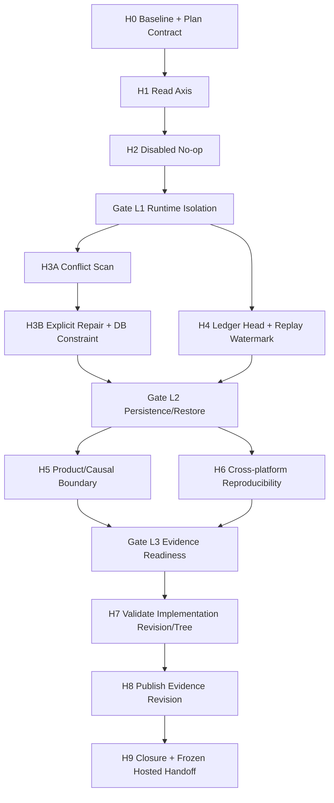
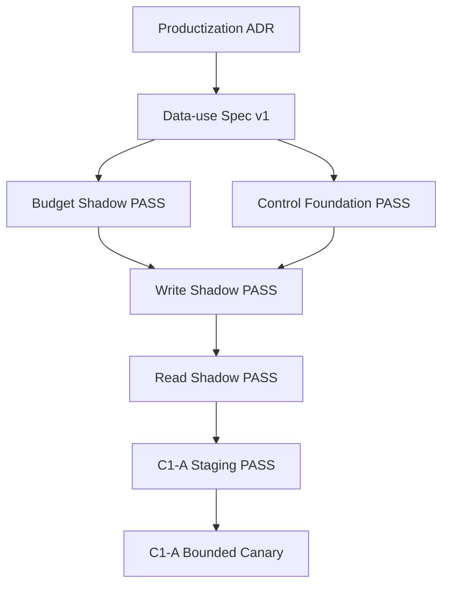
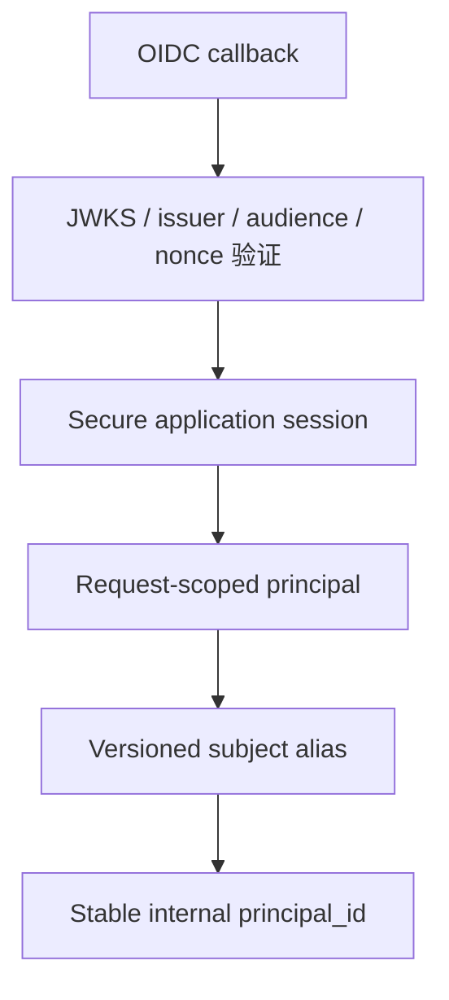
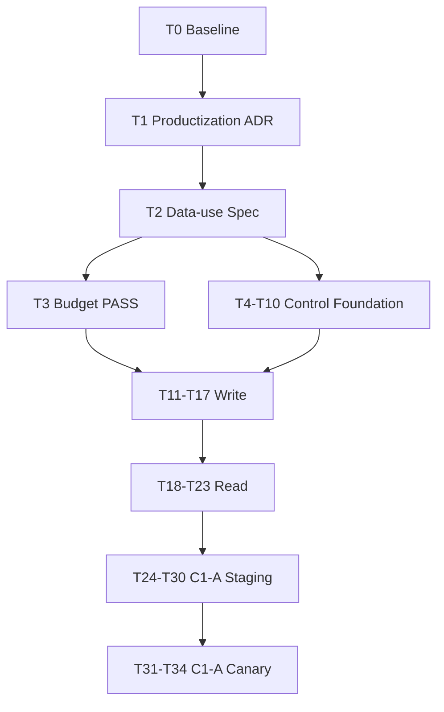

# Interview Agent 长期记忆下一阶段总计划：Local V1 Hardening、最终验收与 Hosted V2 保留路线

**Plan revision:** v0.4-detailed
**Supersedes:** v0.3（保留其全部目标、范围、不变量、H0-H9、Gate L1-L3、回滚与 Hosted V2 路线；本版修复评审发现的执行歧义）
**Document type:** Superseding Master Roadmap + Detailed Local V1 Hardening Execution Contract + Frozen Complete Hosted V2 Appendix
**Plan date:** 2026-08-04
**Target repository:** `luoz6/Interview-Agent`
**Execution baseline:** `2b8cde040fb554288839b46e0cc95a15e42adab3`
**Remote baseline:** `origin/master=2b8cde040fb554288839b46e0cc95a15e42adab3`（2026-08-04 复核）
**Inherited plan:** `2026-08-03-long-term-memory-production-shadows-consumption-and-promotion.md`
**Inherited plan revision:** `v0.2-revised`
**Inherited source SHA-256:** `de0afe41e815b8befbd56ae4acdd5ed7e07540a0baffd3d06bdca4e6542c3227`
**Review source SHA-256:** `9bc732abb6339cfd2ce3e4032635a4be30c521edaf948810d66a2eb6add3abab`
**Planning timezone:** America/Los_Angeles
**Implementation authorization:** `AUTHORIZED_BY_USER`

## 0. 总结论

当前 `master` 已合入 Local V1 长期记忆主体实现，但下一阶段不应直接进入 Hosted V2，也不能继续保持“全部完成、无需后续任务”的验收口径。

本计划把下一阶段固定为：

```text
Local V1 Hardening
  → validate one immutable implementation revision/tree
  → publish evidence in a documentation-only revision
  → verify the publication revision through an external remote ref/status
  → Local V1 Closure
  → Hosted V2 Roadmap remains retained but FROZEN / NO_GO_FOR_NOW
```

当前状态：

```text
PLAN_STATUS=EXECUTED_AND_CLOSED
LOCAL_V1_IMPLEMENTATION=FEATURE_COMPLETE
LOCAL_V1_HARDENING=COMPLETE
LOCAL_V1_FINAL_ACCEPTANCE=PASS
LOCAL_V1_DEFAULT=DISABLED
LOCAL_V1_REAL_CANDIDATE_USE=PROHIBITED
LOCAL_V1_REAL_PROVIDER_EVALUATION=NOT_RUN
REAL_PROVIDER_EVALUATION=NOT_RUN
HOSTED_V2=NO_GO_FOR_NOW
HOSTED_V2_IMPLEMENTATION=NOT_AUTHORIZED
PRODUCTION_SHADOW=NOT_AUTHORIZED
PRODUCTION_CANARY=NOT_AUTHORIZED
LOCAL_HARDENING_IMPLEMENTATION=AUTHORIZED
VALIDATED_IMPLEMENTATION_REVISION=e6b8f29d25276f17c874d07cebc15565bad37492
VALIDATED_IMPLEMENTATION_TREE=354d3d0a1ad99bfef57fd51244d1f5358442c79f
EVIDENCE_PUBLICATION_REF=refs/tags/local-v1-hardening-v0.4-accepted
H0=PASS
H1=PASS
H2=PASS
GATE_L1=PASS
H3=PASS
H4=PASS
GATE_L2=PASS
H5=PASS
H6=PASS
GATE_L3=PASS
H7=PASS
H8=PASS
H9=PASS
NEXT_REQUIRED_TASK=NONE
OPTIONAL_FUTURE_TRACK=HOSTED_PRODUCTIZATION_REDECISION
INHERITED_PLAN_CONTENT=HASH_VERIFIED
INHERITED_PLAN_EXECUTION_STATE=FROZEN_NON_EXECUTABLE
INHERITED_BASELINE=HISTORICAL
REACTIVATION_REQUIRES=NEW_TASK_0_BASELINE_AND_APPROVED_ADR
```

> **执行关闭记录（2026-08-04）：** H7 在 immutable implementation
> revision/tree 上完成 Windows/Ubuntu、PostgreSQL、frontend 与 browser
> 验收；H8 仅发布 sanitized 文档、证据、manifest 与契约测试；H9 保留
> Hosted V2 为 `NO_GO_FOR_NOW`。真实候选人和真实 Provider 均未运行。

> **授权边界：** 本文是实施计划，不是代码修改或生产处理授权。只有明确批准 Local V1 Hardening 后，才可执行 Tasks H0-H9。Hosted V2 仍受原 Productization ADR 和 Data-use Spec 门禁约束；完成 Local V1 Hardening 不自动授权 Hosted V2、真实候选人处理、真实 Provider、Production Shadow 或 C1-A Canary。

## 1. 与旧计划的继承关系

### 1.1 完整包含规则

本文件包含两部分：

1. **Part I：Local V1 Hardening 与最终验收**，即当前可讨论、待批准的下一阶段；
2. **Part II：Hosted Multi-user V2 v0.2-revised 完整原文**，从“`BEGIN COMPLETE INHERITED PLAN`”标记后开始，未删减原计划的目标、范围、20 项固定决策、Tasks 0-34、依赖、生产窗口、门禁、回滚和 DoD。

Part II 不是摘要，也不是外部引用。其原始内容完整嵌入本文件，以避免下一阶段 Plan 丢失此前路线。Part II 的原文保持 hash-verified，但执行状态固定为 `FROZEN_NON_EXECUTABLE`；任何实现者不得直接从 Part II 选取 Task 开始开发。

### 1.2 冲突优先级

若 Part I 的当前状态与 Part II 的历史基线描述不同，按以下优先级解释：

1. Part I 只更新当前 revision、Local V1 实施状态和新增 Hardening 前置阶段；
2. Part II 的 Hosted V2 安全不变量、固定决策、禁止项、Tasks 0-34 和晋级门禁继续完整有效；
3. Part I 不降低 Part II 的任何 Privacy、Security、Fairness、Consent、identity、single-axis、zero-injection 或证据要求；
4. Part II 中基于 `6969efa...` 的历史工程描述必须在其 Task 0 重新核验，不能覆盖本文件对 `2b8cde...` 的当前审查结论；
5. Hosted V2 当前为 `NO_GO_FOR_NOW`，因此 Part II 只作为保留路线，不进入实施。

### 1.3 Frozen Appendix Overlay

| Part II 原文内容 | v0.4 的当前解释 | 是否允许执行 |
|---|---|---:|
| 基于 `6969efa...` 的 runtime conflict | 历史描述；必须在 Hosted 重启时重新审查 | 否 |
| Hosted Task 18 Read Shadow 修复 | H1 已提前修复 Local V1 基线；未来只重新验证，不自动重复实现 | 否 |
| Local V1 尚未完成的描述 | 由 Part I 最终 closure 状态替代 | 否 |
| Hosted Productization ADR | 当前仍为 `NO_GO_FOR_NOW`，必须新建或正式替代决策 | 仅决策准备 |
| Hosted Tasks 4-34 | 身份、Consent、Production Shadow、C1-A 路线完整保留 | 否 |
| Production window / Canary | 仍需独立批准、绝对暴露上限和外部证据 | 否 |

机器可读解释固定为：

```text
INHERITED_PLAN_CONTENT=HASH_VERIFIED
INHERITED_PLAN_EXECUTION_STATE=FROZEN_NON_EXECUTABLE
INHERITED_BASELINE=HISTORICAL
REACTIVATION_REQUIRES=NEW_TASK_0_BASELINE_AND_APPROVED_ADR
```

### 1.4 与 Local V1 Completion Plan 的关系

`2026-08-04-local-v1-long-term-memory-completion.md` 的 Tasks 0-14 已形成主体实现，但其完成证据不能直接关闭本计划：

- Acceptance 绑定 `3d4dcc...`，当前 `master` 为 `2b8cde...`；
- Acceptance 写有 `NEXT_REQUIRED_TASK=NONE`，RC manifest 仍写 `EXACT_EVIDENCE_RETEST_AND_REMOTE_MATCH_REQUIRED`；
- 当前代码仍存在 Read Shadow 配置绕过、disabled 模式 Read Shadow 活动、exclusive taxonomy 数据库约束不足、operator ledger 未进入 readiness 等缺口；
- 本次独立复现为 `1941 passed / 182 skipped / 1 failed`，不能替代仓库记录的 PostgreSQL 完整验收；
- 锁定依赖在 Linux 上不能按 README 的 `--require-hashes` 命令完成安装。

因此 Local V1 Completion Plan 保留为历史实现基线，Tasks H0-H9 负责补齐其验收缺口，不重复重做已经通过的功能。

### 1.5 v0.3 → v0.4 完整修订映射

| v0.3 内容 | v0.4 处理 | 完整性 |
|---|---|---|
| H0-H9 | 全部保留并增加输入、文件、步骤、负向测试、证据、停止条件和 DoD | 保留并细化 |
| Gate L1-L3 | 全部保留，增加 gate owner、必需证据和禁止绕过条件 | 保留并收紧 |
| H1/H2 并行 | 改为 `H0 → H1 → H2`，避免共同修改 runtime wiring 的合并冲突 | 修正 |
| H3 自动确定 winner | 改为 H3A 扫描、H3B 显式决议；歧义冲突不得自动选择 | 修正 |
| H4 ledger readiness | 增加 ledger head、数据库 watermark、prefix compatibility、进程间锁与探针协议 | 补齐 |
| H7/H8 同一 exact revision | 改为 implementation revision/tree + evidence publication revision + 外部 remote ref | 修正自引用 |
| `NEXT_REQUIRED_TASK=...OR_NONE` | 拆成 `NEXT_REQUIRED_TASK=NONE` 与 `OPTIONAL_FUTURE_TRACK=...` | 修正 |
| Part I 无计划契约测试 | H0 新增 `tests/test_long_term_memory_local_v1_hardening_plan.py` | 补齐 |
| 平台范围未固定 | 固定 Windows 11 / Ubuntu 24.04 LTS、Python 3.11、Node 22 LTS 等最小矩阵 | 补齐 |
| Part II 可被误读为当前正文 | 标为 frozen appendix，并增加 overlay | 收紧 |

## 2. 下一阶段目标

### 2.1 Primary Goal

在不扩大产品范围、不处理真实候选人数据、不启用 Hosted V2 的前提下，把 Local V1 从“主体功能完成但验收口径存在缺口”推进到“运行时不变量、数据库约束、恢复防复活、跨平台安装和 exact-revision 证据全部闭环”。

### 2.2 Success Criteria

只有同时满足以下条件，才可把 Local V1 重新标记为 `COMPLETE`：

1. `read_shadow` 启动配置严格为单轴：`write=false, read=true, local_consume=false`；
2. Read Shadow 不调用 extractor，不创建 proposal，不写 proposal outbox，不改变 Provider Context；
3. `disabled` 模式不执行 proposal、select、shadow、injection、digest 或 principal-memory metric；
4. exclusive taxonomy key 在数据库层保证每个 Principal 最多一个 active fact；
5. durable Local Consume readiness 强制要求受保护、可写、可恢复的 operator tombstone ledger；
6. Local Consume 的间接因果风险被明确标记，不被复用为 Hosted C1-A、公平性或真实候选人证据；
7. Windows 与 Linux 的声明支持范围内，锁定依赖安装、Python、PostgreSQL、前端构建和浏览器测试可复现；
8. Acceptance、manifest、handoff 和 README 状态一致；全量测试绑定同一 `validated_implementation_revision` 与 `validated_implementation_tree`；
9. evidence publication revision 只能修改证据、文档和允许的计划契约文件，并通过独立 publication verification；其 exact remote commit 由外部 ref/status 记录，禁止让 Git 文件自引用自己的 commit hash；
10. validated implementation revision 与已批准的 candidate branch 匹配，publication ref 与 remote 匹配，且无 PostgreSQL 测试残留、端口残留或未归属修改；
11. 所有非声明项继续保持 `NOT_AUTHORIZED` 或 `PROHIBITED`。

### 2.3 交付物总表

| Deliverable | 形成阶段 | 内容 | 是否可包含敏感内容 |
|---|---|---|---:|
| Hardening execution baseline | H0 | revision、tree、branch、dirty path ownership、工具版本、支持矩阵 | 否 |
| Part I plan contract test | H0 | 锁定 H0-H9、Gate L1-L3、不变量、冻结边界与继承 SHA | 否 |
| Runtime isolation test bundle | H1-H2 | config 负向矩阵、zero proposal、zero disabled activity | 否 |
| Exclusive conflict scan report | H3A | 只记录计数、taxonomy key 类别与决议状态 | 否 |
| Explicit repair decision artifact | H3B | operator/user 选择的 opaque fact refs 与审批状态 | 不得含 fact value |
| Migration and invariant evidence | H3B | schema version、index/check 名称、并发与重启结果 | 否 |
| Ledger readiness evidence | H4 | schema/head/watermark/lock/fsync/replay 状态和 gate codes | 否 |
| Causal boundary contract | H5 | 允许声明、禁止声明、source/runtime firewall 结果 | 否 |
| Reproducibility matrix | H6 | Windows/Linux clean install、工具版本和命令结果 | 否 |
| Raw validation bundle | H7 | 运行日志、JUnit/JSON、计数、清理结果，保存在 Git 外 | 受控，不进 Git |
| Sanitized acceptance + manifest | H8 | implementation revision/tree、counts、hashes、non-claims | 否 |
| External publication verification | H8 | publication ref → exact remote commit、tag/status 验证 | 否，Git 外或 CI 状态 |
| Closure/handoff | H9 | Local V1 状态、可选未来路线、Hosted frozen 状态 | 否 |

### 2.4 本阶段成功不代表什么

本阶段成功只证明 Local V1 在声明的 trusted-local、default-off 边界内完成 hardening；它不证明 Hosted 身份、多用户隔离、生产数据使用、真实候选人适用性、模型公平性、招聘决策可靠性、生产容量或 C1-A 安全性。

## 3. 本阶段范围

### 3.1 In Scope

- `read_shadow` 配置矩阵和 proposal runtime 的 fail-closed 修复；
- disabled 模式零长期记忆工作与零长期记忆指标；
- exclusive taxonomy key 的数据库级唯一约束、迁移与并发修复；
- operator tombstone ledger 的 readiness、写入、恢复与故障门禁；
- Local Consume 现有语义的证据边界与产品声明修正；
- Windows/Linux 路径契约、hash-locked 依赖和测试可复现性；
- exact-revision 全量验收、manifest、handoff 和状态闭环；
- implementation/evidence 双 revision 模型、外部 publication ref 与机器可读 closure；
- Part I 计划契约测试和 v0.3 继承完整性验证；
- 完整保留 Hosted V2 v0.2-revised 路线。

### 3.2 Out of Scope

- OIDC、账户、Hosted Session、Hosted Principal 或多租户隔离实现；
- Hosted Consent Ledger v2 和生产候选人 Memory Center；
- 真实候选人、真实简历、真实 interview transcript 或生产数据库；
- 真实 Provider 提取、真实模型质量评估或人工读取真实源内容；
- Production Write Shadow、Production Read Shadow 或 C1-A Canary；
- 把 Local Consume 改造成 Hosted C1-A；
- 新增 taxonomy、自由文本记忆、skill inference 或自动确认；
- 把长期记忆连接到评分、证据、报告、PDF、推荐、排名或招聘决定；
- GSAP、前端全站动效或 `/interview` Focus Mode；
- 借 Hardening 名义重构无关模块或清理用户已有修改。

### 3.3 允许修改的路径类别

| Category | Expected paths | 规则 |
|---|---|---|
| Plan/contracts | `docs/superpowers/plans/`、对应 plan test | H0 首先纳入仓库；不得改写 Part II frozen 原文 |
| Runtime/config | `app/services/memory_config.py`、`runtime.py`、graph wiring | 仅 H1/H2；不得顺带重构 Interview runtime |
| Proposal/read shadow | `principal_memory_proposals.py`、`principal_memory_shadow.py`、相关脚本 | 只实现单轴与 no-op |
| Persistence | PostgreSQL Principal Memory store、正式 migration registry/schema contract | 只实现 taxonomy key/invariant/watermark 所需变更 |
| Deletion/operations | Principal deletion、operations/readiness、local CLI | 只实现 ledger readiness/replay/locking |
| Dependency/tooling | requirements source/lock、README/runbook、preflight scripts | 不改变产品功能 |
| Tests | Principal Memory unit/integration/browser/plan/manifest tests | 必须与所属任务一起提交 |
| Evidence | 新 hardening acceptance/manifest/handoff | 只能在 H8 publication revision 修改 |

### 3.4 受保护路径与 change budget

- H0 必须记录所有已有 dirty paths 和 owner；未归属文件不得被格式化、删除、重命名或覆盖。
- 每个 Task 的 commit 只能包含该任务明确列出的 production files、tests 与 docs。
- 若修改超过所属任务路径类别，必须更新 baseline 的 change map 并重新审查，不得用“顺手清理”解释。
- schema、lock file、runtime wiring 和 evidence publication 分属不同 commit 类别，不允许混在一个不可审计提交中。

## 4. 不可修改的不变量

### Invariant 1：默认关闭

```text
MEMORY_LONG_TERM_MODE=disabled
MEMORY_LOCAL_PRINCIPAL_ENABLED=false
MEMORY_TRUSTED_LOCAL_PRINCIPAL_MEMORY_API_ENABLED=false
MEMORY_LONG_TERM_WRITE_SHADOW_ENABLED=false
MEMORY_LONG_TERM_READ_SHADOW_ENABLED=false
MEMORY_LONG_TERM_LOCAL_CONSUMPTION_ENABLED=false
```

任何 legacy alias、migration default、README 示例或测试 fixture 都不得静默开启上述能力。

### Invariant 2：模式矩阵固定

| Mode | Write gate | Read gate | Local Consume gate | Proposal | Read selection | Prompt injection |
|---|---:|---:|---:|---:|---:|---:|
| `disabled` | false | false | false | 0 | 0 | 0 |
| `write_shadow` | true | false | false | proposed-only | 0 | 0 |
| `read_shadow` | false | true | false | 0 | would-select only | 0 |
| `local_consume` | true | true | true | 不新增自动提取语义 | bounded local selection | follow-up only |

`read_shadow + write=true`、`write_shadow + read=true`、`disabled + 任一 gate=true` 必须在配置加载或启动 preflight 时失败。

### Invariant 3：Disabled 是零活动，不只是零注入

Disabled 模式不得：

- resolve Local Principal；
- 构造 proposal event；
- 调用 proposal extractor；
- 调用 retriever/select；
- 计算 Principal Memory Provider Context digest；
- 发布 `principal_read_shadow` 或 local-consume 指标；
- 创建 outbox/effect/metric row；
- 改变 Provider Context、评分、报告或 Knowledge。

### Invariant 4：Read Shadow 是严格单轴

Read Shadow 只允许读取 user-confirmed、active、未过期、未撤回、未删除、Consent 与 controls 当前允许的 canonical fact，计算 would-select 聚合，并返回原始 Provider Context。

硬断言：

```text
proposal_event_count=0
proposal_outbox_count=0
extractor_call_count=0
provider_context_before_sha256=provider_context_after_sha256
injection_count=0
```

### Invariant 5：用户事实权利不回退

view、declare、confirm、correct、reject、revoke、temporary disable、session ignore、safe export、delete 和 tombstone replay 行为不得因 Hardening 退化。模型 proposal 仍不得自动激活。

### Invariant 6：exclusive key 由数据库保证

对于 `EXCLUSIVE_TAXONOMY_KEYS`，同一 `(deployment_id, principal_id, exclusive_scope_key)` 最多存在一个 `status='active'` 的 fact。固定结构为：

```text
taxonomy_key TEXT NOT NULL
exclusive_scope_key TEXT NULL
```

- exclusive taxonomy：`exclusive_scope_key = taxonomy_key`；
- non-exclusive taxonomy：`exclusive_scope_key = NULL`；
- 两个字段都必须由 canonical fact parser/store 内部派生，API 或任意调用方不得自行传入；
- 应用 advisory lock 仍可保留，但不得作为唯一保证；
- 遇到两个独立 active 值且没有无歧义 supersedes 链时，不得自动选择 winner。

### Invariant 7：删除防复活是 readiness 条件

若 Local Consume 使用 durable PostgreSQL，则 operator tombstone ledger 必须配置、位于 workspace 之外、可写、持久化成功且可用于 restore replay。readiness 必须比较 external ledger head 与数据库 applied watermark；缺失、不可写、落后、分叉或锁失败必须返回稳定 gate code，并阻止 `local_consume_ready=true`。

external ledger 最少暴露 content-free 状态：

```text
ledger_schema_version
ledger_event_count
ledger_head_sha256
```

数据库最少保存：

```text
last_applied_ledger_event_count
last_applied_ledger_head_sha256
```

### Invariant 8：Local Consume 证据边界

现有 Local Consume 可在本地、默认关闭、非真实候选人的实验边界内保留 `interview_language`、`target_role_family` 和 `learning_goal` 的 follow-up 辅助语义；但它会改变追问路径，因此：

- 不得声称其对最终评分或报告“因果无影响”；
- 现有直接依赖隔离测试只能证明 score/report 代码没有直接 memory dependency；
- 不得把该证据复用为 Hosted C1-A、公平性、正式评分面试或生产候选人授权；
- Hosted C1-A 仍按 Part II 收缩为语言预填确认和 accessibility UI/interaction，历史 fact 不进入 Provider Prompt。

### Invariant 9：证据使用 implementation/publication 双 revision

不得把 `3d4dcc...`、`496e03...` 或本次审查环境的部分结果直接当作未来修复 revision 的最终 PASS。证据模型固定为：

```text
validated_implementation_revision
validated_implementation_tree
evidence_publication_ref
evidence_publication_verification_source
```

- H7 全量测试只验证一个 immutable implementation commit/tree；
- H8 publication commit 只能增加/修改证据、文档、manifest、handoff 和其契约测试；
- publication commit 若触碰 application code、migration、dependency lock、runtime script 或测试逻辑，H7 全量测试作废；
- tracked Git 文件不得包含自己的最终 commit hash；publication exact SHA 由远端 tag、CI status 或外部 release record 记录；
- publication commit 只需重新执行 publication schema/hash/privacy/plan contracts、文档测试和 `git diff --check`。

### Invariant 10：ledger append 必须跨进程序列化

进程内 `RLock` 不是 durable serialization。所有 ledger append/replay 必须通过同一 sibling lock file 取得 OS-level exclusive lock：POSIX 使用 `fcntl`，Windows 使用 `msvcrt` 等标准库等价机制；必须有有限超时、稳定 gate code、双进程测试和崩溃后锁释放验证。若实现无法在两个声明支持平台证明该行为，则 Local V1 必须固定为单 writer process 并由 preflight 强制验证，不能口头假设。

### Invariant 11：计划与状态码是机器可测试契约

Part I 的 H0-H9、Gate L1-L3、Invariant 1-11、最终 DoD、frozen Hosted 标志及稳定 gate codes 必须由计划契约测试锁定。不得在没有对应 Spec/Plan 修订的情况下引入新的规范性 `MEM-*` 编号。

## 5. 已确认问题与优先级

| Priority | Finding | Current evidence | Required outcome |
|---|---|---|---|
| P0 | Read Shadow 可同时开启 Write gate | config 只要求 Read gate，proposal builder 接受 `read_shadow` | 错误组合启动失败，proposal/outbox 恒为 0 |
| P1 | disabled 仍可执行 Read Shadow observe 并发指标 | Shadow Service 无 mode no-op 边界 | disabled 零 Shadow 工作、零指标 |
| P1 | exclusive taxonomy 只按完整 `normalized_fact` 唯一 | 不同语言值可同时 active | 数据库按 taxonomy key 唯一 |
| P1 | operator ledger 未进入 Local Consume readiness | ledger path 为可选，ready 可在无 ledger 时为 true | durable readiness 强制 ledger |
| P1 | Local Consume 与 Hosted C1-A 因果口径混淆 | follow-up Provider 会接收三类 fact | 明确 local experiment 与 hosted production 证据隔离 |
| P1 | Acceptance 与 manifest 状态矛盾 | `NEXT_REQUIRED_TASK=NONE` 对比 final gate 未关闭 | exact revision 状态统一 |
| P1 | v0.3 H7/H8 证据 commit 自引用 | 测试后写证据必然产生新 commit | 双 revision + 外部 publication ref |
| P1 | ambiguous exclusive conflicts 不能由时间或 ID 自动决定 | “确定性 winner”不等于用户语义正确 | 无歧义链自动修复；其余显式用户决议 |
| P1 | replay freshness 无状态算法 | readiness 无法判断旧备份是否落后 ledger | external head + DB watermark + divergence gate |
| P1 | ledger append 仅进程内锁 | 两个进程可能交错写 JSONL | OS-level lock 或 preflight 强制单 writer |
| P2 | Windows 路径测试在 Linux 失败 | `C:\\...` 被当作跨平台绝对路径 | 固定 host-native path contract |
| P2 | hash-locked Linux 安装失败 | `uvicorn[standard]` 的 `uvloop` 未完整锁定 | Windows/Linux clean install PASS |
| P2 | Part I 无计划契约测试 | 仓库只锁 Part II/历史计划 | 新增 H0-H9 plan contract test |

## 6. 阶段、门禁与依赖



| Task | Depends on | Primary owner | May modify | Exit gate |
|---|---|---|---|---|
| H0 | none | Change Owner + QA | plan/baseline/tests only | `LOCAL_HARDENING_BASELINE=PASS` |
| H1 | H0 | Backend/Runtime | config/proposal/read tooling/tests | `READ_SHADOW_SINGLE_AXIS=PASS` |
| H2 | H1 | Backend/Runtime | runtime/graph/shadow/metrics/tests | `DISABLED_ZERO_ACTIVITY=PASS` |
| H3A | Gate L1 | Data/Backend | scan tool/report only; no mutation | `EXCLUSIVE_FACT_SCAN=PASS_OR_REPAIR_REQUIRED` |
| H3B | H3A | Data/Backend + Local User | explicit repair + forward migration | `EXCLUSIVE_FACT_DB_INVARIANT=PASS` |
| H4 | Gate L1 | Backend/Operations | ledger/readiness/replay/migration/tests | `TOMBSTONE_LEDGER_READINESS=PASS` |
| H5 | Gate L2 | Product + QA + Backend | limited contract/docs/tests | `LOCAL_CONSUME_EVIDENCE_BOUNDARY=PASS` |
| H6 | Gate L2 | Release/QA | tooling/dependency/tests/docs | `CLEAN_ENV_REPRODUCIBILITY=PASS` |
| H7 | Gate L3 | Independent QA | no tracked modifications during run | `LOCAL_MEMORY_IMPLEMENTATION_ACCEPTANCE=PASS` |
| H8 | H7 | Release Owner | evidence/docs/manifest contracts only | `EVIDENCE_PUBLICATION=PASS` |
| H9 | H8 | Change Owner | closure/handoff only | `HOSTED_V2_HANDOFF=RETAINED_NO_GO` |

H1 与 H2 必须串行，因为它们共享 runtime wiring；H3 与 H4 可在 Gate L1 后准备，但 Gate L2 必须在两者合并后的同一 candidate revision 上执行。H5 与 H6 可并行准备，但 Gate L3 必须在组合 revision 上执行。任何 `BLOCKED`、`CONTINUE_OBSERVATION` 或 required `NOT_RUN` 都不得进入下一门禁。

### 6.1 状态机

每个 Task 只能处于以下状态之一：

```text
NOT_STARTED
IN_PROGRESS
BLOCKED
READY_FOR_GATE
COMPLETE
SUPERSEDED
```

每个 Gate 只能输出：

```text
PASS
BLOCKED
CONTINUE_OBSERVATION
```

`COMPLETE` 只能在对应 Gate 为 `PASS` 后写入。`CONTINUE_OBSERVATION` 不是 PASS，也不允许“条件晋级”。

### 6.2 建议提交序列

| Commit class | 内容 | 禁止混入 |
|---|---|---|
| P0 | v0.4 Plan、execution baseline、plan contract test | runtime behavior |
| R1 | H1 Read Shadow 单轴 | disabled no-op、DB migration |
| R2 | H2 disabled no-op | persistence/ledger |
| D1 | H3A scan/read-only tooling | data mutation |
| D2 | H3B repair/migration/constraint | H4 ledger |
| O1 | H4 ledger/watermark/readiness | dependency lock |
| C1 | H5 causal/product contract | production enablement |
| B1 | H6 cross-platform lock/tooling | evidence PASS 声明 |
| I1 | frozen implementation candidate | documentation-only evidence updates |
| E1 | H8 evidence publication | application code、migration、lock、test logic |
| X1 | H9 closure/handoff | Hosted implementation |

### 6.3 计划工期估算

以下是单人串行开发的工程量估算，不是日期承诺；若仓库基线变化或 H3A 发现歧义数据，工期需重估。

| Work package | Estimate | 主要不确定性 |
|---|---:|---|
| H0 | 0.5-1.0 天 | dirty worktree 归属、plan contract |
| H1-H2 + Gate L1 | 1.5-2.5 天 | runtime fixture、PostgreSQL zero-count 证明 |
| H3A | 0.5-1.0 天 | 现存冲突数量 |
| H3B + Gate L2 DB 部分 | 1.5-3.0 天 | 显式用户决议、migration registry |
| H4 + Gate L2 restore 部分 | 2.0-3.5 天 | 跨平台锁、watermark/divergence、restore drill |
| H5 | 0.5-1.0 天 | 现有文档声明范围 |
| H6 | 1.0-2.0 天 | 多平台 lock generation/CI 可用性 |
| H7-H9 | 1.0-2.0 天 | 全套测试时长、PostgreSQL/Chromium 环境 |
| **Total** | **8-15 个工程日** | 不含等待用户决议、审批或 Hosted 路线 |

## 7. 执行任务

### Task H0：冻结执行基线和证据边界

**目标：** 在修改前建立可重复、不可伪造的当前基线。

**Input：** v0.4 Plan、当前 Git checkout、remote metadata、v0.3 历史 acceptance/manifest、附件评审结论。

**Expected files：**

- Create `docs/superpowers/plans/2026-08-04-long-term-memory-local-v1-hardening-and-hosted-v2-roadmap.md`；
- Create `docs/local-v1-long-term-memory-hardening-execution-baseline.md`；
- Create `tests/test_long_term_memory_local_v1_hardening_plan.py`；
- Update plan index/README only if repository already maintains one；
- 不修改 production behavior。

**实施步骤：**

1. 记录 `EXECUTION_START_HEAD`、`EXECUTION_START_TREE`、`origin/master`、ahead/behind、branch、merge-base、dirty paths 与路径 owner；
2. 核验远端 `master` 是否仍为 `2b8cde040fb554288839b46e0cc95a15e42adab3`；若已变化：
   - 输出 `BASELINE_MOVED=BLOCKED`；
   - 生成 changed-path inventory；
   - 重新核验 H1-H6 涉及文件；
   - 修订 Plan 的 execution baseline 后才能继续；
3. 将 v0.4 Plan 纳入仓库正式计划路径；Part II 原文重新计算 SHA-256，必须继续等于 `de0afe...3227`；
4. 新建 Hardening baseline，不覆盖或篡改历史 acceptance；
5. 将下列结果标为 `HISTORICAL_INDEPENDENT_REVIEW_ONLY`，不得写成修复后 PASS：
   - Python：`1941 passed / 182 skipped / 1 failed`；
   - Vite production build：PASS；
   - browser：NOT_REPRODUCED；
   - Linux hash-locked install：FAIL；
6. 固定支持矩阵和 executable 选择规则：
   - Python 必须由 activated venv 或显式 runner 解析为 3.11.x；
   - 在任何 pytest 前输出 `python --version`、`sys.executable` 类别、pip 版本；
   - Node 必须为 22 LTS（20 LTS 可作为兼容矩阵，不作为 v0.4 主要验收）；
   - 记录 PostgreSQL major/pgvector、npm、Playwright/Chromium 版本；
   - 不记录机器私有绝对 executable path、DSN password 或 ledger path；
7. 建立 dirty-path ownership map：`path`、`owner`、`task_allowed`、`preserve=true`；未知 owner 时停止修改重叠路径；
8. 建立 command registry，每条命令记录 purpose、required env、timeout、expected exit、cleanup owner；
9. 新增 Plan contract test，至少断言：
   - H0-H9 连续且 Gate L1-L3 存在；
   - Invariant 1-11 与最终 DoD 存在；
   - H2 依赖 H1；
   - H3 包含 scan → explicit resolution → constraint；
   - H7/H8 使用双 revision 模型；
   - `NEXT_REQUIRED_TASK=NONE` 与 `OPTIONAL_FUTURE_TRACK` 分离；
   - Part II frozen/non-executable；
   - inherited source SHA 与仓库原计划一致；
   - Hosted V2、Production Shadow、真实候选人、真实 Provider、C1-A 未授权；
   - 不出现未经 Spec 定义的规范性 `MEM-*` 编号；
10. 执行 secret、private path、DSN、Principal/Session/fact locator 扫描；
11. 记录 baseline 测试的精确 node ID、OS、Python major/minor、PostgreSQL 是否配置、skip 分类，不把环境 blocker 混为产品失败。

**Machine-readable baseline fields：**

```text
plan_revision
execution_start_head
execution_start_tree
remote_master_head
branch
ahead
behind
dirty_path_count
protected_dirty_path_count
python_major_minor
python_executable_source=explicit|venv|PATH
node_major
postgres_major
pgvector_version
browser_available
historical_test_result_class
implementation_authorized=false
hosted_v2=no_go_for_now
```

**Required commands：**

```text
git rev-parse HEAD
git rev-parse HEAD^{tree}
git status --short
git rev-list --left-right --count HEAD...origin/master
python --version
python -m pip --version
node --version
npm --version
python -m pytest tests/test_long_term_memory_local_v1_hardening_plan.py -q
git diff --check
```

**Failure/stop conditions：** baseline moved、Part II SHA mismatch、Python unsupported、dirty overlap unresolved、发现 secret/真实候选人数据、plan contract FAIL。

**Evidence：** baseline Markdown、plan contract test output、sanitized dirty-path ownership summary。

**DoD：** 上述字段齐全；所有 protected path 有 owner；历史结果未被误标 PASS；计划已进入正式路径；Contract test 通过。

**Exit gate：** `LOCAL_HARDENING_BASELINE=PASS`。

### Task H1：修复 Read Shadow 严格单轴和零 proposal

**主要文件：**

- `app/services/memory_config.py`
- `app/services/principal_memory_proposals.py`
- `app/services/runtime.py`
- `app/services/principal_memory_retrieval.py`
- `scripts/principal_memory_read_shadow.py`
- Read Shadow/config/proposal/runtime tests

**Input：** H0 PASS；mode/gate 当前实现；existing Read Shadow 300-case matrix；proposal event/outbox schema。

**Design decision：** mode 是权威状态，gate 只能验证该 mode 的唯一合法组合，不能把多个 gate 当成可自由组合的 capability flags。

**合法配置矩阵：**

| Mode | local principal | trusted-local API | Write | Read | Local consume | 结果 |
|---|---:|---:|---:|---:|---:|---|
| `disabled` | false | false | false | false | false | valid |
| `write_shadow` | 按现有受控契约 | false | true | false | false | valid |
| `read_shadow` | 按现有受控契约 | false | false | true | false | valid |
| `local_consume` | true | true | true | true | true | valid, trusted-local only |
| 其他任意组合 | any | any | any | any | any | startup/config error |

**实施步骤：**

1. `read_shadow` 强制 `read=true, write=false, local_consume=false`；
2. `write_shadow` 强制 `write=true, read=false, local_consume=false`；
3. `disabled` 与 gate 冲突也在 config load/startup 时失败，不允许 silent downgrade；
4. proposal builder 的 mode allowlist 收缩为真正 proposal-producing mode；`read_shadow` 无论 gate 环境如何都返回 no proposal；
5. 更新 `scripts/principal_memory_read_shadow.py`，不再要求 Write gate；脚本 preflight 必须拒绝 dual-axis；
6. Read Shadow runtime wiring 不实例化、不调用 extractor，不创建 proposal requested event、proposal effect、outbox row、worker claim 或 fact write；
7. selection 只能读 user-confirmed eligible fact，计算 would-select 聚合；不得把 selected fact 或 derived memory block写回 Provider Context；
8. 对 Provider Context 同时做 canonical SHA-256 和对象深比较；测试 fixture 必须防止共享 mutable reference 造成假 PASS；
9. 增加错误配置负向矩阵，包括 env alias、大小写/空格、legacy keys 和全部双 gate 组合；
10. 增加 finished session、replayed session、concurrent completion、zero-fact、revoked Consent、disabled controls 等场景；
11. Local Consume 的手工 user declaration 和 follow-up-only 边界不得被破坏；
12. 更新相关 runbook/config sample，任何 Read Shadow 示例均为 Write=false。

**Required tests：**

- Unit/config：`read_shadow + write=true`、`write_shadow + read=true`、`read_shadow + consume=true`、`disabled + any=true` 均失败；
- Proposal：`build_proposal_event_if_eligible()` 在 Read Shadow 中无条件返回 `None`；
- Runtime：finished/replayed/concurrent session 不创建 proposal event；
- Extractor：spy call count 为 0，Null/real adapter 均不被构造；
- PostgreSQL：proposal/outbox/effect/fact write/worker claim 增量均为 0；
- Read matrix：300-case 保持 zero injection、zero cross-principal、zero exclusive conflict selection；
- Provider firewall：before/after context canonical hash 与 deep equality 均通过；
- Regression：Write Shadow proposal-producing 行为与 Local Consume 手工声明不回退。

**Required hard assertions：**

```text
proposal_event_count=0
proposal_outbox_count=0
proposal_effect_count=0
proposal_worker_claim_count=0
fact_write_count=0
consent_write_count=0
control_write_count=0
extractor_call_count=0
injection_count=0
provider_context_before_sha256=provider_context_after_sha256
```

**Suggested focused test paths：**

```text
tests/test_memory_config.py
tests/test_memory_config_source_audit.py
tests/test_principal_memory_proposals.py
tests/test_principal_memory_read_shadow_runtime.py
tests/test_principal_memory_shadow.py
tests/test_local_principal_memory_read_shadow_matrix.py
tests/test_principal_memory_prompt_isolation.py
```

**Evidence：** negative matrix JSON、focused pytest output、live PostgreSQL delta counts、Provider Context hash report。

**Rollback：** 任何异常时把 mode 恢复为 `disabled`，不删除已存在事实。

**DoD：** 合法矩阵只有表中四行；所有非法组合在启动前失败；Read Shadow 所有写路径为 0；Write Shadow/Local Consume 既有行为回归通过。

**Exit gate：** `READ_SHADOW_SINGLE_AXIS=PASS`。

### Task H2：建立 disabled 模式零长期记忆活动

**主要文件：**

- `app/services/runtime.py`
- `app/services/principal_memory_shadow.py`
- `app/services/memory_metrics.py`
- graph/runtime integration tests

**Input：** H1 合并后的最终模式矩阵；当前 `get_principal_memory_shadow_service()`、durable graph dependency wiring 与 metrics implementation。

**Design decision：** 使用两层 fail-closed：runtime 不挂载 + service 防御性 no-op。这样既避免日常开销，也防止未来错误 wiring 绕过。

**实施步骤：**

1. service factory 在 `disabled` 返回 `None` 或明确的 no-op binding；durable graph 不挂载 Principal Memory Shadow dependency；
2. graph 节点只在正式 Read Shadow mode 调用 observe，不以“对象非空”作为唯一条件；
3. `PrincipalMemoryShadowService.observe()` 仍在入口检查 mode；非 Read Shadow 直接返回 content-free no-op result，不解析 identity、不访问 store、不发指标；
4. disabled 模式不构造 Principal identity resolver、extractor、retriever、consumer、shadow service、proposal worker 或 ledger readiness dependency；若通用 runtime 必须构造 store，测试须证明未调用；
5. 不计算 memory-specific provider context digest；不得发布 `principal_read_shadow`、`principal_local_consume` 或其他 Principal Memory metric；
6. 不创建 event/effect/outbox/fact/control/Consent/metric row；
7. 正常 interview、follow-up、score、report、Knowledge、PDF 输出与 H0 baseline 等价；
8. 覆盖 FastAPI lifespan、durable graph、in-memory runtime、PostgreSQL runtime、report worker/replay 等入口；
9. 增加防回归 source audit，禁止未来重新出现无条件 observe wiring。

**Required assertions：**

```text
identity_resolve_calls=0
fact_store_calls=0
consent_store_calls=0
control_store_calls=0
retriever_calls=0
shadow_observe_calls=0
extractor_calls=0
consumer_calls=0
proposal_events=0
proposal_outbox=0
proposal_effects=0
principal_memory_metrics=0
provider_context_unchanged=true
```

**Focused tests：**

- factory/wiring unit tests；
- graph integration with spies；
- PostgreSQL query counter 或 instrumented store；
- full interview deterministic fixture；
- metric store delta test；
- startup with all default env unset；
- unsupported legacy alias must not activate services。

**Failure interpretation：** 只要任一 counter > 0，Task 失败；不得以“没有注入”或“只是失败指标”降级解释。

**Evidence：** runtime dependency snapshot、zero-call counter JSON、normal interview equivalence hashes、focused/full regression counts。

**Rollback：** 保持所有长期记忆 gate 为 false；若 no-op 修改影响 interview 主链路，回滚代码但仍维持 disabled 配置，不允许回退到“运行 Shadow 但不注入”。

**DoD：** 两层保护均存在；默认 env 下所有 Principal Memory counter 为 0；in-memory/PostgreSQL/graph 结果一致；正常业务回归无差异。

**Exit gate：** `DISABLED_ZERO_ACTIVITY=PASS`。

### Gate L1：Runtime Isolation Review

只有 H1、H2 都通过，才可修改 Principal Memory schema 或 readiness。

Gate 结果只能是：

```text
PASS
BLOCKED
CONTINUE_OBSERVATION
```

**Required evidence：** H1 negative mode matrix、H1 live PostgreSQL zero-write report、H2 zero-call report、Provider Context equality、focused regression、`git diff --check`、changed-path ownership check。

**Gate owner：** 独立 QA/Reviewer；H1/H2 实现者不得单独批准。

**Hard stop：** 任一 Read Shadow write/extractor/injection、任一 disabled memory call/metric、正常 interview 输出漂移、未知 dirty overlap。

### Task H3：把 exclusive taxonomy 唯一性下沉到数据库

**主要文件：**

- `app/services/postgres_principal_memory.py`
- PostgreSQL schema contract/migration files
- lifecycle/correction/PostgreSQL concurrency tests

**Input：** Gate L1 PASS；canonical taxonomy contract；existing facts schema；migration registry/schema contract；live isolated PostgreSQL DSN。

**核心安全决定：** “确定性”不等于“语义正确”。两个独立 active exclusive values 没有可信 supersedes 链时，migration 不得按 `created_at`、fact ID、lexicographic order 或“最新值”自动选择 winner。

#### H3A：只读冲突扫描与分类

**Expected files：** read-only scan script/query、tests、sanitized report schema；不得修改事实。

**步骤：**

1. 在 schema change 前扫描所有 active facts；
2. 使用 canonical fact parser 内部派生 `taxonomy_key`，解析失败单独计数并 BLOCK；
3. 将 rows 分类为：
   - `NO_CONFLICT`：每个 exclusive scope 0/1 个 active；
   - `UNAMBIGUOUS_SUPERSEDES_CHAIN`：有完整、无环、同 scope 的明确纠正链，可证明唯一 current fact；
   - `AMBIGUOUS_MULTIPLE_ACTIVE`：两个或更多独立 active facts；
   - `INVALID_TAXONOMY_PAYLOAD`：无法 canonical parse；
   - `CROSS_SCOPE_CHAIN`：supersedes 指向不同 Principal/deployment/key；
4. 报告只包含 deployment/fact 的安全 opaque hash、taxonomy key 类别、数量、chain validity、resolution required；不得包含 fact value、Principal locator 或原 JSON；
5. 若只有 `NO_CONFLICT`，允许进入 H3B schema backfill；
6. 若有 `UNAMBIGUOUS_SUPERSEDES_CHAIN`，生成 proposed repair set，必须由 operator 审核后执行；
7. 若有其他类别，输出 `EXCLUSIVE_FACT_REPAIR_REQUIRED` 并停止自动 migration。

**H3A exit：**

```text
EXCLUSIVE_FACT_SCAN=PASS
```

或：

```text
EXCLUSIVE_FACT_SCAN=REPAIR_REQUIRED
SCHEMA_INSTALL=BLOCKED
```

#### H3B：显式决议、schema migration 与最终约束

**Schema design：**

```sql
taxonomy_key TEXT NOT NULL,
exclusive_scope_key TEXT NULL
```

派生规则：

```text
canonical parser -> taxonomy_key
taxonomy_key in EXCLUSIVE_TAXONOMY_KEYS -> exclusive_scope_key=taxonomy_key
otherwise -> exclusive_scope_key=NULL
```

建议 partial unique index：

```sql
CREATE UNIQUE INDEX <migration_owned_name>
ON principal_memory_facts (
    deployment_id,
    principal_id,
    exclusive_scope_key
)
WHERE status = 'active'
  AND exclusive_scope_key IS NOT NULL;
```

**步骤：**

1. 通过正式 forward-only migration 添加 nullable columns；不得只依赖 store constructor `_ensure_schema()`；
2. 在受控 transaction/batch 中 backfill canonical `taxonomy_key` 与 `exclusive_scope_key`；调用方不可提交这两个字段；
3. 添加一致性 CHECK 或 migration verification：
   - canonical key 不为空；
   - exclusive key 的 scope key 必须等于 taxonomy key；
   - non-exclusive 的 scope key 必须为 NULL；
4. 对 `UNAMBIGUOUS_SUPERSEDES_CHAIN`：经 operator 批准后，在单事务中把 predecessor 标为 superseded，只保留链尾 active；
5. 对 `AMBIGUOUS_MULTIPLE_ACTIVE`：
   - 在 trusted-local Memory Center 展示候选值；
   - 由本地用户明确选择保留值或全部 revoke；
   - 决议记录只保留 safe refs/操作结果；
   - 未决议时 migration/readiness 保持 BLOCKED；
6. 对 invalid/cross-scope chain：修复 canonical data 或 lifecycle linkage；不得猜测；
7. 再次扫描为零冲突后创建 unique index；
8. confirm/correct 必须由 store-owned 单事务完成 predecessor supersede + replacement activate；
9. application advisory lock 保留以减少竞争，但 direct SQL/第二 writer 绕过时数据库仍拒绝；
10. migration 覆盖 empty schema、current clean、current conflicting、partial backfill、restart/idempotent、transaction rollback；
11. schema contract 和 migration registry 必须识别 index/check/columns；
12. downgrade 不删除事实：回滚策略是保持新 schema 并把 Local Consume 设为 disabled，而非逆向删除 migration。

**Required tests：**

- canonical parser 对每个 taxonomy key 产生稳定 key；
- API/store 拒绝调用方伪造 taxonomy/exclusive scope key；
- 两个不同 `interview_language` 并发激活，数据库最多一个成功；
- direct SQL 绕过 application lock 仍触发 unique violation；
- confirm/correct transaction 中第二步失败时 predecessor 仍 active；
- 同值幂等 correction 不产生重复 active；
- non-exclusive keys 仍按既定契约共存；
- ambiguous values 不自动 winner，migration 输出 BLOCKED；
- explicit user resolution 后 migration 可继续；
- supersedes chain cycle/cross-scope 被拒绝；
- empty/current/dirty/partial/restart migration 均通过；
- schema constructor 不能替代 migration，重启后约束仍有效；
- deletion/revoke/expiry 后 unique slot 可按契约重新使用。

**Evidence：** sanitized scan counts、resolution category counts、migration version/hash、index/check introspection、concurrency results、rollback proof、post-migration zero-conflict query。

**Stop conditions：** 任何 ambiguous conflict 未显式决议、backfill parse failure、跨 scope chain、migration runner 未拥有 schema、direct SQL 可绕过、rollback 丢失旧 active fact。

**DoD：** 数据集冲突归零；无 silent winner；columns/constraints/index 由正式 migration 安装；应用事务与 DB invariant 同时成立；live PostgreSQL restart 后仍成立。

**Exit gate：** `EXCLUSIVE_FACT_DB_INVARIANT=PASS`。

### Task H4：把 operator tombstone ledger 纳入 durable readiness

**主要文件：**

- `app/services/memory_config.py`
- `app/services/principal_memory_operations.py`
- `app/services/principal_memory_deletion.py`
- CLI/runbook/readiness/API tests

**Input：** Gate L1 PASS；existing deletion/tombstone services；protected ledger JSONL contract；live PostgreSQL；Windows/Linux filesystem semantics。

**Design decision：** external ledger 是备份之外的 deletion truth；数据库 watermark 是“已应用到哪里”的本地状态。readiness 只有在二者 head 一致时才为 ready。

#### H4.1 Ledger record 与 hash chain

每条 ledger event 使用 versioned canonical JSON；event 内容继续保持 opaque/minimal。每条记录至少包含：

```text
schema_version
event_index
previous_head_sha256
event_sha256
opaque_deployment_ref
opaque_principal_ref
deletion_cycle
completed_at
```

`event_sha256` 必须基于 canonical serialization；禁止保存 Principal ID、session ID、fact value、prompt、answer、resume、email、路径或 source excerpt。

ledger summary：

```text
ledger_schema_version
ledger_event_count
ledger_head_sha256
```

数据库 watermark：

```text
last_applied_ledger_event_count
last_applied_ledger_head_sha256
last_applied_at
```

#### H4.2 Readiness 状态算法

| External ledger | DB watermark | Gate | Ready |
|---|---|---|---:|
| 未配置 | any | `TOMBSTONE_LEDGER_REQUIRED` | false |
| 非 native absolute / workspace 内 | any | `TOMBSTONE_LEDGER_PATH_INVALID` | false |
| 不可读/不可写/不可 fsync | any | `TOMBSTONE_LEDGER_UNWRITABLE` | false |
| valid empty | empty/genesis | none | true |
| head == applied head | equal | none | true |
| external 是 DB watermark 的严格后继 | behind | `TOMBSTONE_REPLAY_REQUIRED` | false |
| DB count/head 不在 external prefix 中 | diverged | `TOMBSTONE_LEDGER_DIVERGED` | false |
| schema unsupported | any | `TOMBSTONE_LEDGER_SCHEMA_UNSUPPORTED` | false |
| lock acquisition timeout | any | `TOMBSTONE_LEDGER_LOCK_UNAVAILABLE` | false |
| replay residue > 0 | advanced/unknown | `TOMBSTONE_REPLAY_RESIDUE` | false |

**实施步骤：**

1. durable `local_consume` 强制 ledger；disabled 与明确的纯测试 in-memory mode 不强制；
2. ledger path 使用 host-native `Path.is_absolute()` 语义，并通过 resolved path 检查确保位于 repository/workspace 外；符号链接/ junction 解析后仍不得指回 workspace；
3. readiness/API 只返回 content-free gate code 与布尔状态，不返回实际 path、head hash、opaque refs；详细 head 仅进入本地 operator CLI 的受控输出；
4. preflight 写探针不修改真实 ledger：
   - 在同目录创建随机 sibling temp；
   - 写固定非候选人内容；
   - flush + fsync file；
   - 支持时 fsync directory；
   - 删除 temp；
   - 任一步失败均 fail-closed；
5. 建立 sibling lock file；所有 append、head scan、replay/watermark advance 使用同一 OS-level exclusive lock，带有限 timeout；
6. append 顺序：validate current head → build canonical event → append full line → flush/fsync → reread/verify new head → 返回 committed；
7. short write、torn trailing line、invalid JSON、hash mismatch 不得被静默跳过；readiness 输出 corrupted/diverged gate；
8. deletion 状态机固定为：online fence → purge/residue check → durable ledger append → tombstone completed；ledger append 失败时不得返回 completed；
9. restore 流程固定为：network isolated → load/verify full ledger → compare watermark → replay missing events → residue zero → atomically advance watermark → readiness PASS → release traffic；
10. replay idempotent，支持同一 Principal 多次 deletion cycle；旧 cycle 不能阻止新 cycle，也不能复活旧 facts；
11. watermark 必须位于 migration-owned PostgreSQL relation；不能只保存在进程内或 ledger 同目录；
12. CLI 增加 `status/preflight/replay` content-free exit codes；dry-run 不改变 ledger/DB；execute 必须显式确认；
13. 删除/恢复 runbook 增加 lock timeout、corruption、divergence、old backup、partial replay 的操作步骤；
14. metrics 只允许低基数 gate code/count，不记录 path/head/ref。

**Required tests：**

- ledger missing/relative/workspace/symlink-back/unwritable blocked；
- sibling temp probe 不改变真实 ledger event count/head；
- append + fsync 成功后 head/count 正确；
- short write/torn line/invalid hash/schema mismatch blocked；
- 两进程并发 append 不交错、不丢 event，index 连续，hash chain 完整；
- 一个进程崩溃后 lock 可恢复；timeout 返回稳定 code；
- deletion ledger failure 不宣称 completed；retry 幂等；
- external ahead → `TOMBSTONE_REPLAY_REQUIRED`；equal → ready；diverged → hard block；
- old backup restore 后 replay missing events，facts/proposals/effects/outbox/cache/export refs residue 均为 0；
- multi-cycle delete/recreate/delete/replay 正确；
- readiness/API/metrics/logs 不泄漏 path/head/Principal/session/fact locator；
- Windows 11 与 Ubuntu 24.04 上 lock/path/fsync 契约均通过。

**Evidence：** ledger schema/hash-chain contract、preflight matrix、cross-process test、restore drill report、residue query counts、privacy scan。

**Stop conditions：** 无法在两个支持平台证明跨进程锁；ledger 不是 backup-external；divergence 无法解释；restore residue 非零；任何候选人内容进入 ledger/metrics/Git。

**Rollback：** 将 mode 设为 disabled；保留 ledger、watermark、tombstone 与 deletion fence；不得删除或截断 ledger。修复后从 verified head 恢复。

**DoD：** readiness 算法可判定 equal/ahead/diverged；append 跨进程安全；restore replay 在旧备份上 fail-closed；API/metrics content-free；live PostgreSQL 验证通过。

**Exit gate：** `TOMBSTONE_LEDGER_READINESS=PASS`。

### Gate L2：Persistence and Restore Review

Gate L2 必须在 live PostgreSQL 上执行 migration、并发 correction、delete-vs-write、backup restore 和 ledger replay。仅使用 mock 或 in-memory 结果不得 PASS。

**Required evidence：**

- H3A sanitized conflict scan；
- 所有 ambiguous conflict 的显式决议完成，未决数为 0；
- schema/migration introspection；
- direct SQL/concurrent correction invariant；
- H4 ledger preflight/lock/hash-chain/watermark matrix；
- isolated old-backup restore + replay + residue zero；
- PostgreSQL test relation cleanup count=0；
- secret/private-path scan PASS。

**Gate owner：** Data/Operations/QA 至少两种职责复核；实现者不能独自批准。

**Hard stop：** silent winner、migration-only `_ensure_schema()`、ledger divergence、non-zero residue、跨进程 append 未证明、真实数据库/真实候选人数据被使用。

### Task H5：固定 Local Consume 的产品与证据边界

**目标：** 修正文档和验收声明，不把现有 Local 实验能力误写为 Hosted C1-A 或公平性证据。

**Input：** Gate L2 PASS；`principal_memory_consume.py` 当前允许 keys；follow-up provider assembly；score/report/Knowledge source audits；existing docs/UI copy。

**允许的产品声明：**

```text
Local V1 is a trusted-local, default-off experiment.
Memory may influence follow-up generation only.
Score/report modules have no direct Principal Memory dependency.
No claim is made that changed interview trajectories are causally equivalent.
```

**禁止的产品声明：**

```text
fairness validated
score unaffected in all cases
report causally identical
production ready
candidate safe
Hosted C1-A equivalent
```

**实施步骤：**

1. 保持 Local Consume 默认关闭、trusted-local、非真实候选人边界；
2. 明确 `learning_goal`、`target_role_family` 可能改变 follow-up 路径；
3. 把 score/report isolation 表述限定为“无直接 memory dependency”；
4. 禁止声称不同 follow-up 路径的 score/report 因果等价；
5. 建立 sink allowlist：只有 follow-up generation adapter 可接收 local memory block；所有其他 provider/evaluator/report/prep/review paths 使用显式 deny；
6. 增加 source-level import/dependency test，禁止 score/report/evidence/PDF/Knowledge 直接依赖 consumer、retriever、fact store 或 memory block；
7. 增加 runtime spy test：相同当前 follow-up input、仅切换 memory block 时，只有 follow-up request 可变化；score/report 路径不得收到 block 或 safe ref；
8. 注意该测试不能证明后续候选人回答相同，因此文档必须保留 indirect causal risk；
9. 保持 evaluator、score、evidence、report、PDF、prep、review、Knowledge、public corpus、embedding、retrieval cache firewall；
10. Memory Center、README、operations doc、runbook、acceptance 使用一致提示：不是正式候选人生产功能；
11. 对外 API 不新增生产 enable 开关；`local_consume` 仍要求 explicit trusted-local controls；
12. Part II 的 Hosted C1-A 定义不变：语言预填需候选人确认，accessibility UI/interaction 独立，历史 fact 不进入 Provider Prompt；
13. 增加文案契约测试，禁止未来 acceptance 把 direct isolation 写成 causal equivalence。

**Required tests：**

- import/source graph firewall；
- follow-up provider receives only allowlisted bounded block；
- score/report/evaluator/PDF/Knowledge provider spies receive zero memory fields；
- local disabled/session ignore/control disable cause no follow-up memory block；
- prompt logs/metrics/traces 不包含 fact values；
- README/runbook/UI/acceptance status text 一致；
- Hosted Part II C1-A constraints unchanged。

**Evidence：** source dependency report、runtime sink matrix、documentation contract output、forbidden-field scan。

**Rollback：** 若无法证明 sink isolation，关闭 Local Consume；不删除 user facts/controls。

**DoD：** 只有 follow-up sink 可接收 bounded block；所有直接 firewalls 通过；文档无过度因果声明；Hosted 路线未被放宽。

**Exit gate：** `LOCAL_CONSUME_EVIDENCE_BOUNDARY=PASS`。

### Task H6：修复跨平台路径和 hash-locked 依赖

**固定支持矩阵：**

| Platform | Python | Node | npm | PostgreSQL | pgvector | Browser |
|---|---|---|---|---|---|---|
| Windows 11 x64 | 3.11.x | 22 LTS | lock-compatible | 16.x | 当前支持版本 | Playwright lock 对应 Chromium |
| Ubuntu 24.04 LTS x64 | 3.11.x | 22 LTS | lock-compatible | 16.x | 当前支持版本 | Playwright lock 对应 Chromium |

Node 20 LTS 可运行兼容回归，但不是本阶段 mandatory primary matrix。其他 OS/Python/Node 只能输出 `UNTESTED`，不阻塞本阶段，也不能自动声称支持。

**Input：** Gate L2 PASS；requirements source/lock；package locks；README/runbook；当前路径测试；clean environment runners。

**Dependency lock decision：** 保持一个统一 `requirements.lock.txt`，在受控 Linux Python 3.11 环境通过确定的 pip-tools 版本生成；对平台相关依赖使用明确 marker，使 Windows 安装跳过 `uvloop`、Linux 安装包含完整 hashes。若统一锁在两个平台不可证明，则通过独立 ADR 改为 platform lock files；不得临时手工补 hash。

**实施步骤：**

1. `MEMORY_PRINCIPAL_TOMBSTONE_LEDGER_PATH` 使用 host-native absolute path 契约；
2. 通用测试使用 `tmp_path.resolve()`；Windows 字面路径测试仅在 Windows 运行；Linux 使用 POSIX absolute path；
3. 路径测试覆盖 drive/root、UNC（Windows-only）、POSIX root（Linux-only）、relative、symlink/junction、workspace escape；
4. 在任何 test/install 前 fail-fast 验证 Python 3.11；不允许 PATH 意外选择 Python 3.8 后把语法错误误判为产品缺陷；
5. 固定 pip/pip-tools generator 版本和生成命令；requirements source 明确 `uvicorn[standard]` 的平台依赖策略；
6. 重新生成而非手工编辑 `requirements.lock.txt`；review lock diff，确认 `uvloop` 及其 hashes/marker 完整；
7. fresh virtual environment 执行：

   ```text
   python -m pip install --require-hashes -r requirements.lock.txt
   python -m pip check
   ```

8. 两个平台都从 empty venv 执行；不得复用全局 site-packages/cache 作为成功必要条件；可以使用 cache 加速，但必须至少一次 `--no-cache-dir` 验证；
9. `pip check` 后记录 dependency inventory hash，不公开机器私有路径；
10. 前端从锁文件执行 `npm ci`、production build、browser dependency preflight 和 `npm run test:browser`；
11. 记录 Python、pip、pip-tools、Node、npm、PostgreSQL、pgvector、Playwright/Chromium 版本；
12. 未安装 PostgreSQL/Chromium 或网络无法获取依赖时报告 `BLOCKED/NOT_RUN`，不能把 skip 当 PASS；
13. README 与 runbook 的支持矩阵、安装命令、Python version fail-fast 和 browser preflight 保持一致；
14. dependency lock source/hash generation 由 contract test 锁定，防止未来直接改 lock 不改 source。

**Required tests：**

- Windows path test + Linux path test；
- unsupported Python fail-fast：`PYTHON_VERSION_UNSUPPORTED`；
- executable/venv mismatch：`PYTHON_ENVIRONMENT_MISMATCH`；
- Windows clean hash install PASS；
- Ubuntu clean hash install PASS，确认 `uvloop` resolved；
- `python -m pip check` PASS；
- lock regeneration reproducible（相同 source/tool version 产生相同 normalized lock）；
- `npm ci`、frontend build、browser preflight/test PASS；
- docs commands 与 package scripts 一致；
- clean env 完成后未污染 repo，临时 venv/ports/processes 被清理。

**Evidence fields：**

```text
os_family
os_version
architecture
python_major_minor
python_executable_source
pip_version
lock_generator_version
requirements_lock_sha256
node_version
npm_version
package_lock_sha256
postgres_major
pgvector_version
playwright_version
chromium_revision
install_result
pip_check_result
frontend_build_result
browser_result
```

**Stop conditions：** 任一 mandatory platform 只能依赖未锁 transitive package；锁文件手工修补；Python 版本不符；required integration 被 skip；README 声称未测试平台受支持。

**Rollback：** 恢复上一有效 dependency source/lock pair；Local Consume 保持 disabled；不得仅恢复 lock 而保留不匹配 source。

**DoD：** 两个平台 clean install 与 pip check 通过；host-native path 契约通过；frontend/browser 在锁定版本可复现；版本和命令均记录。

**Exit gate：** `CLEAN_ENV_REPRODUCIBILITY=PASS`。

### Gate L3：Evidence Readiness Review

进入 H7 前必须确认：

- 所有 Hardening 代码和 migration 已冻结；
- clean install 在声明支持环境通过；
- PostgreSQL 与 Chromium 可用；
- test scope、revision、DSN 类别、端口和清理规则已登记；
- 没有真实候选人数据、真实 Provider credential 或生产 DSN。

**Additional requirements：**

- H5 direct-dependency/firewall 与文档声明 PASS；
- H6 Windows/Ubuntu mandatory matrix PASS；
- candidate commit 只包含已批准 H0-H6 paths；
- candidate worktree clean；
- raw H7 output 目录位于 Git 外且访问受控；
- evidence schema、sanitizer 与 publication allowlist 已冻结；
- implementation commit 不再接受功能修改；任何修改产生新 candidate 并重新过 L1/L2/L3 影响范围审查。

**Gate owner：** Release Owner + Independent QA。

**Hard stop：** required dependency/browser/PostgreSQL unavailable、candidate dirty、真实 Provider/production DSN、evidence sanitizer 未冻结、H5 仍有因果过度声明。

### Task H7：验证 immutable implementation revision 与 tree

**目标：** 在一个不再变化的 implementation commit/tree 上运行全部必需验收；原始运行输出保存在 Git 外，避免测试结果写回仓库后改变被验证 commit。

**Preconditions：** Gate L3 PASS；candidate worktree clean；candidate branch 已 push 或至少已形成 immutable commit；禁止真实 Provider/真实候选人/production DSN。

**Revision capture：**

```text
VALIDATED_IMPLEMENTATION_REVISION=$(git rev-parse HEAD)
VALIDATED_IMPLEMENTATION_TREE=$(git rev-parse HEAD^{tree})
```

H7 开始后若 `git status --short` 非空，或 HEAD/tree 改变，本次 run 立即失效。

**Environment preflight：**

1. Python 3.11.x；
2. clean venv；
3. isolated test PostgreSQL 16/pgvector，明确唯一 table prefix/schema；
4. Node 22 LTS；
5. Playwright/Chromium ready；
6. ports/process owners 登记；
7. production/provider credentials 不在环境中；
8. raw evidence directory 位于 repository 外。

**必须在同一 implementation revision 执行：**

```text
python -m pip install --require-hashes -r requirements.lock.txt
python -m pip check
python -m compileall -q app scripts tests
python -m pytest -q
npm ci
npm run build:frontend
npm run test:browser
git diff --check
```

Windows 与 Ubuntu 分别执行 install/platform-specific gates；完整 Python/PostgreSQL/browser 主验收至少在 Ubuntu mandatory runner 执行一次，并在 Windows 对平台相关路径、lock、CLI/browser 做对应 mandatory 验收。若团队选择两个平台都跑全套，manifest 分别记录 counts。

**验收矩阵必须包含：**

- config negative matrix；
- Read Shadow zero proposal/extractor/outbox/injection；
- disabled zero identity/retrieval/shadow/metric activity；
- Local Consume bounded follow-up-only 和直接依赖隔离；
- canonical taxonomy、lifecycle、Consent、controls、Safe Ref；
- exclusive-key live PostgreSQL concurrency；
- migration empty/current/dirty/repair/restart；
- deletion fencing、ledger failure、backup restore/replay；
- export completeness 与 forbidden-field scan；
- Memory Center desktop/mobile/keyboard/reduced-motion；
- Knowledge、Prompt、score、report、PDF、prep 和 review firewall；
- full repository regression；
- browser/port cleanup；
- PostgreSQL test relation residue 为 0；
- user-owned/unrelated files 未被修改。

**额外 mandatory checks：**

- plan contract 与 inherited SHA；
- exclusive conflict scan/resolution count 为 0 pending；
- DB columns/check/index introspection；
- ledger two-process append、head/watermark equal/ahead/diverged；
- publication sanitizer dry-run；
- full test skip classification；
- final worktree clean、HEAD/tree unchanged；
- listener/process/port residue=0。

**证据规则：**

1. 每项记录 PASS、BLOCKED、CONTINUE_OBSERVATION 或 NOT_RUN；
2. 任何 required 项为 BLOCKED/NOT_RUN，最终 gate 不得 PASS；
3. skipped tests 必须逐项归类为 conditional non-applicable 或 blocker；
4. real-provider test 可保持 NOT_RUN，因为仍未授权，但必须作为明确 non-claim；
5. raw evidence 可包含 test node names 与本地诊断，但必须位于 Git 外、受控、完成后按 policy 保留/删除；
6. tracked evidence 只记录 aggregate counts、validated revision/tree、工具版本、artifact hashes 和 sanitized fields；
7. 不把 DSN、secret、ledger path/head、Principal/Session/fact locator 写入 Git；
8. 所有 required tests 必须明确 `executed=true`；仅总 passed count 不足以证明 PostgreSQL/browser 实际运行；
9. skipped tests 逐项分类：
   - `CONDITIONAL_NON_APPLICABLE`：与本阶段明确无关；
   - `OPTIONAL_NOT_AUTHORIZED`：真实 Provider 等明确 non-claim；
   - `BLOCKER`：mandatory dependency 缺失；
10. 任何 blocker skip 都使 H7 FAIL。

**Raw evidence bundle 最少包含：**

```text
run_id
validated_implementation_revision
validated_implementation_tree
command_id
platform
tool_versions
started_at/ended_at
exit_code
passed/failed/skipped/deselected
required_test_executed
artifact_sha256
cleanup_result
```

**Failure handling：**

- 测试失败：修复代码后形成新 implementation commit，重新执行受影响 Gates 和完整 H7；
- 测试产生 tracked diff：本 run 失效，清理并重跑；
- cleanup 失败：run 为 BLOCKED，即使 tests passed；
- evidence 泄密：隔离/删除 artifact，Privacy review 后重跑；
- remote candidate 与本地 implementation commit 不同：BLOCKED。

**DoD：** 所有 mandatory commands/test families PASS；required skip=0；candidate HEAD/tree 全程不变；repo/DB/ports clean；raw bundle hashes 完整。

**Exit gate：** `LOCAL_MEMORY_IMPLEMENTATION_ACCEPTANCE=PASS`。

### Task H8：发布 evidence revision 并完成外部 remote verification

**目标：** 将 H7 raw bundle 转换为可提交的 sanitized evidence，同时避免 tracked manifest 自引用自己的 commit hash。

**Input：** H7 PASS raw bundle；validated implementation revision/tree；frozen sanitizer/schema；publication path allowlist。

**Publication allowlist：**

- new Hardening acceptance Markdown/JSON；
- new/updated Hardening manifest；
- README、runbook、handoff 的状态与命令说明；
- evidence/manifest/document contract tests；
- v0.4 plan status；
- 不得包含 application code、migration、requirements source/lock、runtime scripts、测试行为逻辑。

**实施步骤：**

1. 校验 raw bundle 的 artifact hashes、revision/tree、required test execution 与 cleanup；
2. 生成 sanitized acceptance Markdown/JSON，记录：
   - `validated_implementation_revision`；
   - `validated_implementation_tree`；
   - platform/tool matrix；
   - test counts 与 mandatory families；
   - skip classifications；
   - cleanup/residue；
   - non-claims/authorization state；
3. manifest 不记录自己的 commit hash；使用：

   ```text
   evidence_publication_ref=refs/tags/local-v1-hardening-v0.4-accepted
   evidence_publication_verification_source=external_remote_ref
   ```

4. 为 publication ref 选择不可变、唯一 tag 名；若 tag 已存在且不是本次 commit，必须 BLOCK，不得覆盖；
5. Acceptance、manifest、README、runbook、handoff 状态完全一致；
6. 保留所有历史 acceptance 原样，不回填其未运行的新测试；
7. 对 publication diff 执行 allowlist 检查；若触碰 implementation path，H7 作废并返回 Gate L3；
8. 执行 publication-only verification：

   ```text
   python -m pytest <plan/manifest/docs/evidence contract tests> -q
   python -m compileall -q <evidence scripts if changed>
   git diff --check
   privacy/secret/path/locator scan
   inherited Part II SHA check
   ```

9. 提交 evidence publication commit；
10. 创建 annotated/signed（如流程支持）tag `local-v1-hardening-v0.4-accepted` 指向 publication commit；tag message 记录 validated implementation revision/tree 与 manifest SHA；
11. push publication commit 与 tag；通过 `git ls-remote`、CI status 或 release system 外部验证：
    - remote branch 包含 publication commit；
    - tag 精确指向 publication commit；
    - publication commit 的 parent history 包含 validated implementation revision；
12. 外部 verifier 记录 publication exact SHA；该记录不写回同一 tracked manifest，避免自引用；
13. 若必须修订任何证据文件，创建新的 publication commit/tag version，并重新跑 publication checks；只要 implementation tree 未变，无需重跑 H7；
14. 若任何代码/migration/lock/test logic 改变，必须形成新 implementation revision 并完整重跑 H7。

**Closure state：**

```text
LOCAL_V1_IMPLEMENTATION=FEATURE_COMPLETE
LOCAL_V1_HARDENING=COMPLETE
LOCAL_V1_FINAL_ACCEPTANCE=PASS
LOCAL_V1_DEFAULT=DISABLED
LOCAL_V1_REAL_CANDIDATE_USE=PROHIBITED
REAL_PROVIDER_EVALUATION=NOT_RUN
HOSTED_V2=NO_GO_FOR_NOW
NEXT_REQUIRED_TASK=NONE
OPTIONAL_FUTURE_TRACK=HOSTED_PRODUCTIZATION_REDECISION
```

**Required tests：** manifest schema；cross-document state equality；allowlist；artifact hash；privacy scan；remote ref verification；tag immutability；implementation tree unchanged；historical evidence untouched。

**Stop conditions：** publication diff 含 implementation path、tag collision、remote mismatch、sanitizer leak、manifest/README 状态矛盾、attempt to amend repeatedly to self-record commit hash。

**Evidence：** sanitized acceptance/manifest、publication contract output、external remote verification record/tag/status。

**DoD：** implementation revision/tree 与 H7 一致；publication 仅证据/文档；external ref 精确指向 publication commit；所有状态一致；无自引用。

**Exit gate：** `EVIDENCE_PUBLICATION=PASS`，随后 `LOCAL_V1_HARDENING=COMPLETE`。

### Task H9：关闭本阶段并保留 Hosted V2 路线

**Input：** H8 external publication verification PASS；all cross-document states consistent。

**实施步骤：**

1. 记录 Local V1 Hardening 已关闭，但不把 Hosted V2 改为 approved；
2. 重新验证 Part II source SHA；保留全部内容和原 Productization/Data-use 门禁；
3. 若未来重启 Hosted V2，先重新执行 Part II Task 0，并重新打开/替代 Productization ADR；
4. 只有新的 ADR 明确 `APPROVED`，才可进入 Part II Task 2 及其后续授权流程；
5. Local V1 facts、Consent 或 tombstone 不得被自动迁移为 Hosted Principal 数据；迁移需要独立 Spec、Consent 与 mapping plan；
6. Local Consume 的生产证据不得复用到 Hosted Write、Read 或 C1-A；
7. 输出稳定状态：

   ```text
   NEXT_REQUIRED_TASK=NONE
   OPTIONAL_FUTURE_TRACK=HOSTED_PRODUCTIZATION_REDECISION
   HOSTED_V2=NO_GO_FOR_NOW
   INHERITED_PLAN_EXECUTION_STATE=FROZEN_NON_EXECUTABLE
   ```

8. 建立未来 reactivation checklist：
   - fetch 最新 remote；
   - 新建 Hosted baseline；
   - 重新核验 Part II 历史文件/接口；
   - 产品、Privacy、Security、Legal、Budget 重新决策；
   - 明确 Local→Hosted 数据完全不自动迁移；
   - 新 implementation authorization；
9. 关闭本阶段任务板/issue 时只关闭 H0-H9，不关闭 Hosted roadmap；
10. handoff 说明 safe rollback 仍是 mode=disabled，且 ledger/tombstone/migration 必须保留。

**Required tests/checks：** Part II SHA；frozen flags；cross-doc state equality；no Hosted enable config；no Local→Hosted migration path；publication ref still valid。

**DoD：** Local V1 closure 与 Hosted no-go 同时清楚；机器可读 next/optional 状态无歧义；未来 reactivation 不能绕过 Task 0/ADR。

**Exit gate：** `HOSTED_V2_HANDOFF=RETAINED_NO_GO`。

## 8. 最终 DoD

以下 56 项全部满足，下一阶段才算完成。任何 required 项不得用“后续补充”关闭：

**Baseline/Plan**

1. v0.4 Plan 已进入正式仓库路径；
2. Part I plan contract test PASS；
3. Part II inherited source SHA 完全一致；
4. execution start HEAD/tree/remote/branch 已冻结；
5. 用户已有 dirty paths 均有 owner 且未受影响；
6. Python/Node/PostgreSQL/browser 支持矩阵已固定；
7. 历史独立测试结果明确标为 historical，不冒充本阶段 PASS；

**Runtime isolation**

8. Read Shadow 错误双轴配置启动失败；
9. Write Shadow 错误双轴配置启动失败；
10. disabled + 任一 gate=true 启动失败；
11. Read Shadow proposal event 为 0；
12. Read Shadow proposal outbox/effect/worker claim 为 0；
13. Read Shadow extractor 调用为 0；
14. Read Shadow fact/Consent/control write 为 0；
15. Read Shadow Provider Context canonical digest 与 deep equality 完全相等；
16. 300-case Read Shadow matrix zero injection；
17. disabled identity/retrieval/shadow/extractor/consumer/injection 为 0；
18. disabled fact/Consent/control store calls 为 0；
19. disabled Principal Memory metrics 为 0；
20. 正常 interview/follow-up/score/report 基线不回退；

**Exclusive facts / database**

21. `taxonomy_key` 与 `exclusive_scope_key` 由 canonical parser/store 派生；
22. 调用方不能伪造派生 key；
23. H3A conflict scan 覆盖全部 active facts；
24. ambiguous active conflicts 未被自动选择 winner；
25. ambiguous conflicts 的显式用户/operator 决议 pending=0；
26. supersedes chain cycle/cross-scope 被拒绝；
27. exclusive taxonomy key 由数据库 partial unique invariant 保证；
28. direct SQL 绕过应用锁仍不能产生两个 active；
29. concurrent correction 最多一个 active exclusive fact；
30. correction supersede/activate 保持单事务；
31. non-exclusive coexistence 未回退；
32. migration empty/current/dirty/partial/restart/rollback 全通过；
33. migration registry/schema contract 正式拥有 columns/check/index；

**Deletion ledger / restore**

34. operator ledger 是 durable Local Consume readiness 必需项；
35. ledger path 为 workspace 外 host-native resolved absolute path；
36. preflight probe 不修改真实 ledger；
37. ledger 不可写/不可 fsync/lock timeout 时 fail-closed；
38. ledger event hash chain、count、head 验证通过；
39. 两进程 append 不交错、不丢失；
40. external head == DB watermark 才 ready；
41. external ahead 触发 replay required；
42. divergence/corruption hard block；
43. deletion ledger append 失败不宣称 completed；
44. backup restore/replay 防复活与 residue zero 通过；
45. multi-cycle deletion/replay 幂等；
46. readiness/API/metrics/logs 不泄漏 path/head/locator/content；

**Product/evidence boundary**

47. Local Consume 间接因果边界已准确记录；
48. score/report/evaluator/PDF/Knowledge 等无直接 memory dependency；
49. memory block 只进入 allowlisted follow-up sink；
50. Hosted C1-A 定义未被 Local 行为放宽；

**Reproducibility/acceptance**

51. Windows 11 与 Ubuntu 24.04 host-native path/lock 测试通过；
52. hash-locked clean install 与 `pip check` 在两平台通过；
53. full Python/live PostgreSQL、frontend build、browser mandatory matrix 通过，required skip=0；
54. PostgreSQL relation、process、listener 与端口残留为 0；
55. Acceptance/manifest/README/runbook/handoff 状态一致；H7 绑定同一 implementation revision/tree，H8 publication 仅证据/文档，external ref 精确匹配 remote；
56. Hosted V2、真实候选人、真实 Provider、Production Shadow、C1-A Canary 和 GA 仍未授权。

## 9. 回滚与停止条件

| Failure | Immediate action | Data handling | Resume condition |
|---|---|---|---|
| Read Shadow 产生 proposal/outbox | mode 设为 `disabled`，停止 H1 | 保留 facts，不执行提取 | root cause 与负向测试通过 |
| disabled 出现 memory metric/activity | 禁止发布 RC | 不删除用户事实 | zero-activity integration PASS |
| migration 发现 ambiguous exclusive facts | 停止 schema install | 只生成 sanitized category/count；不选 winner | 本地用户显式决议并复扫为零 |
| unique migration 失败 | 回滚当前 transaction | 旧 schema 与 facts 保持 | empty/current/dirty 全通过 |
| ledger 缺失或不可写 | `local_consume_ready=false` | 禁止完成删除声明 | protected ledger preflight PASS |
| ledger head divergence/corruption | 禁止 Local Consume 与 restore release | 不截断、不重写 ledger | operator investigation + verified chain/watermark |
| ledger lock timeout | fail-closed | 保持 deletion fence，稍后重试 | lock owner 退出且双进程 test PASS |
| restore replay 不完整 | 禁止启动 Local Consume | 保持 deletion fence | replay 达到零 residue |
| clean install 失败 | final acceptance BLOCKED | 不更改运行配置 | 两个支持 OS 安装 PASS |
| required test skipped | final acceptance BLOCKED | 不作完成声明 | 依赖可用并重跑 |
| implementation revision/tree 改变 | H7 证据作废 | 保留历史 raw bundle为 failed/superseded | 新 candidate 完整重跑 H7 |
| publication diff 触碰代码/migration/lock/test logic | publication BLOCKED | 不发布 tag | 返回 Gate L3/H7 |
| publication ref 与 remote 不同 | 不关闭 H8 | 保留 validated implementation 证据 | immutable remote ref match |
| 发现真实数据或 secret | 立即停止并隔离 artifact | 按安全流程处理 | Security/Privacy 允许恢复 |
| Hosted 范围被意外启用 | 全部回到 disabled | 不迁移 Local 数据 | 新 ADR/Data-use approval |

## 10. 执行后的允许状态

本计划完成后只允许得出：

```text
LOCAL_V1=HARDENED_AND_EXACTLY_ACCEPTED
LOCAL_V1_DEFAULT=DISABLED
LOCAL_V1_USE=TRUSTED_LOCAL_ONLY
LOCAL_V1_CAUSAL_CLAIM=NO_DIRECT_SCORE_REPORT_DEPENDENCY_ONLY
REAL_CANDIDATE_USE=PROHIBITED
REAL_PROVIDER_EVALUATION=NOT_RUN
HOSTED_V2=NO_GO_FOR_NOW
PRODUCTION_SHADOW=NOT_AUTHORIZED
C1A_CANARY=NOT_AUTHORIZED
```

不得自动推出：

```text
HOSTED_V2_APPROVED
PRODUCTION_READY
FAIRNESS_VALIDATED
REAL_CANDIDATE_AUTHORIZED
C1A_AUTHORIZED
GENERAL_AVAILABILITY
```

稳定 closure fields：

```text
NEXT_REQUIRED_TASK=NONE
OPTIONAL_FUTURE_TRACK=HOSTED_PRODUCTIZATION_REDECISION
INHERITED_PLAN_EXECUTION_STATE=FROZEN_NON_EXECUTABLE
```

## 11. 稳定 Gate Code Registry

以下 code 是本阶段机器可读契约。新增 code 必须同步 Plan、tests、docs 和 API contract，不得临时拼接自由文本。

| Code | Owner | Meaning | Fail closed action |
|---|---|---|---|
| `BASELINE_MOVED` | H0 | remote/current baseline changed | stop and re-review |
| `PYTHON_VERSION_UNSUPPORTED` | H0/H6 | Python not 3.11.x | no tests/acceptance |
| `PYTHON_ENVIRONMENT_MISMATCH` | H0/H6 | wrong interpreter/venv | recreate env |
| `READ_SHADOW_AXIS_INVALID` | H1 | illegal mode/gate combination | startup fails |
| `READ_SHADOW_WRITE_ACTIVITY` | H1 | proposal/write/extractor observed | mode disabled |
| `DISABLED_MEMORY_ACTIVITY` | H2 | any memory call/metric in disabled | RC blocked |
| `EXCLUSIVE_FACT_REPAIR_REQUIRED` | H3A | ambiguous/invalid active facts | schema install blocked |
| `EXCLUSIVE_FACT_INVARIANT_FAILED` | H3B | DB allows duplicate active scope | Local Consume disabled |
| `TOMBSTONE_LEDGER_REQUIRED` | H4 | durable mode has no ledger | readiness false |
| `TOMBSTONE_LEDGER_PATH_INVALID` | H4 | relative/workspace/resolved path invalid | readiness false |
| `TOMBSTONE_LEDGER_UNWRITABLE` | H4 | probe/append/fsync fails | readiness false |
| `TOMBSTONE_LEDGER_LOCK_UNAVAILABLE` | H4 | interprocess lock timeout | readiness false/retry |
| `TOMBSTONE_LEDGER_SCHEMA_UNSUPPORTED` | H4 | unknown ledger version | readiness false |
| `TOMBSTONE_REPLAY_REQUIRED` | H4 | external head ahead of DB | isolate and replay |
| `TOMBSTONE_LEDGER_DIVERGED` | H4 | DB watermark not ledger prefix | hard block/investigate |
| `TOMBSTONE_REPLAY_RESIDUE` | H4 | deleted data remains after replay | traffic blocked |
| `CAUSAL_BOUNDARY_VIOLATION` | H5 | unsupported claim or sink dependency | Local Consume disabled |
| `CLEAN_INSTALL_FAILED` | H6 | mandatory platform lock install fails | H7 blocked |
| `MANDATORY_TEST_NOT_RUN` | H7 | required family missing/skipped | acceptance blocked |
| `IMPLEMENTATION_REVISION_CHANGED` | H7 | HEAD/tree changed during run | run invalid |
| `PUBLICATION_SCOPE_VIOLATION` | H8 | evidence commit changes implementation | H7 invalid/restart |
| `PUBLICATION_REMOTE_MISMATCH` | H8 | ref/tag not exact remote commit | closure blocked |

## 12. 详细测试与证据矩阵

| Area | Unit | Integration | Live PostgreSQL | Browser | Cross-platform | Required evidence |
|---|---:|---:|---:|---:|---:|---|
| Plan/baseline | ✓ | — | — | — | ✓ | plan contract + SHA |
| Mode matrix | ✓ | ✓ | optional | — | ✓ | negative matrix |
| Read zero-write | ✓ | ✓ | ✓ | — | primary runner | counters + context hashes |
| Disabled zero-activity | ✓ | ✓ | ✓ query delta | — | primary runner | spy/query/metric zero report |
| Taxonomy derivation | ✓ | ✓ | ✓ | Memory Center decision flow if needed | primary runner | parser + schema report |
| Exclusive migration | ✓ | ✓ | mandatory | optional | primary runner | scan/repair/index/concurrency |
| Ledger path/lock | ✓ | ✓ | watermark mandatory | — | Windows + Ubuntu | probe/2-process/hash chain |
| Backup restore/replay | ✓ | ✓ | mandatory | — | Ubuntu primary | residue zero report |
| Local Consume firewall | ✓ source | ✓ runtime | bounded | optional UI contract | primary runner | sink matrix + non-claim |
| Dependency locks | — | clean env | client available | browser install | Windows + Ubuntu | versions/hashes/results |
| Memory Center regression | contract | API | durable mode | mandatory desktop/mobile/keyboard | primary browser runner | Playwright report |
| Full repository | all | all | mandatory marked tests | mandatory | primary + platform checks | counts/skip classification |
| Publication | schema | cross-doc | — | — | runner independent | allowlist/privacy/remote ref |

### 12.1 Required PostgreSQL test isolation

- 使用 test-only DSN 和唯一 prefix/schema；禁止 production/staging DSN；
- preflight 验证 database identity 与 allowlisted host；
- migration/repair 在 disposable clone/isolated schema 先执行；
- 测试前后记录 matching relations 数量；结束必须为 0；
- delete-vs-write、correction concurrency、ledger replay 使用不同 Principal opaque fixtures；
- fixture 不含真实候选人数据；
- cleanup failure 使 gate BLOCKED。

### 12.2 Browser acceptance minimum

- Memory Center desktop/mobile；
- keyboard-only declare/correct/revoke/delete；
- reduced motion；
- disabled/control/session-ignore UI state；
- ambiguous exclusive conflict 的 explicit user resolution（仅当 H3A fixture 构造冲突）；
- no raw Principal/fact/ledger locator in DOM、URL、console、network error；
- test runner 自主启动/停止 services，结束 listener=0。

### 12.3 Privacy scan forbidden patterns

Tracked evidence、logs、metrics、screenshots、test artifacts 中禁止出现：

```text
POSTGRES_DSN with credentials
provider API key/token
ledger absolute path
principal_id/session_id/fact_id raw locator
resume/interview answer/prompt/excerpt
email/phone/name/device/network identifier
raw fact value or memory block
```

## 13. Evidence Schema 与 publication protocol

### 13.1 Implementation acceptance summary

```json
{
  "schema_version": "local-v1-hardening-acceptance-v1",
  "validated_implementation_revision": "<git commit>",
  "validated_implementation_tree": "<git tree>",
  "platforms": [],
  "commands": [],
  "mandatory_test_families": {},
  "skip_classification": {},
  "cleanup": {},
  "critical_artifact_hashes": {},
  "privacy_scan": "PASS",
  "local_v1_final_acceptance": "PASS|BLOCKED",
  "non_claims": []
}
```

该 JSON 只是字段计划；执行时必须由正式 JSON schema 和 contract test 固定。不得在计划阶段伪造实际 hash/count。

### 13.2 Publication manifest

```json
{
  "schema_version": "local-v1-hardening-publication-v1",
  "validated_implementation_revision": "<from H7>",
  "validated_implementation_tree": "<from H7>",
  "evidence_publication_ref": "refs/tags/local-v1-hardening-v0.4-accepted",
  "evidence_publication_verification_source": "external_remote_ref",
  "publication_commit_self_hash_recorded_in_manifest": false,
  "publication_scope": "docs_evidence_contracts_only",
  "hosted_v2": "NO_GO_FOR_NOW"
}
```

### 13.3 External verification record

外部 CI/release status 至少记录：publication ref、resolved remote commit、validated implementation revision/tree、manifest SHA、verification time、verifier identity/role、remote match。此记录不回写同一 publication commit。

## 14. 角色与审批职责

| Role | Responsibilities | Cannot approve alone |
|---|---|---|
| Change Owner | baseline、scope、commit sequencing、final closure | 自己实现的 Gate |
| Backend/Runtime | H1/H2/H3/H4 code/tests | L1/L2 final PASS |
| Local User/Product Owner | ambiguous fact semantic resolution、H5 claims | DB technical invariant |
| Data/DB Reviewer | migration、constraint、rollback、residue | product/Privacy claims |
| Operations | ledger path/lock/fsync/restore/remote ref | candidate data semantics |
| QA | negative matrices、full regression、browser、skip classification | product authorization |
| Privacy/Security Reviewer | ledger minimality、artifact scan、non-leak | implementation correctness alone |
| Release Owner | H7 freeze、H8 publication/tag/remote verification | Hosted productization |

最小 separation：实现者不能独自批准对应 Gate；H8 remote verification 不能只由生成 publication commit 的同一自动步骤自述成功。

## 15. 每日执行与检查点模板

每个 Task 开始：

```text
TASK_ID=
START_HEAD=
START_TREE=
DEPENDENCY_GATE=
ALLOWED_PATHS=
PROTECTED_PATHS=
IMPLEMENTATION_AUTHORIZED=true|false
```

每个 Task 结束：

```text
END_HEAD=
CHANGED_PATHS=
FOCUSED_TESTS=
FULL_REGRESSION_REQUIRED=true|false
EVIDENCE_ARTIFACTS=
CLEANUP_RESULT=
TASK_STATUS=
NEXT_GATE=
```

提交前检查：

1. changed paths 全部在 task allowlist；
2. no secret/private locator；
3. focused tests PASS；
4. `git diff --check` PASS；
5. no unowned dirty overlap；
6. docs/config/test 同步；
7. status 不越权；
8. rollback 保留 facts/ledger/migration。

## 16. 风险登记与缓解

| Risk | Likelihood | Impact | Mitigation | Owner |
|---|---:|---:|---|---|
| Baseline changes before start | Medium | High | H0 stop/re-review | Change Owner |
| H1/H2 runtime merge conflict | High if parallel | High | strict serial dependency | Runtime |
| Ambiguous facts require user input | Unknown | High | H3A early scan; explicit resolution | Product/Local User |
| Migration installed only by constructor | Medium | High | registry/schema contract tests | Data |
| Ledger divergence after restore | Medium | Critical | head/watermark/prefix algorithm | Operations |
| Cross-process ledger corruption | Medium | Critical | OS lock + two-process tests | Backend/Ops |
| Windows/Linux lock behavior differs | Medium | High | mandatory dual-platform matrix | Release |
| Lock file remains non-reproducible | Medium | High | pinned generator + clean env | Release |
| Browser/PostgreSQL skipped | High | High | required-test execution assertions | QA |
| Evidence commit self-reference | Certain under old model | High | external ref/status | Release |
| Privacy leak in artifacts | Low/Medium | Critical | sanitizer + forbidden scan | Privacy |
| Local evidence reused for Hosted | Medium | Critical | frozen appendix + non-claims | Product |

## 17. Plan 批准清单

开始 H0-H9 前，批准人必须确认：

- [ ] 接受 v0.4 取代 v0.3；
- [x] 接受 H1 → H2 串行；
- [x] 接受 ambiguous exclusive fact 不自动 winner；
- [x] 接受 `exclusive_scope_key` 数据库结构方向；
- [x] 接受 ledger head/watermark/prefix 与跨进程锁方案；
- [x] 接受 Windows 11 + Ubuntu 24.04 mandatory matrix；
- [x] 接受 implementation/publication 双 revision 与外部 remote ref；
- [x] 接受 Local Consume 仅“无直接 score/report dependency”的证据边界；
- [x] 接受 Hosted Part II frozen/no-go；
- [x] 用户已明确授权 `LOCAL_HARDENING_IMPLEMENTATION=AUTHORIZED`，可以执行 H0-H9。

---

<!--
INHERITED_PLAN_CONTENT=HASH_VERIFIED
INHERITED_PLAN_EXECUTION_STATE=FROZEN_NON_EXECUTABLE
INHERITED_BASELINE=HISTORICAL
REACTIVATION_REQUIRES=NEW_TASK_0_BASELINE_AND_APPROVED_ADR
-->

<!-- BEGIN COMPLETE INHERITED PLAN: SHA256 de0afe41e815b8befbd56ae4acdd5ed7e07540a0baffd3d06bdca4e6542c3227 -->
# Interview Agent 长期记忆 Hosted 产品化、Production Shadow 与有界晋级主计划

**Plan revision:** v0.2-revised
**Document type:** Master Roadmap + Phase Execution Contract
**Target audience:** Product、Change Owner、Operations、Privacy、Security、Fairness、Legal、Interview Quality、后端、Agent、前端、SRE、QA 与验收负责人
**Historical Memory RC:** `f5dce4206751775c1650a4fccbd5060625af523a`
**Repository baseline reviewed:** `6969efa119de0da33698f0de74f4fdeee502b375`

**Primary goal:** 先决定项目是否从“本地单机、单用户、无登录”升级为 Hosted Multi-user V2；只有该产品化决策通过后，才依次建立真实认证、稳定 Principal、独立 Consent、候选人控制面、Production Write Shadow、Production Read Shadow 单轴零注入，以及不把历史事实直接注入 Provider Prompt 的 C1-A 有界辅助能力。

**Status at revision:**

```text
HOSTED_PRODUCTIZATION_DECISION=NOT_APPROVED
PRODUCTION_DATA_USE_SPEC=NOT_APPROVED
PRODUCTION_BUDGET_SHADOW=NOT_RUN
PRINCIPAL_WRITE_SHADOW_PRODUCTION=NOT_AUTHORIZED
PRINCIPAL_READ_SHADOW_PRODUCTION=NOT_AUTHORIZED
PRINCIPAL_MEMORY_C1A_SPEC=DRAFT
IMPLEMENTATION=NOT_AUTHORIZED
PRODUCTION_CANARY=NOT_AUTHORIZED
```

> **授权边界：** 本文件规定路线、依赖、技术不变量和晋级门禁，不构成任何生产授权。生产任务必须绑定精确 revision、deployment scope、数据目的、窗口、绝对暴露上限、配置和外部批准记录；change preflight 未返回 `PASS` 时不得改变生产配置。

---

## 1. 修订结论与执行方式

### 1.1 本次修订解决的问题

本版本对 v0.1 做出以下实质修正：

1. 在 OIDC、Memory Center 和生产候选人数据处理前新增 Hosted Multi-user V2 Productization ADR；
2. 把 Consent 文案、jurisdiction、retention、人工复核、Provider logging/training/DPA 等决策前置到首次 Write Shadow 之前；
3. Principal ID 改为稳定随机内部 ID，versioned HMAC 只用于 subject alias 映射，密钥轮换不改变 Principal ID；
4. 补齐 OIDC callback、JWKS、Session、Cookie/Token、CSRF、logout、re-auth、request-scoped Principal 和异步 owner binding；
5. 补齐真实 Production extractor/provider adapter 与 runtime wiring，禁止生产 Shadow 使用 Null identity/extractor；
6. 修正 Read Shadow：Write gate 必须为 `false`，不得创建 proposal/outbox event；
7. 生产窗口不再以 `0.1% + 固定样本` 作为唯一可执行口径，改为绝对 Principal/Session 暴露上限，并由预注册 observation protocol 固定最小证据量；
8. C1 收缩为 C1-A：语言只做候选人确认前的预填；无障碍偏好只作用于 UI/交互；历史事实不直接进入 Provider Prompt；
9. `learning_goal`、`target_role_family` 移出本计划的生产范围，仅允许未来 C1-B 在非评分练习模式单独立项；
10. 评分/报告验收改为“相同当前会话设置与 transcript 的路径等价”，不再声称改变追问后仍能保持最终输出完全相等；
11. Plan 测试只锁定结构化不变量、DAG 和禁止状态，不再用大量字符串断言代替运行时契约测试；
12. 将 35 个任务分为五个独立阶段包，每个生产阶段使用独立 RC、审批和关闭证据。

### 1.2 本文件如何执行

本文件是 Master Roadmap，不授权一次性实施 Tasks 0-34。

- 每次只启动一个已满足入口门禁的阶段包；
- repository-only 的 Budget 与 Control Foundation 分支可在明确条件下并行；
- Write、Read、C1-A Production 严格串行；
- 每个生产窗口都要生成独立 phase runbook、RC、PENDING bundle、批准与 post-observation evidence；
- 任一阶段输出 `BLOCKED` 或 `CONTINUE_OBSERVATION` 时，不得进入下一阶段；
- 子阶段的实现细节可以在独立 phase plan 中细化，但不得修改本文件的安全不变量。

### 1.3 固定晋级路线



以下结论彼此不等价：

```text
Productization ADR APPROVED ≠ 数据使用已批准
Budget PASS ≠ Write Shadow 已授权
Write PASS ≠ Read Shadow 已授权
Read PASS ≠ C1-A 实现已授权
C1-A Staging PASS ≠ Production Canary 已授权
C1-A Canary PASS ≠ 扩容或 General Availability 已授权
```

---

## 2. 当前工程基线与已确认冲突

### 2.1 产品基线

当前 README 将项目定位为本地单机、单用户、不包含登录和账户隔离。OIDC、多用户 Principal、账户恢复、候选人 Memory Center 和真实生产 Consent 均属于 Hosted Multi-user V2 产品化升级，而不是 Local V1 的普通功能增量。

因此：

```text
HOSTED_PRODUCTIZATION_DECISION != APPROVED
  → Tasks 4-34 不得实施
  → Local V1 行为必须保持不变
```

### 2.2 已确认的运行时冲突

执行时必须再次以实际 HEAD 核验，当前已知冲突包括：

- `app/services/memory_config.py` 的 `read_shadow` 同时要求 Write gate；
- `app/services/principal_memory_proposals.py` 在 `write_shadow` 和 `read_shadow` 都可能构造 proposal event；
- `app/services/runtime.py` 使用 `NullPrincipalIdentityResolver`；
- `app/services/runtime.py` 使用 `NullPrincipalMemoryExtractor`；
- 当前 Consent 是 Principal 级聚合记录，不能完整表达各 purpose 独立版本和撤回；
- 当前 runtime dependency graph 不具备多用户 request scope 与异步 owner re-binding。

这些冲突不是 observation tooling 可以弥补的，必须在对应 runtime 任务中修复并由代码测试锁定。

### 2.3 历史证据边界

历史 frozen RC：

```text
f5dce4206751775c1650a4fccbd5060625af523a
```

历史证据可作为 Staging 和工具链参考，但不能自动授权新的 Hosted 产品、真实候选人数据处理、Write、Read 或 C1-A Production。

Task 0 必须重新记录：

```text
EXECUTION_START_HEAD
EXECUTION_REMOTE_HEAD
ahead/behind
dirty paths and ownership
deployed revision
test baseline
```

不得 reset、restore、clean、覆盖或错误提交用户已有修改。

---

## 3. 范围

### 3.1 本计划包含

- Hosted Multi-user V2 go/no-go ADR；
- Production Principal Memory Data-use Spec v1；
- OIDC authentication、secure session、CSRF、logout、re-auth；
- 稳定随机内部 Principal ID 与 versioned subject alias；
- request-scoped Principal、immutable session owner 和 async worker binding；
- purpose-specific、versioned、default-off Consent ledger；
- Candidate Memory Center、自助 API 和用户权利生命周期；
- session ignore、disable-now、delete/export 与 tombstone replay；
- Production extractor/provider adapter、结构化输出、容错、成本和 retention 边界；
- Production Write Shadow 单轴运行与 proposal 质量评审；
- Production Read Shadow 单轴整改、would-select 和零注入审计；
- C1-A：语言预填后由候选人确认；无障碍偏好只进入 UI/交互；
- 独立 Staging、bounded production canary、hard stop、关闭和证据闭环。

### 3.2 本计划明确排除

- 在 Hosted Productization ADR 通过前实现生产 OIDC、Memory Center 或 Principal Memory；
- 在 Data-use Spec v1 通过前处理真实候选人 proposal、调用提取 Provider 或进行人工源内容复核；
- trusted-local、email、姓名、电话、IP、设备指纹、简历或模型推断作为 production identity；
- 把 HMAC 输出直接作为稳定内部 Principal ID；
- global mutable current-user singleton；
- 后台 worker 依赖当前 HTTP 用户或 raw OIDC subject；
- production Write 使用 Null identity resolver 或 Null extractor；
- Read Shadow 开启 Write gate、调用 extractor、创建 proposal 或 proposal outbox event；
- 模型自动确认、激活、纠正或合并 fact；
- unconfirmed、revoked、expired、deleted、conflicting 或 stale fact 被读取或应用；
- C1-A 将任何 Principal fact block、source excerpt 或历史自由文本发送给 Provider；
- C1-A 用 `learning_goal`、`target_role_family` 或 `confirmed_skill` 改变正式评分面试；
- 长期记忆直接或间接成为 score、evidence、report、rank、recommendation 或 hiring decision 输入；
- Principal data 进入公共 Knowledge、corpus、embedding 或共享向量检索；
- cross-Principal retrieval、similarity、collaborative filtering 或自动 identity merge；
- 用百分比流量替代绝对暴露上限和预注册证据门槛；
- 把不足样本、审批缺失或指标不完整解释为 PASS；
- 在生产窗口内热修代码、切换 revision、改变 schema 或复用其他阶段批准；
- 把外部批准记录、ticket、approver、deployment digest、secret 或 candidate locator 写入 Git；
- 本计划自动授权超过 C1-A 有界 Canary、5% 扩容或 General Availability。

---

## 4. 固定决策

### Decision 1：Hosted Productization ADR 是首个产品门禁

ADR 必须明确目标用户、部署模型、账户边界、运营责任、合规区域、支持与退出策略。若结果为 `NO_GO`，本计划停止，Local V1 保持原样。

### Decision 2：原始 Session 和当前会话输入始终权威

Principal Memory 是派生、可撤回、非权威数据。当前 session 的明确选择、当前 interview plan、当前 evidence 和 transcript 永远优先。

### Decision 3：Data-use Spec 必须早于首次真实 Write

Consent 文案、目的、retention、删除、导出、人工复核、Provider policy、jurisdiction、Legal/Privacy/Security approval 必须在 Production extractor 和 Write Shadow 使用真实数据前完成。

### Decision 4：内部 Principal ID 稳定且不由 HMAC 直接充当

结构固定为：

```text
verified issuer/subject
  → versioned subject HMAC alias
  → stable random internal principal_id
```

HMAC key rotation 只更新或新增 alias，不改变内部 Principal ID。

### Decision 5：Principal 必须 request-scoped，异步任务使用不可变 owner binding

HTTP request 解析 authenticated Principal；Session 创建时冻结 owner；Outbox/worker 只携带 opaque owner binding，并在 operation time 重新读取 Consent、disable、deletion 和 source state。禁止 global mutable current user。

### Decision 6：Consent 按 purpose 独立、版本化、default off

固定 purposes：

```text
proposal_write
fact_storage
read_shadow
assist_c1a
```

任何 purpose 的 grant/revoke 不隐含其他 purpose。

### Decision 7：模型和 Provider 只能产生 proposed fact

只有 authenticated candidate 的显式 confirm/correct 可以创建 active user-confirmed fact。Correct 的“supersede predecessor + activate replacement”必须在一个数据库事务中完成。

### Decision 8：候选人控制面先于生产 Shadow

正式 Write 前必须具备 view、confirm、correct、revoke、delete、export、ignore-for-session 和 disable-now。拒绝或关闭不得降低功能或影响评分。

### Decision 9：Write 与 Read 是严格单轴模式

```text
Write Shadow: write=true, read=false, assist=false
Read Shadow:  write=false, read=true, assist=false
C1-A:         write=false, read=false, assist=true
```

Read Shadow 内 `new proposal operations=0` 是硬不变量。

### Decision 10：Production runtime 禁止 Null 组件

当 Write 或 Read production gate 打开时，Null identity/extractor、trusted-local identity、缺失 owner binding 或测试 Provider 必须导致 startup/preflight fail-closed。

### Decision 11：生产暴露由绝对上限控制

每个窗口必须批准 `max_principals`、`max_sessions`、`minimum_duration`、`maximum_duration` 和预注册的 `minimum_evidence_n`。百分比或 basis points 只可作为附加收缩条件，不能替代绝对上限。

### Decision 12：Assignment 必须稳定、版本化、可复现

如使用流量分配，必须固定 hash input、salt/version、basis points、eligible denominator 和 sticky scope。改变算法或 version 需要新批准。

### Decision 13：C1-A 不把历史事实直接发送给 Provider

- `interview_language`：只作为面试前建议值；候选人确认后转为当前 session setting；
- `accessibility_preference`：只进入 UI、键盘、字幕、节奏或交互控制；永不发送给 LLM；
- `learning_goal`、`target_role_family`：只允许未来 C1-B 非评分练习模式单独立项；
- `confirmed_skill`：继续禁止消费。

### Decision 14：C1-A 使用同输入路径等价性验收

对相同 candidate-confirmed session settings 和相同 transcript，memory-assisted 与 manual-setting 路径的 evaluator input、score、evidence 和 report 必须完全相等。不得用不同问题路径之间的“on/off 全相等”作为伪验收。

### Decision 15：无候选人确认不得应用语言预填

预填必须可见、可拒绝、可修改；候选人不操作时使用产品默认值。Memory fact 本身不能成为 current session setting。

### Decision 16：常规观察只保存低基数聚合

Observation 不保存 Principal、Session、Fact、Question、Message、Prompt、source、answer、resume、report 或 approval locator；低样本 bucket 合并、延迟或抑制。

### Decision 17：删除由 online state 与 operator tombstone 共同维持

Online delete 清理 facts、proposals、effects、bindings、cache 和 derived refs；旧备份恢复后必须先 replay operator tombstone，residue=0 后才可接流量。

### Decision 18：Hard stop 不等待统计显著性

Cross-Principal、no-Consent、Read proposal creation、private artifact、历史 fact 进入 Provider、score/report direct dependency、disable/delete SLA breach 等问题立即关闭。

### Decision 19：窗口结束先关闭再判定

Scheduled end、manual stop 或 hard stop 都先恢复 disabled，验证 zero new operation，再输出 `PASS`、`BLOCKED` 或 `CONTINUE_OBSERVATION`。

### Decision 20：实现批准、生产批准和扩容批准相互独立

Spec approval 只允许实现；Staging PASS 只允许申请 Production；Canary PASS 只证明批准上限内的行为，不授权扩容或 GA。

---

## 5. 目标架构

### 5.1 Authentication 与 Principal Mapping



认证边界必须覆盖：callback、JWKS rotation、issuer/audience、state/nonce、Session fixation、Cookie/Token 生命周期、CSRF、logout、re-auth、account recovery 和 incident revoke。

### 5.2 Session Owner 与 Async Binding

```text
authenticated request
  → create session with immutable owner_principal_id
  → create outbox event with opaque owner binding
  → worker loads session owner
  → worker rechecks consent/control/deletion/source
  → eligible operation or no-op
```

Outbox 不保存 raw issuer/subject、email 或姓名。

### 5.3 Write Shadow

```text
authoritative completed session
  → production extractor adapter
  → strict structured output validation
  → operation-time identity/consent/source checks
  → proposed fact only
  → candidate-visible review
  → explicit confirm/correct transaction
  → active user-confirmed fact
```

Provider failure、timeout、rate limit、circuit open 或 schema mismatch 均返回 no proposal，面试主流程继续。

### 5.4 Read Shadow

```text
authenticated session owner
  → current read_shadow consent/control
  → eligible active facts
  → deterministic would-select
  → aggregate outcome only
  → no prompt/provider/question/output mutation
```

Read Shadow 不初始化 extractor，不创建 proposal，不写 proposal outbox。

### 5.5 C1-A Assist

```text
confirmed eligible preference
  → visible pre-interview suggestion
  → candidate accepts/edits/rejects
  → current session setting
  → normal deterministic interview path
```

Accessibility 只作用于 UI/interaction；Principal fact 不进入 Provider payload。

---

## 6. Consent Ledger v2 与撤回语义

Ledger 使用 append-only versioned records，业务键至少包含：

```text
(deployment_id, principal_id, purpose, policy_version, consent_version)
```

每条记录包含 decision、effective_at、revoked_at、authority、policy copy reference 和 immutable audit metadata。当前有效授权由确定性规则解析，不使用 session-start 缓存。

| Purpose | Grant | Revoke effect |
|---|---|---|
| `proposal_write` | 允许提取并按批准的短期 TTL 保存 proposed record | 立即停止新 proposal；既有未确认 proposal 终止并在 proposal retention SLO 内清除 |
| `fact_storage` | 允许保存 candidate-confirmed active fact | 立即使 active facts 不可选，并在 SLO 内 purge facts/derived refs 与写入 tombstone；proposal 仍由 `proposal_write` 管理 |
| `read_shadow` | 允许 would-select | 立即停止 selection；不改变其他 purpose |
| `assist_c1a` | 允许显示预填建议 | 立即停止新 suggestion；不删除事实，不改变其他 purpose |

规则：

- policy version 变化需要重新同意；
- revoke 在下一 operation 前生效；
- confirm/correct 必须同时具备有效 `fact_storage`；
- Correct 在单事务中 supersede predecessor 并激活 replacement；
- exclusive key 必须由数据库约束保证同一时刻最多一个 active fact；
- delete 与 Consent revoke 是不同用户动作，但 `fact_storage` revoke 必须触发 purge。

---

## 7. 安全配置矩阵

| 配置 | Disabled | Write Shadow | Read Shadow | C1-A Staging | C1-A Canary |
|---|---:|---:|---:|---:|---:|
| `MEMORY_LONG_TERM_MODE` | `disabled` | `write_shadow` | `read_shadow` | `assist_c1a` | `assist_c1a` |
| `MEMORY_LONG_TERM_WRITE_SHADOW_ENABLED` | `false` | `true` | `false` | `false` | `false` |
| `MEMORY_LONG_TERM_READ_SHADOW_ENABLED` | `false` | `false` | `true` | `false` | `false` |
| `MEMORY_LONG_TERM_ASSIST_C1A_ENABLED` | `false` | `false` | `false` | `true` | `true` |
| `MEMORY_LONG_TERM_ASSIGNMENT_BPS` | `0` | approval-defined or `0` | approval-defined or `0` | synthetic-only | approval-defined or `0` |
| `MEMORY_LONG_TERM_MAX_PRINCIPALS` | `0` | approved absolute cap | approved absolute cap | fixture cap | approved absolute cap |
| `MEMORY_LONG_TERM_MAX_SESSIONS` | `0` | approved absolute cap | approved absolute cap | fixture cap | approved absolute cap |
| `MEMORY_TRUSTED_LOCAL_PRINCIPAL_MEMORY_API_ENABLED` | `false` | `false` | `false` | `false` | `false` |
| `MEMORY_AUTHENTICATED_SELF_SERVICE_ENABLED` | `false` | cohort-only | cohort-only | `true` | `true` |
| `MEMORY_CONSUMPTION_KILL_SWITCH` | `true` | `true` | `true` | test-controlled | window-controlled |

共同约束：

- `read_shadow` 时 Write gate 必须为 `false`；
- `assist_c1a` 不允许 Provider Prompt memory block；
- `consume`、`consume_c1` 在本计划中继续为非法值；
- canonical/legacy 配置冲突 fail-closed；
- 绝对 cap 必须在 assignment 前和 operation 前各校验一次；
- production mode + Null/test component 组合必须 startup/preflight fail-closed。

---

## 8. 任务依赖与阶段包

### 8.1 依赖图



### 8.2 允许的并行

Task 2 PASS 后：

- Task 3 Budget observation；
- Tasks 4-10 repository-only Control Foundation。

这两个分支可并行，但不得处理 Principal Write/Read/Assist 生产数据。Task 11 必须同时等待 Task 3 和 Task 10 PASS。

Write、Read 和 C1-A Production 不允许并行。Reviewer training、synthetic fixtures、offline tooling 可以提前准备，但不得形成生产结论。

### 8.3 Plan 测试策略

`tests/test_long_term_memory_production_plan.py` 只应锁定：

- Task 0-34 连续且 DAG 无环；
- Decisions 1-20 存在；
- Productization ADR 与 Data-use Spec 是生产前置；
- stable internal Principal ID，不允许 HMAC rotation 改变 ID；
- Read mode 的 Write gate 为 false；
- C1-A 不把历史 fact 发送给 Provider；
- absolute exposure caps 和三态关闭；
- phase approval 不可复用。

以下必须由真实代码测试锁定，不能只做 Markdown 字符串断言：

- Read 不创建 proposal/outbox；
- production mode 禁止 Null identity/extractor；
- Consent 各 purpose 独立 grant/revoke；
- request-scoped Principal 与 async owner isolation；
- disable/delete 后 zero new operation；
- Correct 原子事务和 exclusive active unique constraint；
- same-session-input score/report parity；
- C1-A Provider payload 不含 Principal fact。

---

## 9. 统一生产窗口与证据协议

### 9.1 暴露协议

每个生产窗口在外部批准系统预注册：

```text
phase
exact_revision
deployment_scope
eligible_population
assignment_version
assignment_bps (optional narrowing only)
max_principals
max_sessions
minimum_evidence_n
minimum_duration
maximum_duration
hard_stops
performance_thresholds
rollback_owner
incident_channel
```

默认安全上限建议仅作为审批输入，不是自动批准：

| Window | max_principals | max_sessions | minimum_duration | maximum_duration |
|---|---:|---:|---:|---:|
| Warm-up | 20 | 50 | 30 分钟 | 4 小时 |
| Observation/Canary | 200 | 500 | 24 小时 | 7 天 |

`minimum_evidence_n` 必须依据真实 eligible traffic、事件发生率和风险容忍度预注册。达不到时输出 `CONTINUE_OBSERVATION`，不得为达到样本而突破绝对 cap。

### 9.2 共同证据字段

允许保存：public revision、phase、duration、approved caps、aggregate exposure count、low-cardinality category/outcome counts、hard-stop count、error/latency aggregate、config restored boolean。

禁止保存：Principal/Session/Fact/Question/Message/Artifact locator、fact value、Prompt、answer、resume、report、source excerpt/digest、OIDC issuer/subject、email/name、DSN/secret、approval/ticket/approver digest、低样本时间序列和自由文本 reviewer note。

### 9.3 三态关闭

```text
PASS
BLOCKED
CONTINUE_OBSERVATION
```

共同顺序：

```text
stop assignment
  → disable phase gate
  → stop new leasing
  → verify zero new operations
  → sanitize aggregate evidence
  → decide PASS/BLOCKED/CONTINUE
```

---

## 10. Hard Stop Gates

### 10.1 Write Shadow

```text
WRITE_CROSS_PRINCIPAL
WRITE_WITHOUT_CURRENT_CONSENT
WRITE_AFTER_DISABLE_OR_DELETE
WRITE_ASYNC_OWNER_MISMATCH
WRITE_NULL_OR_TEST_IDENTITY
WRITE_NULL_OR_TEST_EXTRACTOR
WRITE_SOURCE_MISMATCH
WRITE_FREE_TEXT_OR_INVALID_TAXONOMY
WRITE_INFERRED_ACCESSIBILITY
WRITE_AUTOMATIC_ACTIVE
WRITE_PROVIDER_POLICY_NOT_APPROVED
WRITE_PUBLIC_KNOWLEDGE_MUTATION
WRITE_INTERVIEW_BEHAVIOR_CHANGED
WRITE_PRIVATE_ARTIFACT_HIT
WRITE_ABSOLUTE_CAP_EXCEEDED
WRITE_APPROVAL_REVISION_SCOPE_MISMATCH
WRITE_METRICS_INCOMPLETE
```

### 10.2 Read Shadow

```text
READ_CROSS_PRINCIPAL
READ_WITHOUT_CURRENT_CONSENT
READ_WRITE_GATE_ENABLED
READ_PROPOSAL_OR_OUTBOX_CREATED
READ_EXTRACTOR_INVOKED
READ_UNCONFIRMED_REVOKED_EXPIRED_DELETED
READ_CONFLICT_OR_STALE_SOURCE_SELECTED
READ_PROMPT_OR_PROVIDER_CONTEXT_CHANGED
READ_QUESTION_SCORE_REPORT_API_CHANGED
READ_PRIVATE_ARTIFACT_HIT
READ_ABSOLUTE_CAP_EXCEEDED
READ_APPROVAL_REVISION_SCOPE_MISMATCH
READ_METRICS_INCOMPLETE
```

### 10.3 C1-A Assist

```text
C1A_CROSS_PRINCIPAL
C1A_WITHOUT_CURRENT_CONSENT
C1A_AFTER_IGNORE_DISABLE_OR_DELETE
C1A_UNCONFIRMED_PREFILL_APPLIED
C1A_HIDDEN_OR_UNDISMISSABLE_SUGGESTION
C1A_MEMORY_FACT_IN_PROVIDER_PAYLOAD
C1A_ACCESSIBILITY_SENT_TO_PROVIDER
C1A_LEARNING_GOAL_ROLE_OR_SKILL_USED
C1A_SCORE_REPORT_DIRECT_DEPENDENCY
C1A_SAME_INPUT_PARITY_MISMATCH
C1A_PUBLIC_KNOWLEDGE_MUTATION
C1A_DISABLE_DELETE_SLA_BREACH
C1A_PRIVATE_ARTIFACT_HIT
C1A_ABSOLUTE_CAP_EXCEEDED
C1A_APPROVAL_REVISION_SCOPE_MISMATCH
C1A_METRICS_INCOMPLETE
```

样本充分后才应用预注册的 error/latency threshold；所有安全 hard stop 不等待统计显著性。

---

## Task 0：冻结执行基线与测试策略

**Goal:** 建立可复现、不会覆盖用户工作的起点。

**Steps:**

1. 记录实际 HEAD、remote、ahead/behind、dirty paths、ownership、deployment revision 和 test baseline；
2. 验证所有 production memory modes 默认 disabled；
3. 把历史 RC 标为 evidence-only；
4. 新建或修订 plan test，只锁定 §8.3 的结构化不变量；
5. 不 stage、reset、restore 或 clean 用户路径；
6. 运行 plan test 与 `git diff --check`。

**Exit gate:** `EXECUTION_BASELINE=FROZEN`；生产状态未改变。

---

## Task 1：批准 Hosted Multi-user V2 Productization ADR

**Dependencies:** Task 0。

**Goal:** 决定是否从 Local V1 升级为托管多用户产品。

**ADR 必须固定:** 用户与租户模型、部署和数据区域、认证 Provider、账户恢复、支持/on-call、隐私和安全 owner、删除与退出策略、SLO、运营成本、Local V1 兼容边界。

**Exit gate:**

```text
GO     → HOSTED_PRODUCTIZATION_DECISION=APPROVED
NO_GO  → PLAN=STOPPED; LOCAL_V1=UNCHANGED
```

---

## Task 2：批准 Principal Memory Production Data-use Spec v1

**Dependencies:** Task 1 GO。

**Goal:** 在任何真实 Principal Write 前批准数据使用边界。

**必须决策:** 四 purpose Consent 文案、proposal/fact/source retention、fact_storage revoke purge、delete/export SLO、人工 reviewer 授权与最小源访问、Provider logging/training/retention/DPA、jurisdiction、subprocessor、incident、candidate notice、protected-class/accessibility 边界。

**Approvals:** Product、Privacy、Security、Legal、Fairness、Operations。

**Exit gate:** `PRODUCTION_DATA_USE_SPEC=APPROVED`；仍不授权生产 Write。

---

## Task 3：完成 Production Budget Shadow 并发布关闭证据

**Dependencies:** Task 2。

**Goal:** 完成既有 Budget Shadow 外部窗口，不把其批准复用于 Principal Memory。

**Steps:** 绑定 exact revision/scope；使用独立批准；按既有 plan 运行；关闭配置；sanitize aggregate；输出三态；生成独立 post-observation evidence。

**Exit gate:** 仅 `PRODUCTION_BUDGET_SHADOW=PASS` 可进入 Write 依赖；继续输出 `PRINCIPAL_WRITE_SHADOW_PRODUCTION=NOT_AUTHORIZED`。

---

## Task 4：实现完整 OIDC Authentication Runtime

**Dependencies:** Task 2。

**Goal:** 建立 production authentication boundary，而不只是接收“已验证 subject”参数。

**Steps:** 实现 callback、authorization code flow、JWKS/issuer/audience/exp/nonce/state 验证、安全 Session、Cookie/Token rotation、CSRF、logout、re-auth、session fixation 防护、revocation；trusted-local route 只保留测试 gate。

**Tests:** forged token、JWKS rotation、issuer/audience confusion、nonce replay、CSRF、logout/re-auth、session fixation、expired/revoked session。

**Exit gate:** `AUTHENTICATION_RUNTIME=PASS`。

---

## Task 5：实现 Stable Principal Mapping、Rotation 与 Recovery

**Dependencies:** Task 4。

**Goal:** 让 key rotation 和账户恢复不改变或错绑内部 Principal。

**Steps:** 创建 stable random `principal_id`；versioned subject HMAC alias；deployment/issuer isolation；双读单写 rotation；显式 old/new proof rebind；禁止自动继承；delete/tombstone；并发 unique constraints。

**Exit gate:** rotation 前后内部 Principal ID 不变；collision/recovery/cross-issuer tests PASS；无 PII 字段。

---

## Task 6：实现 Request-scoped Principal 与 Async Owner Binding

**Dependencies:** Task 5。

**Goal:** 防止多用户 singleton 和后台任务身份漂移。

**Steps:** request dependency 解析 Principal；Session 创建时冻结 owner；owner 不允许普通 update；outbox 只保存 opaque owner binding；worker 从 session owner 重新绑定并重读 Consent/control/deletion；owner mismatch no-op + hard stop；禁止 global mutable current user。

**Tests:** 多 Principal 并发、request reuse、worker retry、outbox delay、owner mismatch、session transfer attempt、delete/revoke race。

**Exit gate:** `PRINCIPAL_ASYNC_BINDING=PASS`。

---

## Task 7：升级 Purpose-specific Consent Ledger v2

**Dependencies:** Task 6。

**Goal:** 实现 §6 的独立、版本化、实时 Consent。

**Steps:** append-only schema/migration；default off；每 operation 读取；四 purpose 独立 grant/revoke；policy upgrade re-consent；fact_storage revoke purge；TOCTOU 和并发 tests；metrics 仅低基数计数。

**Exit gate:** purpose confusion、version downgrade、concurrent revoke/enqueue/select tests PASS。

---

## Task 8：建立 Authenticated Self-service API 与 Candidate Memory Center

**Dependencies:** Task 7。

**Goal:** 让候选人查看和管理自己的长期记忆。

**Steps:** authenticated + CSRF/re-auth routes；Principal-scoped opaque handles；view/confirm/correct/revoke/delete/export；分 purpose Consent；状态和 coarse source status；统一 not-found 防枚举；rate limit；accessible UI；no-dark-pattern/no-penalty 文案。

**Exit gate:** authorization、CSRF、enumeration、idempotency、browser、mobile、keyboard、screen-reader tests PASS。

---

## Task 9：实现 Runtime Controls、原子纠正与完整生命周期

**Dependencies:** Task 8。

**Goal:** 提供 ignore、disable、correct、delete、export 和恢复副本控制。

**Steps:** session-sticky ignore；disable 在 next assembly 且最长 60 秒生效；Correct 单事务；exclusive active unique constraint；online purge；export；tombstone replay；in-flight disclosure；zero post-disable operation；24h delete/export SLO。

**Exit gate:** concurrency、process loss、duplicate、delete/export race、backup restore residue=0。

---

## Task 10：Control Foundation Acceptance

**Dependencies:** Tasks 4-9。

**Goal:** 在任何 Principal production Shadow 前验收身份、Consent 和用户权利。

**Required evidence:** auth threat model；account recovery；request/worker isolation；Consent comprehension；accessibility；no-penalty parity；delete/export/restore；artifact privacy scan；full regression。

**Pass output:**

```text
PRINCIPAL_MEMORY_CONTROL_FOUNDATION=PASS
AUTHENTICATED_PRINCIPAL=PASS
CONSENT_USER_RIGHTS=PASS
WRITE_PRODUCTION_APPROVAL_REQUIRED
```

---

## Task 11：实现 Production Extractor Provider Adapter

**Dependencies:** Tasks 3、10。

**Goal:** 让 Write Shadow 具有真实、受控、可失败回退的提取器。

**Steps:** strict structured output；canonical taxonomy；direct-declaration rule；accessibility 禁止推断；timeout/retry/rate limit/circuit breaker；provider retention/logging/training config；cost cap；prompt injection defense；failure=no proposal；provider adapter 与 contract tests。

**Exit gate:** approved provider policy 生效；production preflight 可证明 extractor 非 Null/test；Provider 故障不改变主面试。

---

## Task 12：实现 Write Runtime Wiring 与单轴不变量

**Dependencies:** Task 11。

**Goal:** 只在 Write Shadow 生成 proposed facts。

**Steps:** production identity/extractor 接入 request/worker scope；proposal event 仅允许 `write_shadow`；operation-time identity/Consent/source/deletion checks；all outputs proposed；duplicate idempotency；read/assist gates false；startup/preflight Null component rejection。

**Exit gate:** Write enabled 时 proposal 可产生；Read/Disabled/Assist 时 proposal/outbox operation 恒为 0。

---

## Task 13：建立 Write Observation Tooling、RC 与批准包

**Dependencies:** Task 12。

**Goal:** 生成离线 allowlisted sanitizer、window controller、three-state acceptance、runbook、manifest 和 PENDING bundle。

**Steps:** 固定 absolute caps；离线工具不连 production DB/HTTP/Provider；unknown field fail-closed；remote exact-revision reproduction；Product/Change Owner/Operations/Privacy/Security/Fairness/Legal-as-required 独立批准；preflight 证明单轴和配置未改变。

**Exit gate:** `WRITE_CHANGE_PREFLIGHT=PASS`；配置仍 disabled。

---

## Task 14：运行 Write Bounded Warm-up

**Dependencies:** Task 13。

**Goal:** 在最小绝对暴露内验证真实 identity、Consent、extractor、proposal 和 stop path。

**Bounds:** 不超过 20 Principals、50 Sessions、4 小时；至少 30 分钟；还必须达到预注册 `minimum_evidence_n`。

**Exit gate:** hard stop=0、metrics complete、主面试 health PASS；不足则关闭并输出 CONTINUE。

---

## Task 15：运行 Write Bounded Observation

**Dependencies:** Task 14 PASS。

**Goal:** 获取 production proposal 分布证据。

**Bounds:** 不超过 200 Principals、500 Sessions、7 天；至少 24 小时；达到预注册 `minimum_evidence_n`；不得为补样本突破 cap。

**Steps:** operation-time recheck；provider health/cost；duplicate/retry/worker loss；scheduled close；sanitized aggregate。

**Exit gate:** window CLOSED；等待 Task 16。

---

## Task 16：执行 Proposal Quality 与 Lifecycle/Restore Gates

**Dependencies:** Task 15。

**Goal:** 验证 proposed facts 质量、人工复核授权、撤回、删除和恢复传播。

**Steps:** 按 Data-use Spec 的最小必要源访问和抽样协议复核；固定标签；raw text 只留受控系统；privacy_sensitive=0；unsupported threshold 预注册；执行 revoke-before-worker、delete-before-replay、principal purge、old-backup restore、tombstone replay；residue=0。

**Exit gate:** quality、Consent、delete、restore 全 PASS，否则 BLOCKED/CONTINUE。

---

## Task 17：关闭 Write 并发布 Post-observation Evidence

**Dependencies:** Tasks 15-16。

**Steps:** disable Write；stop leasing；验证 new proposal=0；sanitizer/acceptance；Privacy/Security review；clean RC regression；remote reproduction；发布独立 evidence。

**Pass output:**

```text
PRINCIPAL_WRITE_SHADOW_PRODUCTION=PASS
CONFIGURATION_RESTORED=disabled
PRINCIPAL_READ_SHADOW_PRODUCTION=NOT_AUTHORIZED
```

---

## Task 18：修正 Read Shadow 单轴 Runtime

**Dependencies:** Task 17 PASS。

**Goal:** 在任何 Read production approval 前消除现有 Write/Read 耦合。

**Required changes:** `read_shadow` 不要求 Write gate；Write gate 必须 false；proposal event builder 只允许 `write_shadow`；Read 不初始化/调用 extractor；Read 无 proposal/outbox write；安全配置矩阵和 Staging runner 同步更新。

**Required runtime tests:** Read gate + Write gate 为 false 可以启动；Read gate + Write gate 为 true fail-closed；Read 完成 session 后 proposal/outbox=0；concurrent/retry/replay 仍为 0。

**Exit gate:** `READ_SINGLE_AXIS_RUNTIME=PASS`。

---

## Task 19：建立 Read Tooling、RC 与独立批准

**Dependencies:** Task 18。

**Goal:** 绑定 would-select、zero-injection、absolute caps 和独立审批。

**Steps:** aggregate schema；zero-injection hard stops；offline sanitizer/acceptance；clean RC/manifest/remote drill；phase=`READ_SHADOW_ZERO_INJECTION_ONLY`；新批准不可复用 Write；preflight 证明 Write=false、extractor disabled、proposal operation=0。

**Exit gate:** `READ_CHANGE_PREFLIGHT=PASS`；配置仍 disabled。

---

## Task 20：运行 Read Bounded Warm-up

**Dependencies:** Task 19。

**Bounds:** 不超过 20 Principals、50 Sessions、4 小时；至少 30 分钟；达到预注册最小证据量。

**Checks:** operation-time identity/Consent/control；eligible active facts；conflict/freshness；Prompt/Provider/question/API equality；proposal/outbox=0；absolute caps。

**Exit gate:** hard stop=0，否则立即关闭。

---

## Task 21：运行 Read Bounded Observation

**Dependencies:** Task 20 PASS。

**Bounds:** 不超过 200 Principals、500 Sessions、7 天；至少 24 小时；达到预注册最小证据量。

**Steps:** would-select/exclusion aggregate；store/cache fallback；Consent revoke、disable、delete；zero prompt/provider mutation；scheduled close；sanitized export。

**Exit gate:** window CLOSED；等待 Task 22。

---

## Task 22：执行 Zero-injection、Conflict 与 Fairness Audit

**Dependencies:** Task 21。

**Checks:** proposal/outbox/extractor=0；Prompt/Provider/question/evaluator/score/evidence/report/PDF/API equality；score/report/Knowledge dependency source audit；exclusive conflicts；current-session contradiction；stale/deleted source；accessibility direct declaration；language/role/goal proxy review；仅保存 aggregate。

**Exit gate:** `READ_ZERO_INJECTION=PASS` 且无 Critical fairness/privacy finding。

---

## Task 23：关闭 Read 并发布 Post-observation Evidence

**Dependencies:** Tasks 21-22。

**Steps:** disable Read；验证 selection=0、proposal=0；acceptance/privacy review；clean RC regression；独立 evidence；不得输出 C1-A implementation/canary authorized。

**Pass output:**

```text
PRINCIPAL_READ_SHADOW_PRODUCTION=PASS
READ_ZERO_INJECTION=PASS
CONFIGURATION_RESTORED=disabled
PRINCIPAL_MEMORY_C1A_SPEC=READY_FOR_FINAL_REVIEW
```

---

## Task 24：批准 C1-A Product Spec v1

**Dependencies:** Task 23 PASS。

**Goal:** 固定语言预填、候选人确认、accessibility UI-only 和 no-penalty 语义。

**Must resolve:** exact taxonomy；freshness；suggestion copy；default behavior；accept/edit/reject；session setting ownership；visibility；assist Consent；disable owner；fairness measures；candidate research；manual-setting parity；C1-B 明确排除。

**Approvals:** Product、Privacy、Security、Fairness、Interview Quality、Accessibility、Operations、Legal-as-required。

**Exit gate:** `C1A_IMPLEMENTATION=AUTHORIZED`；Production Canary 仍未授权。

---

## Task 25：实现 C1-A Config、Contracts 与 Migration

**Dependencies:** Task 24。

**Steps:** 添加 `assist_c1a` 和 explicit gate；继续拒绝 `consume`/`consume_c1`；assignment version；absolute cap state；session suggestion/confirmation state；old sessions no-assist；config conflict fail-closed；rollback 只 disable，不删除 migration/tombstone。

**Exit gate:** 默认仍 disabled；无授权配置无法启用。

---

## Task 26：实现 Deterministic Suggestion Selector 与 Session Confirmation

**Dependencies:** Task 25。

**Goal:** 只产生候选人可见的预面试 suggestion，不产生 Provider context。

**Steps:** exact Principal/Consent/source/status checks；只选 active user-confirmed language/accessibility facts；current explicit choice wins；deterministic dedupe；输出无 raw source；候选人 accept/edit 后创建 current session setting；reject/no-action 使用默认；Principal fact 对 Provider serializer 不可见。

**Exit gate:** selector/property/conflict tests；unconfirmed suggestion 永不影响 interview。

---

## Task 27：实现 Candidate-visible C1-A UI 与 Accessibility Controls

**Dependencies:** Tasks 9、26。

**Steps:** visible suggestion indicator；accept/edit/reject；Ignore；Disable now；no-penalty copy；accessibility 只改变 UI/interaction；slow network、mobile、keyboard、screen reader；当前请求 in-flight 边界；无 hidden personalization。

**Exit gate:** comprehension、accessibility、no-dark-pattern 和 browser tests PASS。

---

## Task 28：强化 Provider、Score、Report 与 Knowledge Firewalls

**Dependencies:** Task 26。

**Goal:** 保证历史 fact 不进入 Provider 或招聘语义路径。

**Tests:** Provider payload/source audit 不含 Principal fact；accessibility 不发送给 Provider；evaluator/report/Knowledge/embedding 无 Principal dependency；相同 confirmed session settings + 相同 transcript 的 manual/assisted paths exact parity；adversarial fact 请求打分、泄露或 Knowledge write 均无效。

**Exit gate:** `C1A_PROVIDER_AND_DECISION_ISOLATION=PASS`。

---

## Task 29：实现 C1-A Metrics、Kill Switch 与 Window Tooling

**Dependencies:** Tasks 27-28。

**Steps:** aggregate eligible/suggested/accepted/edited/rejected/disabled/fallback counts；low-volume suppression；absolute cap controller；assignment version；central kill switch；stop leasing；zero post-stop assist；offline sanitizer/three-state acceptance；无 raw/digest/locator。

**Exit gate:** timed rollback、privacy artifact 和 cap concurrency tests PASS。

---

## Task 30：执行完整测试矩阵与 Isolated Staging

**Dependencies:** Tasks 25-29。

**Required suites:** auth/recovery；Consent TOCTOU；cross-Principal；controls/lifecycle；C1-A allowlist；unconfirmed no-effect；Provider zero-memory；same-input parity；Knowledge firewall；live PostgreSQL；restore/tombstone；browser/accessibility；adversarial privacy/fairness；metrics/caps/kill switch；full regression/remote reproduction。

**Staging:** isolated deployment；synthetic/internal authorized principals；中文/英文/mixed；accept/edit/reject/ignore/disable/delete/conflict/restore；Provider payload scan；cleanup residue=0；config restored disabled。

**Exit gate:**

```text
PRINCIPAL_MEMORY_C1A_STAGING=PASS
C1A_PROVIDER_AND_DECISION_ISOLATION=PASS
PRODUCTION_CANARY=NOT_AUTHORIZED
```

---

## Task 31：生成 C1-A RC 并取得独立 Production Approval

**Dependencies:** Task 30 PASS。

**Steps:** clean RC/full regression；manifest/bundle/sidecar/remote drill；phase=`PRINCIPAL_MEMORY_ASSIST_C1A_ONLY`；exact population/caps/duration/evidence threshold；Product、Change Owner、Operations、Privacy、Security、Fairness、Accessibility、Legal-as-required 独立批准；preflight 前配置不变。

**Exit gate:** `C1A_CHANGE_PREFLIGHT=PASS`。

---

## Task 32：运行 C1-A Bounded Warm-up

**Dependencies:** Task 31。

**Bounds:** 不超过 20 Principals、50 Sessions、4 小时；至少 30 分钟；达到预注册最小证据量。

**Checks:** visible suggestion；confirm-before-effect；Provider zero-memory；accessibility UI-only；same-input parity；disable/kill switch；caps；hard stop=0。

**Exit gate:** PASS 才能进入 Canary；不足则关闭并输出 CONTINUE。

---

## Task 33：运行 C1-A Bounded Canary 与 Acceptance

**Dependencies:** Task 32 PASS。

**Bounds:** 不超过 200 Principals、500 Sessions、7 天；至少 24 小时；达到预注册最小证据量。任何 BPS 只可进一步缩小暴露。

**Checks:** 所有 C1-A hard stops；error/latency threshold；accept/edit/reject/disable outcomes；no-penalty；fairness bucket 不足时禁止外推；scheduled close；sanitizer；Privacy/Security/Fairness/Accessibility review。

**Pass output:**

```text
PRINCIPAL_MEMORY_ASSIST_C1A=PASS
OBSERVATION_WINDOW=CLOSED
CONFIGURATION_RESTORED=disabled
MAX_VERIFIED_PRINCIPALS=approved_observed_value
MAX_VERIFIED_SESSIONS=approved_observed_value
EXPANSION=NOT_AUTHORIZED
```

---

## Task 34：发布 C1-A Post-observation Evidence 并关闭路线

**Dependencies:** Task 33。

**Steps:** 确认 assist disabled、new suggestion=0、leasing stopped；发布 sanitized observation/acceptance；保持 pre-approval immutable；clean RC/remote reproduction；记录 candidate research、privacy/fairness/operational residual risks；PASS/CONTINUE/BLOCKED 分流；不自动创建扩容授权。

**Terminal output:**

```text
LONG_TERM_MEMORY_C1A_EVIDENCE=CLOSED
C1B_NON_SCORED_PRACTICE=NOT_AUTHORIZED
EXPANSION=NOT_AUTHORIZED
GENERAL_AVAILABILITY=NOT_AUTHORIZED
```

---

## 11. 晋级门禁总表

| From | To | Required gate |
|---|---|---|
| Local V1 | Hosted work | Productization ADR GO |
| ADR | Principal implementation | Data-use Spec v1 approved |
| Budget/Control branches | Write approval | Budget PASS + Control Foundation PASS |
| Write tooling | Write window | exact RC + independent approval + preflight PASS |
| Write observation | Write PASS | closed + quality + Consent/delete/restore PASS |
| Write PASS | Read approval | runtime single-axis PASS + new RC/approval |
| Read observation | Read PASS | proposal=0 + Prompt/business zero-injection + fairness review |
| Read PASS | C1-A implementation | C1-A Spec v1 approved |
| C1-A implementation | Staging PASS | full runtime/browser/PG/privacy/fairness matrix |
| Staging PASS | C1-A production | new RC + independent approval + absolute caps |
| Warm-up | Canary | warm-up PASS; no automatic ramp on insufficient evidence |
| Canary | Closed PASS | disabled first + evidence verified |
| Closed PASS | Any expansion/C1-B | new plan and new authorization only |

---

## 12. 回滚矩阵

| Failure | Immediate action | Data/lifecycle action | Next authorization |
|---|---|---|---|
| ADR NO_GO | stop plan | keep Local V1 | new product decision |
| Data-use/Provider policy absent | hold | no real Principal processing | complete approvals |
| Auth/recovery ambiguity | disable Principal Memory | freeze affected bindings | security review |
| Cross-Principal access | disable all Principal Memory | preserve minimal incident evidence | privacy/security incident + new RC |
| Async owner mismatch | stop phase | no operation; inspect affected events | fix + reapproval |
| Consent missing/revoked | stop operation | apply purpose-specific effect | new explicit Consent only |
| fact_storage revoke/delete residue | disable all phases | purge + tombstone replay | no advancement |
| Null/test production component | startup/preflight fail | no data operation | correct RC |
| Provider policy/config mismatch | stop Write | no new proposal | Legal/Security approval |
| Automatic active/free-text fact | stop Write | reject/purge unsafe proposal | extractor fix + new RC |
| Read Write gate enabled | startup/preflight fail | no read | runtime/config fix |
| Read proposal/outbox/extractor event | stop Read | quarantine event; verify no active fact | incident + new RC |
| Read Prompt/business mutation | stop Read | deterministic path restored | isolation fix + new RC |
| C1-A memory fact in Provider | kill C1-A | deterministic default/manual path | privacy/security fix |
| Unconfirmed suggestion applied | kill C1-A | revert session to explicit/default setting | product/privacy review |
| Accessibility sent to Provider | kill C1-A | purge artifact if any | privacy/accessibility review |
| Same-input parity mismatch | kill C1-A | preserve aggregate evidence | interview quality/fairness review |
| Knowledge contamination | disable all phases | purge and verify corpus/index | security incident |
| Disable/delete SLA breach | kill switch | stop leasing; continue purge | new RC |
| Absolute cap exceeded | STOP_NOW | no new assignment | incident + new approval |
| Metrics incomplete/private | stop window | quarantine/delete artifact | privacy review |
| Sample insufficient | close as CONTINUE | preserve safe aggregate | new approved window |
| Production code defect | STOP_NOW | no hotfix in window | new RC/full regression |
| Scheduled end | disable first | retain legitimate facts/tombstones | acceptance only |

---

## 13. 风险登记

| Risk | Severity | Primary mitigation | Required evidence |
|---|---|---|---|
| Hosted scope not approved | Critical | Productization ADR | signed GO/NO_GO record |
| Identity collision/rotation orphan | Critical | stable random ID + alias mapping | rotation/collision tests |
| Account takeover/recovery misbind | Critical | explicit proof + no auto inherit | threat/penetration tests |
| Global user singleton leakage | Critical | request scope + immutable owner | concurrency/source audit |
| Async worker identity drift | Critical | owner binding + operation recheck | retry/delay/race tests |
| Consent dark pattern/confusion | Critical | purpose split + plain language | comprehension audit |
| Consent TOCTOU | Critical | operation-time read | concurrent revoke tests |
| Provider retention/training | Critical | Data-use Spec + DPA/config | Legal/Security evidence |
| Null extractor false success | Critical | startup/preflight prohibition | runtime wiring tests |
| Read secretly writes | Critical | single-axis runtime invariant | proposal/outbox zero tests |
| Automatic confirmation | Critical | proposed-only transitions | DB/state tests |
| Cross-Principal cache | Critical | full owner key | concurrency tests |
| Historical anchoring | Critical | C1-A no prompt injection | provider payload audit |
| Accessibility misuse | Critical | direct declaration + UI-only | source/browser audit |
| Scoring/report influence | Critical | same-input structural parity | exact parity tests |
| Knowledge contamination | Critical | dependency/store firewall | source/index audit |
| Incomplete deletion/restore | Critical | purge + tombstone replay | residue drills |
| Observation re-identification | High | low-cardinality suppression | artifact audit |
| Percentage/sample mismatch | High | absolute caps + preregistration | window protocol |
| Canary drift | High | versioned sticky assignment | deterministic tests |
| Underpowered fairness | High | no extrapolation | bucket sufficiency review |
| Config axis conflict | Critical | matrix + preflight fail-closed | config tests |
| Approval leakage/reuse | High | external records + phase binding | artifact/source scan |

---

## 14. Definition of Done

本计划只有在以下条件全部满足后才完成：

1. 执行基线和用户文件 ownership 已冻结；
2. Hosted Productization ADR 为 GO；
3. Production Data-use Spec v1 已获所需批准；
4. Budget Shadow 已关闭并 PASS；
5. 完整 OIDC auth/session/CSRF/logout/re-auth 已验收；
6. stable random Principal ID 在 HMAC rotation 前后不变；
7. request-scoped Principal 与 async owner binding 通过并发测试；
8. 四 purpose Consent 独立、versioned、default off；
9. fact_storage revoke 的 purge/tombstone 语义已实现；
10. self-service、Memory Center 和 no-dark-pattern review PASS；
11. view/confirm/correct/revoke/delete/export 全部可用；
12. Correct 原子事务和 exclusive active unique constraint PASS；
13. ignore sticky，disable/delete SLO 和 zero new operation PASS；
14. backup restore tombstone replay residue=0；
15. Production extractor/provider adapter 非 Null/test 且 fail-safe；
16. Write 只生成 proposed facts；
17. Write bounded window、quality 和 lifecycle gates PASS；
18. Write 已关闭且配置 restored disabled；
19. Read mode 的 Write gate=false；
20. Read extractor/proposal/outbox operation=0；
21. Read Prompt/Provider/question/score/report/API mutation=0；
22. Read bounded window 和 fairness/privacy audit PASS；
23. Read 已关闭且配置 restored disabled；
24. C1-A Spec 明确 language prefill + confirmation 与 accessibility UI-only；
25. C1-A 不消费 learning_goal、target_role_family、confirmed_skill；
26. C1-A 历史 fact 不进入 Provider payload；
27. 未确认 suggestion 对面试无影响；
28. same-session-input score/evidence/report parity PASS；
29. C1-A UI、accessibility、no-penalty 和 disable tests PASS；
30. absolute caps、kill switch 和 zero post-stop assist PASS；
31. Isolated Staging PASS；
32. C1-A 使用独立 RC、批准和 preflight；
33. Bounded Warm-up 与 Canary 均未突破 absolute caps；
34. Production window 先关闭再形成三态结论；
35. 最终仍明确 C1-B、扩容和 GA 未授权。

---

## 15. 稳定状态输出

### 15.1 当前

```text
HOSTED_PRODUCTIZATION_DECISION=NOT_APPROVED
PRODUCTION_DATA_USE_SPEC=NOT_APPROVED
PRODUCTION_BUDGET_SHADOW=NOT_RUN
PRINCIPAL_WRITE_SHADOW_PRODUCTION=NOT_AUTHORIZED
PRINCIPAL_READ_SHADOW_PRODUCTION=NOT_AUTHORIZED
PRINCIPAL_MEMORY_C1A_SPEC=DRAFT
IMPLEMENTATION=NOT_AUTHORIZED
PRODUCTION_CANARY=NOT_AUTHORIZED
```

### 15.2 Write PASS 后

```text
PRINCIPAL_WRITE_SHADOW_PRODUCTION=PASS
PRINCIPAL_READ_SHADOW_PRODUCTION=NOT_AUTHORIZED
PRINCIPAL_MEMORY_ASSIST_C1A=BLOCKED
```

### 15.3 Read PASS 后

```text
PRINCIPAL_READ_SHADOW_PRODUCTION=PASS
READ_ZERO_INJECTION=PASS
PRINCIPAL_MEMORY_C1A_SPEC=READY_FOR_FINAL_REVIEW
PRODUCTION_CANARY=NOT_AUTHORIZED
```

### 15.4 C1-A Staging PASS 后

```text
PRINCIPAL_MEMORY_C1A_STAGING=PASS
C1A_PROVIDER_AND_DECISION_ISOLATION=PASS
PRODUCTION_CANARY=NOT_AUTHORIZED
EXTERNAL_C1A_APPROVAL_REQUIRED
```

### 15.5 C1-A Production PASS 后

```text
PRINCIPAL_MEMORY_ASSIST_C1A=PASS
OBSERVATION_WINDOW=CLOSED
CONFIGURATION_RESTORED=disabled
EXPANSION=NOT_AUTHORIZED
C1B_NON_SCORED_PRACTICE=NOT_AUTHORIZED
GENERAL_AVAILABILITY=NOT_AUTHORIZED
```

---

## 16. 后续路线（不属于本计划授权）

### C1-B：非评分练习模式

未来若要使用 `learning_goal` 或 `target_role_family` 改变追问，只能在明确的 non-scored practice mode 单独立项。新计划必须承认面试路径会改变，并重新定义质量、公平性、报告语义和 candidate research；不得复用 C1-A 的 same-input parity 作为充分证据。

### 扩容与 GA

任何更大暴露需要新的真实流量分析、power analysis、absolute caps、候选人研究、fairness review、privacy/security/operations approval、exact RC、rollback drill 和 post-observation evidence。C1-A PASS 不自动授权 5%、25%、50%、100% 或 GA。

---

## 17. 最终边界

本计划最多可以证明：

```text
在 Hosted Multi-user V2、真实认证、稳定 Principal、独立 Consent、候选人控制、
Write/Read production Shadow 和独立有界 Canary 的前提下，
user-confirmed interview language 可以作为可拒绝的预面试建议，
user-confirmed accessibility preference 可以只作用于 UI/交互，
历史 Principal fact 不直接进入 Provider、评分、报告、Knowledge 或招聘判断，
并且 ignore、disable、correct、delete、restore 和 rollback 可执行。
```

它不能证明或授权：

```text
改变正式评分面试追问的长期记忆消费
learning_goal / target_role_family production consumption
confirmed_skill consumption
自由文本长期记忆
历史评分、回答或报告复用
隐式 personalization
cross-Principal retrieval
任何未批准扩容
General Availability
长期记忆参与招聘判断
```
